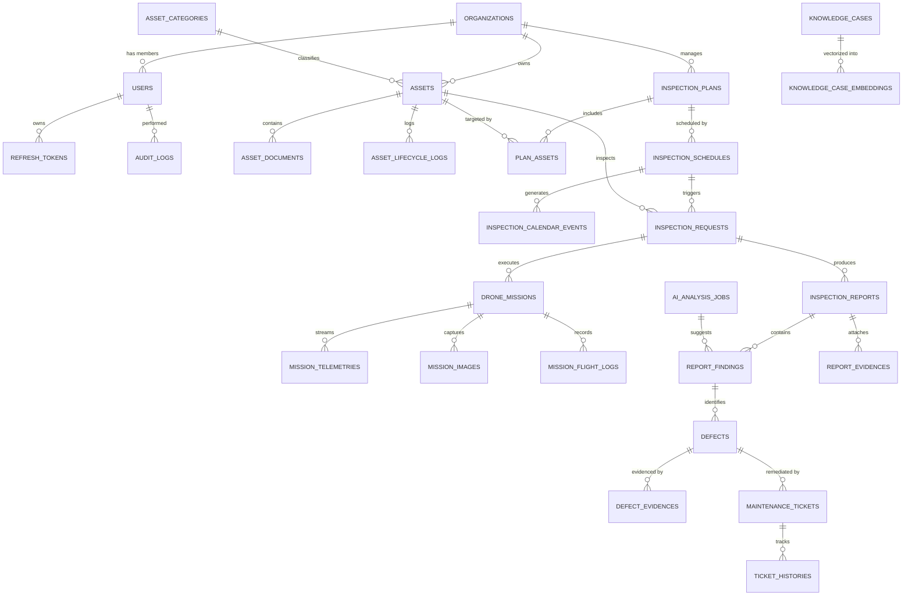

# Database Schema & Data Architecture

> SmartDroneInspection — PostgreSQL 16 + `pgvector` · EF Core 9 (Npgsql)

## 1. Overview & Core Principles

The database follows a modular relational model in PostgreSQL with vector similarity search for AI knowledge management.

- **Naming Convention**: `snake_case` for all table and column names (`UseSnakeCaseNamingConvention()`).
- **Primary Keys**: UUID / `Guid` (`id`) generated on client/domain creation for non-blocking distributed inserts.
- **Audit Columns (`IAuditable`)**:
  - `created_at` (timestamptz, UTC)
  - `created_by` (uuid, nullable)
  - `updated_at` (timestamptz, UTC, nullable)
  - `updated_by` (uuid, nullable)
- **Soft Delete (`ISoftDelete`)**:
  - `is_deleted` (boolean, default false)
  - `deleted_at` (timestamptz, nullable)
  - `deleted_by` (uuid, nullable)
  - Automatically filtered across all queries via EF Core Global Query Filters.
- **Optimistic Concurrency (`IHasVersion`)**:
  - `version` (int, default 1, incremented automatically in `SaveChangesAsync`).

---

## 2. Entity-Relationship Model

---

## 3. Module Tables

### 3.1 Users & Identity (`Users/`)
- `organizations`: Tenant boundary (`id`, `name`, `code`, `is_active`, `tier`).
- `users`: Accounts with role-based access (`id`, `organization_id`, `email`, `normalized_email`, `full_name`, `password_hash`, `role`, `failed_login_count`, `lockout_end_at`, `is_active`).
- `refresh_tokens`: Refresh token rotation chain (`id`, `user_id`, `token_hash`, `jwt_id`, `expires_at`, `revoked_at`, `revoked_reason`, `replaced_by_token_id`, `ip_address`, `user_agent`).
- `audit_logs`: User activity and security events (`id`, `user_id`, `action`, `resource`, `resource_id`, `payload`, `ip_address`).
- `system_settings`: Global / organization configuration key-values.

### 3.2 Assets (`Assets/`)
- `asset_categories`: Hierarchical category catalog (`id`, `name`, `code`, `description`).
- `assets`: Infrastructure assets (towers, bridges, solar panels) (`id`, `organization_id`, `category_id`, `name`, `code`, `normalized_code`, `status`, `address`, `region`, `latitude`, `longitude`, `specifications_json`).
- `asset_documents`: Attached blueprints, manuals (`id`, `asset_id`, `document_type`, `file_name`, `storage_key`, `file_size`).
- `asset_lifecycle_logs`: Status history and state transitions (`id`, `asset_id`, `from_status`, `to_status`, `reason`, `changed_by`).

### 3.3 Inspection Planning (`Planning/`)
- `inspection_plans`: Long-term plans (`id`, `organization_id`, `title`, `code`, `priority`, `status`, `start_date`, `end_date`).
- `plan_assets`: Many-to-many join between plans and target assets (`plan_id`, `asset_id`).
- `inspection_schedules`: Recurrence rules (`id`, `plan_id`, `frequency_type`, `cron_expression`, `status`, `next_run_at`).
- `inspection_calendar_events`: Materialized calendar slots for planners (`id`, `schedule_id`, `title`, `start_time`, `end_time`, `assigned_inspector_id`).
- `notifications`: Alerts dispatched via Web/Email/Push (`id`, `recipient_id`, `type`, `channel`, `status`, `title`, `body`, `sent_at`).

### 3.4 Missions & Drone Integration (`Missions/`)
- `inspection_requests`: Formal mission request sent to SmartDroneHub (`id`, `asset_id`, `schedule_id`, `priority`, `status`, `requested_date`).
- `drone_missions`: Drone flight mission instance (`id`, `request_id`, `external_mission_id`, `status`, `started_at`, `completed_at`, `drone_model`, `pilot_name`).
- `mission_telemetries`: Real-time streaming coordinate points (`id`, `mission_id`, `latitude`, `longitude`, `altitude`, `battery_percent`, `speed`, `timestamp`).
- `mission_images`: Raw images captured during flight stored in MinIO (`id`, `mission_id`, `storage_key`, `captured_at`, `latitude`, `longitude`, `altitude`).
- `mission_flight_logs`: Flight telemetry summary and raw logs (`id`, `mission_id`, `log_type`, `storage_key`, `duration`).

### 3.5 Reports, Defects & Maintenance (`Reports/`)
- `inspection_reports`: Generated assessment report (`id`, `request_id`, `author_id`, `status`, `summary`, `conclusion`, `approved_at`).
- `report_evidences`: Images/documents attached to final report (`id`, `report_id`, `storage_key`, `caption`).
- `report_findings`: Observations made during inspection (`id`, `report_id`, `ai_job_id`, `title`, `description`, `confidence`).
- `defects`: Confirmed structural defects requiring action (`id`, `finding_id`, `asset_id`, `severity`, `category`, `status`, `location_description`).
- `defect_evidences`: Cropped defect images with bounding box metadata (`id`, `defect_id`, `storage_key`, `bounding_box_json`).
- `maintenance_tickets`: Corrective work orders assigned to Maintenance Engineers (`id`, `defect_id`, `assigned_engineer_id`, `priority`, `status`, `due_date`, `resolution_notes`).
- `ticket_histories`: Audit trail of ticket lifecycle (`id`, `ticket_id`, `from_status`, `to_status`, `notes`, `changed_by`).

### 3.6 AI & Knowledge Retrieval (`Ai/`)
- `ai_analysis_jobs`: Vision AI inference processing jobs (`id`, `mission_id`, `job_type`, `status`, `result_payload`, `started_at`, `completed_at`).
- `knowledge_cases`: Historical domain knowledge & past defect resolutions for RAG (`id`, `title`, `defect_type`, `asset_type`, `resolution_summary`, `severity`).
- `knowledge_case_embeddings`: High-dimensional vector embeddings for cosine similarity retrieval:
  - `case_id` (uuid, FK)
  - `embedding` (`vector(1536)` / `vector(768)`)
  - Index: `HNSW` or `IVFFlat` index on `embedding vector_cosine_ops`.
