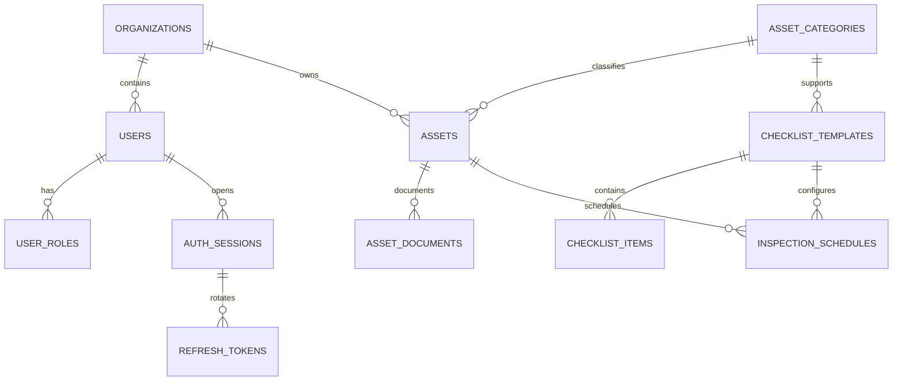
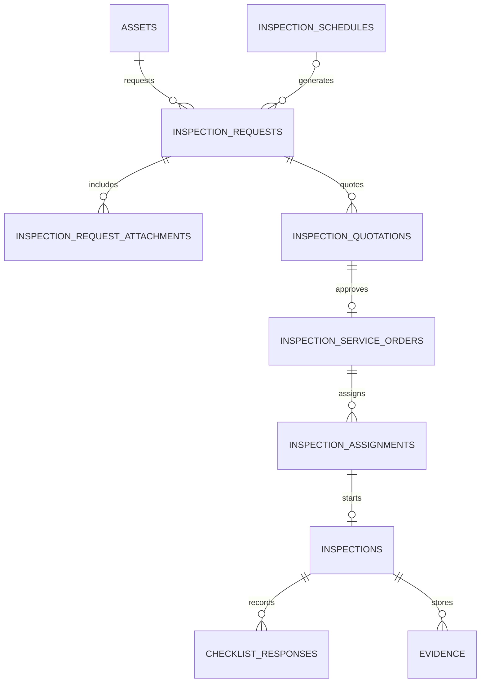
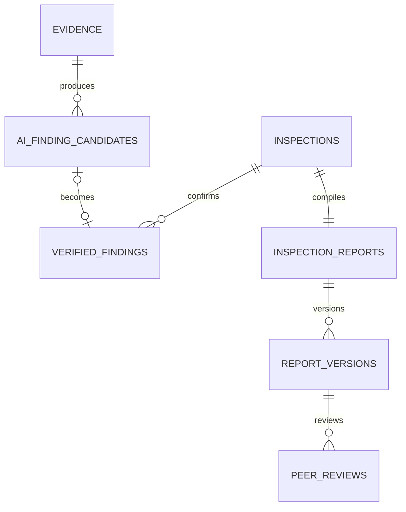
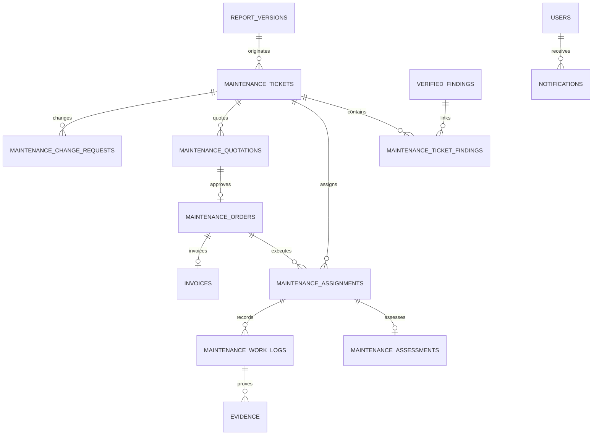

# SmartDroneInspection Database Design

This document defines the target PostgreSQL schema for the Java/JPA code-first domain model. It is the physical-design companion to the conceptual entities in the Report 3 SRS and the WF1-WF4 business-flow reference.

It is not an executable Flyway migration and does not claim that every table below is already implemented. The current implementation boundary is recorded in [Implementation status](#implementation-status).

## 1. Design goals

- Support the five roles `ADMIN`, `CLIENT`, `SERVICE_MANAGER`, `INSPECTOR`, and `MAINTENANCE_ENGINEER`.
- Preserve organization, ownership, assignment, and separation-of-duties scope in relational keys.
- Cover WF1-WF4 without adding speculative subsystems.
- Preserve required quotation, order, report, assignment, approval, and resolution history.
- Store transactional state and metadata in PostgreSQL while MinIO stores file bytes.
- Keep JPA entities inside the feature that owns the business capability.
- Use forward-only Flyway migrations for deployed environments; never use Hibernate schema update in production.

## 2. Right-sized schema

The target contains **35 application tables** plus the Spring Modulith `event_publication` infrastructure table.

| Capability | Tables | Count |
| --- | --- | ---: |
| Identity and access | `organizations`, `users`, `user_roles`, `auth_sessions`, `refresh_tokens` | 5 |
| Audit | `security_audit_events` | 1 |
| Asset catalog and planning | `asset_categories`, `checklist_templates`, `checklist_items`, `assets`, `asset_documents`, `inspection_schedules` | 6 |
| WF2 request and service preparation | `inspection_requests`, `inspection_request_attachments`, `inspection_quotations`, `inspection_service_orders`, `inspection_assignments` | 5 |
| WF3 inspection and report delivery | `inspections`, `checklist_responses`, `evidence`, `ai_finding_candidates`, `verified_findings`, `inspection_reports`, `report_versions`, `peer_reviews` | 8 |
| WF4 maintenance and billing | `maintenance_tickets`, `maintenance_ticket_findings`, `maintenance_assessments`, `maintenance_quotations`, `maintenance_orders`, `maintenance_assignments`, `maintenance_work_logs`, `maintenance_change_requests`, `invoices` | 9 |
| Supporting workflow | `notifications` | 1 |
| Framework infrastructure | `event_publication` | 1 |

The design deliberately does not create separate lookup tables for roles, statuses, priorities, severities, or actor zones. These are stable Java enums persisted as constrained strings. It also does not create dashboard, search-index, notification-template, payment-transaction, or file-blob tables.

## 3. Code-first and migration policy

The Java model is written first, but the production database remains migration-controlled:

1. Model an aggregate with JPA entities and value types inside its owning feature.
2. Generate or draft the PostgreSQL DDL from the reviewed model.
3. Convert it into a new forward Flyway migration and review all foreign keys, checks, indexes, and delete behavior.
4. Run production with Hibernate schema validation, not automatic schema mutation.

Recommended mappings:

| Java | PostgreSQL | Rule |
| --- | --- | --- |
| `UUID` | `UUID` | Generated with `gen_random_uuid()`; public identifiers are non-sequential. |
| `Instant` | `TIMESTAMPTZ` | All stored timestamps represent an absolute instant. |
| `BigDecimal` | `NUMERIC(14,2)` | Monetary values never use floating point. |
| Java enum | `VARCHAR` + check constraint | Enum names are persisted; renames require a migration. |
| `@Version long` | `BIGINT` | Used on mutable aggregates to reject stale updates. |
| Snapshot/value structure | `JSONB` | Limited to immutable commercial/report snapshots and flexible metadata. |

Cross-module references should normally be stored as UUID fields in Java instead of cross-module JPA object graphs. PostgreSQL still enforces the foreign key. Relationships inside the same aggregate may use lazy JPA associations. Cascades must not cross aggregate boundaries.

## 4. Common physical conventions

- Table and column names use `snake_case`; Java types use the project Java naming conventions.
- Every aggregate/entity table has `id UUID PRIMARY KEY DEFAULT gen_random_uuid()`, except pure junction tables and framework-owned tables.
- Mutable aggregates have `created_at`, `updated_at`, and `row_version`.
- Append-only versions, decisions, evidence metadata, and audit records have `created_at` and are not overwritten after becoming final.
- Required customer-visible decisions record the actor and decision timestamp.
- Business records referenced by history are not hard-deleted. Their status is changed to an inactive, cancelled, retired, or superseded state.
- Foreign-key delete behavior defaults to `RESTRICT`. Authentication children may use `CASCADE`; optional actor references may use `SET NULL`.
- File tables store `object_key`, checksum, size, and media metadata only. File bytes remain in MinIO.
- Sensitive credentials, raw refresh tokens, access tokens, and object-storage secrets are never stored.

## 5. Relationship overview

The diagrams are split by workflow so the physical model remains readable.

### 5.1 Identity, assets, and schedules

### 5.2 Inspection request and execution

### 5.3 Findings and reports

### 5.4 Maintenance and supporting records

## 6. Data dictionary

When a definition below says **mutable aggregate columns**, it means `created_at TIMESTAMPTZ`, `updated_at TIMESTAMPTZ`, and `row_version BIGINT NOT NULL DEFAULT 0`. Append-only child/version tables include `created_at TIMESTAMPTZ`. Existing identity tables retain their current timestamp and locking shape unless a target addition is explicitly listed.

### 6.1 Identity and access

#### `organizations`

| Column | Type | Null | Constraint or purpose |
| --- | --- | --- | --- |
| `id` | `UUID` | No | Primary key. |
| `name` | `VARCHAR(200)` | No | Display name. |
| `code` | `VARCHAR(64)` | No | Unique stable organization code. |
| `description` | `VARCHAR(2000)` | Yes | Administrative description. |
| `active` | `BOOLEAN` | No | Defaults to `TRUE`. |
| `created_at` | `TIMESTAMPTZ` | No | Creation time. |
| `updated_at` | `TIMESTAMPTZ` | No | Last update time. |

Indexes: unique `code`; index `active` when organization administration requires filtering.

#### `users`

| Column | Type | Null | Constraint or purpose |
| --- | --- | --- | --- |
| `id` | `UUID` | No | Primary key. |
| `email` | `VARCHAR(320)` | No | Original display value. |
| `normalized_email` | `VARCHAR(320)` | No | Unique lower-case lookup value. |
| `full_name` | `VARCHAR(200)` | No | User display name. |
| `password_hash` | `VARCHAR(1024)` | Yes | Adaptive password hash; null only during controlled provisioning if supported. |
| `status` | `VARCHAR(32)` | No | `ACTIVE`, `SUSPENDED`, or `DISABLED`. |
| `actor_zone` | `VARCHAR(32)` | No | `PLATFORM`, `CUSTOMER_ORGANIZATION`, or `SERVICE_WORKFORCE`. |
| `organization_id` | `UUID` | Yes | FK to `organizations`; required only for customer identities. |
| `auth_version` | `INTEGER` | No | Incremented when all tokens must become stale. |
| `failed_login_count` | `INTEGER` | No | Non-negative failed-attempt counter. |
| `lockout_until` | `TIMESTAMPTZ` | Yes | Temporary login cooldown. |
| `must_change_password` | `BOOLEAN` | No | Requires password setup/change before normal access. |
| `last_login_at` | `TIMESTAMPTZ` | Yes | Last successful login. |
| `last_login_ip` | `VARCHAR(45)` | Yes | IPv4/IPv6 text. |
| `created_at` | `TIMESTAMPTZ` | No | Creation time. |
| `updated_at` | `TIMESTAMPTZ` | No | Last update time. |

Constraints: normalized email is unique; customer-zone users require an organization; other zones must not have one.

#### `user_roles`

| Column | Type | Null | Constraint or purpose |
| --- | --- | --- | --- |
| `id` | `UUID` | No | Primary key. |
| `user_id` | `UUID` | No | FK to `users`, cascade on user deletion before operational history exists. |
| `role` | `VARCHAR(64)` | No | One of the five canonical role codes. |

Constraints: unique `(user_id, role)`; actor-zone combinations are validated in the domain policy and tests.

#### `auth_sessions`

| Column | Type | Null | Constraint or purpose |
| --- | --- | --- | --- |
| `id` | `UUID` | No | Session identifier embedded in access tokens. |
| `user_id` | `UUID` | No | FK to `users`. |
| `client_type` | `VARCHAR(16)` | No | `WEB` or `MOBILE`. |
| `expires_at` | `TIMESTAMPTZ` | No | Absolute session expiry. |
| `revoked_at` | `TIMESTAMPTZ` | Yes | Revocation timestamp. |
| `revoked_reason` | `VARCHAR(128)` | Yes | Logout, role change, password change, disablement, or reuse reason. |

Indexes: `(user_id, revoked_at)` and `expires_at` for cleanup.

#### `refresh_tokens`

| Column | Type | Null | Constraint or purpose |
| --- | --- | --- | --- |
| `id` | `UUID` | No | Primary key. |
| `session_id` | `UUID` | No | FK to `auth_sessions`, cascade on session deletion. |
| `token_hash` | `VARCHAR(64)` | No | Unique keyed hash; never stores a raw token. |
| `issued_at` | `TIMESTAMPTZ` | No | Issue time. |
| `expires_at` | `TIMESTAMPTZ` | No | Token expiry after issue time. |
| `revoked_at` | `TIMESTAMPTZ` | Yes | Rotation or revocation time. |
| `revoke_reason` | `VARCHAR(128)` | Yes | Stable operational reason. |

Indexes: unique `token_hash`; `(session_id, issued_at DESC)`; `expires_at` for retention cleanup.

#### `security_audit_events`

This existing table remains the single append-only audit stream for authentication and material workflow events. The name is retained to avoid an unnecessary rename.

| Column | Type | Null | Constraint or purpose |
| --- | --- | --- | --- |
| `id` | `UUID` | No | Primary key. |
| `actor_user_id` | `UUID` | Yes | FK to `users`, set null when required. |
| `subject_user_id` | `UUID` | Yes | Affected user for identity events. |
| `organization_id` | `UUID` | Yes | Scope of a workflow event. Target addition. |
| `event_type` | `VARCHAR(96)` | No | Stable event name. |
| `outcome` | `VARCHAR(16)` | No | `SUCCESS`, `FAILURE`, or `DENIED`. |
| `entity_type` | `VARCHAR(64)` | Yes | Business entity type. Target addition. |
| `entity_id` | `UUID` | Yes | Business entity identifier. Target addition. |
| `details` | `JSONB` | Yes | Non-secret structured audit metadata. Target addition. |
| `ip_address` | `VARCHAR(45)` | Yes | Request source when applicable. |
| `user_agent` | `VARCHAR(1000)` | Yes | Client metadata when applicable. |
| `correlation_id` | `VARCHAR(128)` | Yes | Trace identifier. |
| `occurred_at` | `TIMESTAMPTZ` | No | Event time. |

Indexes: `(event_type, occurred_at DESC)`, `(subject_user_id, occurred_at DESC)`, and `(entity_type, entity_id, occurred_at DESC)`.

### 6.2 Asset catalog and planning

#### `asset_categories`

Columns: `id`, unique `code VARCHAR(64)`, `name VARCHAR(160)`, `description VARCHAR(2000)`, `active BOOLEAN`, and the mutable aggregate timestamps/version.

#### `checklist_templates`

| Column | Type | Null | Constraint or purpose |
| --- | --- | --- | --- |
| `id` | `UUID` | No | Version identifier. |
| `template_key` | `VARCHAR(64)` | No | Stable key shared by all versions. |
| `version_number` | `INTEGER` | No | Positive version number. |
| `asset_category_id` | `UUID` | Yes | Optional FK to `asset_categories`. |
| `name` | `VARCHAR(200)` | No | Template name. |
| `description` | `VARCHAR(2000)` | Yes | Template purpose. |
| `status` | `VARCHAR(24)` | No | `DRAFT`, `ACTIVE`, or `RETIRED`. |
| `created_by_user_id` | `UUID` | No | Admin who created the version. |
| `published_at` | `TIMESTAMPTZ` | Yes | Time the version became active. |

Constraints: unique `(template_key, version_number)`; a published version is immutable.

#### `checklist_items`

| Column | Type | Null | Constraint or purpose |
| --- | --- | --- | --- |
| `id` | `UUID` | No | Primary key. |
| `template_id` | `UUID` | No | FK to one checklist-template version. |
| `item_code` | `VARCHAR(64)` | No | Stable code within the version. |
| `section_name` | `VARCHAR(160)` | Yes | Display grouping. |
| `prompt` | `VARCHAR(1000)` | No | Inspection instruction/question. |
| `response_type` | `VARCHAR(24)` | No | `PASS_FAIL`, `TEXT`, `NUMBER`, `BOOLEAN`, or `CHOICE`. |
| `required` | `BOOLEAN` | No | Whether completion is mandatory. |
| `display_order` | `INTEGER` | No | Non-negative ordering value. |
| `guidance` | `VARCHAR(2000)` | Yes | Field guidance. |
| `validation_config` | `JSONB` | Yes | Allowed choices or numeric bounds. |

Constraints: unique `(template_id, item_code)` and `(template_id, display_order)`.

#### `assets`

| Column | Type | Null | Constraint or purpose |
| --- | --- | --- | --- |
| `id` | `UUID` | No | Primary key. |
| `organization_id` | `UUID` | No | Owning organization. |
| `category_id` | `UUID` | No | FK to `asset_categories`. |
| `code` | `VARCHAR(64)` | No | Unique inside the organization. |
| `name` | `VARCHAR(200)` | No | Asset name. |
| `description` | `VARCHAR(2000)` | Yes | Asset description. |
| `location_text` | `VARCHAR(500)` | No | Human-readable location. |
| `latitude` | `NUMERIC(9,6)` | Yes | Optional WGS84 latitude. |
| `longitude` | `NUMERIC(9,6)` | Yes | Optional WGS84 longitude. |
| `ownership_information` | `VARCHAR(1000)` | Yes | Customer-provided ownership detail. |
| `status` | `VARCHAR(24)` | No | `ACTIVE`, `INACTIVE`, or `RETIRED`. |
| `created_by_user_id` | `UUID` | No | Client actor in the same organization. |

Constraints: unique `(organization_id, code)`; latitude/longitude ranges are checked.

#### `asset_documents`

Columns: `id`, `asset_id`, `uploaded_by_user_id`, `document_type`, `file_name`, `content_type`, `size_bytes`, `checksum_sha256`, unique `object_key`, optional `document_date`, and `created_at`.

Indexes: `(asset_id, created_at DESC)` and `(asset_id, checksum_sha256)`.

#### `inspection_schedules`

| Column | Type | Null | Constraint or purpose |
| --- | --- | --- | --- |
| `id` | `UUID` | No | Primary key. |
| `asset_id` | `UUID` | No | Scheduled asset. |
| `checklist_template_id` | `UUID` | No | Published template version. |
| `frequency_unit` | `VARCHAR(16)` | No | `DAY`, `WEEK`, `MONTH`, or `YEAR`. |
| `frequency_interval` | `INTEGER` | No | Positive interval. |
| `next_due_at` | `TIMESTAMPTZ` | No | Next due cycle. |
| `last_generated_due_cycle` | `DATE` | Yes | Last successfully generated cycle. |
| `status` | `VARCHAR(24)` | No | `ACTIVE`, `PAUSED`, or `DISABLED`. |
| `created_by_user_id` | `UUID` | No | Client actor in the asset organization. |

Indexes: `(status, next_due_at)` for the scheduler and `asset_id` for scoped retrieval.

### 6.3 WF2 request, quotation, order, and assignment

#### `inspection_requests`

| Column | Type | Null | Constraint or purpose |
| --- | --- | --- | --- |
| `id` | `UUID` | No | Primary key. |
| `organization_id` | `UUID` | No | Denormalized owner scope. |
| `asset_id` | `UUID` | No | Requested asset. |
| `schedule_id` | `UUID` | Yes | Required for periodic requests. |
| `checklist_template_id` | `UUID` | No | Checklist version used for the work. |
| `request_type` | `VARCHAR(16)` | No | `PERIODIC` or `AD_HOC`. |
| `due_cycle` | `DATE` | Yes | Required for periodic requests. |
| `linked_maintenance_ticket_id` | `UUID` | Yes | Source when created by a re-inspection decision. |
| `requested_by_user_id` | `UUID` | Yes | Null only for scheduler-created periodic requests. |
| `scope` | `VARCHAR(4000)` | No | Requested inspection scope. |
| `priority` | `VARCHAR(16)` | No | `LOW`, `NORMAL`, `HIGH`, or `URGENT`. |
| `preferred_deadline` | `TIMESTAMPTZ` | Yes | Customer preference. |
| `site_access_constraints` | `VARCHAR(2000)` | Yes | Access and safety notes. |
| `contact_name` | `VARCHAR(200)` | Yes | Site contact. |
| `contact_phone` | `VARCHAR(32)` | Yes | Site contact phone. |
| `contact_email` | `VARCHAR(320)` | Yes | Site contact email. |
| `status` | `VARCHAR(40)` | No | Controlled WF1/WF2 state. |
| `submitted_at` | `TIMESTAMPTZ` | Yes | Submission time. |

Constraints: periodic rows require schedule and due cycle; ad hoc rows must not have a due cycle; unique `(asset_id, schedule_id, due_cycle)` where type is `PERIODIC`.

#### `inspection_request_attachments`

Columns: `id`, `inspection_request_id`, `uploaded_by_user_id`, `file_name`, `content_type`, `size_bytes`, `checksum_sha256`, unique `object_key`, optional `description`, and `created_at`.

#### `inspection_quotations`

Each row is one immutable commercial version.

| Column | Type | Null | Constraint or purpose |
| --- | --- | --- | --- |
| `id` | `UUID` | No | Quotation-version identifier. |
| `quotation_series_id` | `UUID` | No | Stable identifier shared by revisions. |
| `inspection_request_id` | `UUID` | No | Quoted request. |
| `version_number` | `INTEGER` | No | Positive version number. |
| `previous_version_id` | `UUID` | Yes | Self-FK to the prior version. |
| `prepared_by_user_id` | `UUID` | No | Service Manager. |
| `currency` | `CHAR(3)` | No | ISO currency code. |
| `subtotal` | `NUMERIC(14,2)` | No | Non-negative. |
| `tax_amount` | `NUMERIC(14,2)` | No | Non-negative. |
| `total_amount` | `NUMERIC(14,2)` | No | Non-negative. |
| `pricing_details` | `JSONB` | No | Immutable line-item snapshot. |
| `scope_snapshot` | `JSONB` | No | Agreed scope and deliverables snapshot. |
| `estimated_duration_hours` | `NUMERIC(10,2)` | Yes | Positive estimate. |
| `payment_terms` | `VARCHAR(2000)` | No | Post-service payment terms. |
| `status` | `VARCHAR(32)` | No | Draft, sent, revision requested, approved, rejected, or superseded. |
| `sent_at` | `TIMESTAMPTZ` | Yes | Customer-visible time. |
| `decided_by_user_id` | `UUID` | Yes | Client decision actor. |
| `decided_at` | `TIMESTAMPTZ` | Yes | Decision time. |
| `revision_reason` | `VARCHAR(2000)` | Yes | Required when revision is requested. |
| `created_at` | `TIMESTAMPTZ` | No | Creation time. |
| `row_version` | `BIGINT` | No | Optimistic-lock version for concurrent quotation decisions. |

Constraints: unique `(quotation_series_id, version_number)`; only an approved version can create a service order. The
commercial snapshot is immutable after finalization, while `row_version` protects concurrent state transitions before
that point.

#### `inspection_service_orders`

Columns: `id`, unique `order_number`, unique `approved_quotation_id`, `inspection_request_id`, `confirmed_by_user_id`, `confirmed_at`, `scope_snapshot JSONB`, `deliverables JSONB`, `payment_terms`, `status`, optional `started_at`, optional `completed_at`, and mutable aggregate columns.

#### `inspection_assignments`

| Column | Type | Null | Constraint or purpose |
| --- | --- | --- | --- |
| `id` | `UUID` | No | Assignment attempt. |
| `service_order_id` | `UUID` | No | Confirmed inspection order. |
| `inspector_user_id` | `UUID` | No | Assigned Inspector. |
| `assigned_by_user_id` | `UUID` | No | Service Manager. |
| `status` | `VARCHAR(24)` | No | `PENDING`, `ACCEPTED`, `REJECTED`, `CANCELLED`, or `COMPLETED`. |
| `deadline` | `TIMESTAMPTZ` | Yes | Assignment deadline. |
| `access_instructions` | `VARCHAR(2000)` | Yes | Assignment package instructions. |
| `responded_at` | `TIMESTAMPTZ` | Yes | Accept/reject time. |
| `rejection_reason` | `VARCHAR(1000)` | Yes | Required when rejected. |

Constraint: only one pending or accepted Inspector assignment per service order; a rejected assignment remains as history.

### 6.4 WF3 inspection, evidence, findings, and reports

#### `inspections`

Columns: `id`, unique `service_order_id`, unique `accepted_assignment_id`, `asset_id`, `author_user_id`, `checklist_template_id`, `status`, optional `started_at`, optional `completed_at`, and mutable aggregate columns.

#### `checklist_responses`

Columns: `id`, `inspection_id`, `checklist_item_id`, `response_value JSONB`, optional `notes`, `completed_by_user_id`, `completed_at`, and `created_at`/`updated_at`.

Constraints: unique `(inspection_id, checklist_item_id)`; value shape must match the checklist item's response type.

#### `evidence`

| Column | Type | Null | Constraint or purpose |
| --- | --- | --- | --- |
| `id` | `UUID` | No | Primary key. |
| `inspection_id` | `UUID` | Yes | Inspection owner. |
| `maintenance_work_log_id` | `UUID` | Yes | Maintenance owner. |
| `uploaded_by_user_id` | `UUID` | No | Assigned field worker. |
| `evidence_kind` | `VARCHAR(32)` | No | `INSPECTION`, `BEFORE_MAINTENANCE`, `AFTER_MAINTENANCE`, or `OTHER`. |
| `file_name` | `VARCHAR(500)` | No | Original file name. |
| `content_type` | `VARCHAR(160)` | No | Validated media type. |
| `size_bytes` | `BIGINT` | No | Positive file size. |
| `checksum_sha256` | `CHAR(64)` | No | Duplicate-detection checksum. |
| `object_key` | `VARCHAR(1000)` | No | Unique MinIO object key. |
| `capture_time` | `TIMESTAMPTZ` | Yes | Original capture time. |
| `source` | `VARCHAR(32)` | No | SD card, web upload, mobile upload, or imported source. |
| `latitude` | `NUMERIC(9,6)` | Yes | Optional GPS metadata. |
| `longitude` | `NUMERIC(9,6)` | Yes | Optional GPS metadata. |
| `external_reference` | `VARCHAR(200)` | Yes | Optional external mission/reference value. |
| `upload_status` | `VARCHAR(24)` | No | `UPLOADING`, `AVAILABLE`, `FAILED`, or `QUARANTINED`. |

Constraints: exactly one parent is set; partial unique indexes prevent duplicate checksums inside the same inspection or maintenance work log.

#### `ai_finding_candidates`

Columns: `id`, `evidence_id`, `model_name`, `model_version`, `predicted_label`, `confidence NUMERIC(6,5)`, `bounding_box JSONB`, `status`, optional `reviewed_by_user_id`, optional `reviewed_at`, optional `rejection_reason`, and `created_at`.

Constraints: confidence is between zero and one; candidate status is `PENDING`, `CONFIRMED`, `MODIFIED`, or `REJECTED`.

#### `verified_findings`

| Column | Type | Null | Constraint or purpose |
| --- | --- | --- | --- |
| `id` | `UUID` | No | Official finding identifier. |
| `inspection_id` | `UUID` | No | Owning inspection. |
| `evidence_id` | `UUID` | Yes | Supporting evidence. |
| `ai_candidate_id` | `UUID` | Yes | Source candidate; null for manual findings. |
| `created_by_user_id` | `UUID` | No | Inspector who verified/created it. |
| `source` | `VARCHAR(24)` | No | `AI_CONFIRMED`, `AI_MODIFIED`, or `MANUAL`. |
| `finding_code` | `VARCHAR(64)` | No | Unique within the inspection. |
| `defect_label` | `VARCHAR(160)` | No | Verified classification. |
| `severity` | `VARCHAR(16)` | No | `LOW`, `MEDIUM`, `HIGH`, or `CRITICAL`. |
| `location_description` | `VARCHAR(1000)` | No | Defect location. |
| `bounding_box` | `JSONB` | Yes | Verified image coordinates. |
| `technical_notes` | `VARCHAR(4000)` | No | Inspector conclusion. |
| `recommended_action` | `VARCHAR(4000)` | Yes | Recommended next action. |
| `status` | `VARCHAR(24)` | No | `OPEN`, `IN_MAINTENANCE`, or `RESOLVED`. |
| `resolved_at` | `TIMESTAMPTZ` | Yes | Resolution time. |

Constraints: unique `(inspection_id, finding_code)`; manual findings must not reference a candidate; AI-derived findings must reference one.

#### `inspection_reports`

Columns: `id`, unique `inspection_id`, `author_user_id`, `status`, `current_version_number`, and mutable aggregate columns.

#### `report_versions`

| Column | Type | Null | Constraint or purpose |
| --- | --- | --- | --- |
| `id` | `UUID` | No | Version identifier. |
| `report_id` | `UUID` | No | Parent report. |
| `version_number` | `INTEGER` | No | Positive sequential number. |
| `source_version_id` | `UUID` | Yes | Version corrected or revised. |
| `created_by_user_id` | `UUID` | No | Report author. |
| `content_snapshot` | `JSONB` | No | Immutable report content snapshot. |
| `pdf_object_key` | `VARCHAR(1000)` | Yes | Generated report file in MinIO. |
| `status` | `VARCHAR(32)` | No | Draft through accepted lifecycle. |
| `submitted_at` | `TIMESTAMPTZ` | Yes | Peer-review submission. |
| `technically_approved_at` | `TIMESTAMPTZ` | Yes | Peer approval time. |
| `released_at` | `TIMESTAMPTZ` | Yes | Service Manager release time. |
| `accepted_at` | `TIMESTAMPTZ` | Yes | Client acceptance time. |
| `immutable` | `BOOLEAN` | No | Must be true after acceptance. |

Constraints: unique `(report_id, version_number)`; an accepted version is append-only and cannot be updated.

#### `peer_reviews`

Columns: `id`, `report_version_id`, `reviewer_user_id`, `assigned_by_user_id`, `assigned_at`, `decision`, optional `comments`, optional `reviewed_at`, and `created_at`.

Constraints: reviewer must differ from the report author; decision is `PENDING`, `CHANGES_REQUESTED`, or `APPROVED`; only an approved review can make the version technically approved.

Use unique `report_version_id` so each submitted version has one assigned peer reviewer. A change request creates a new report version for the same reviewer instead of overwriting the reviewed version.

### 6.5 WF4 maintenance and billing

#### `maintenance_tickets`

| Column | Type | Null | Constraint or purpose |
| --- | --- | --- | --- |
| `id` | `UUID` | No | Primary key. |
| `organization_id` | `UUID` | No | Customer scope. |
| `asset_id` | `UUID` | No | Affected asset. |
| `accepted_report_version_id` | `UUID` | No | Client-accepted source report. |
| `created_by_user_id` | `UUID` | No | Client actor. |
| `priority` | `VARCHAR(16)` | No | Shared priority values. |
| `preferred_deadline` | `TIMESTAMPTZ` | Yes | Customer preference. |
| `instructions` | `VARCHAR(4000)` | Yes | Additional customer instructions. |
| `status` | `VARCHAR(40)` | No | Controlled WF4 state. |
| `resolution_decision` | `VARCHAR(32)` | Yes | Accept, rework, or re-inspection. |
| `released_at` | `TIMESTAMPTZ` | Yes | Customer-visible result time. |
| `closed_at` | `TIMESTAMPTZ` | Yes | Final closure time. |

#### `maintenance_ticket_findings`

Columns: `maintenance_ticket_id`, `verified_finding_id`, and `created_at`; composite primary key `(maintenance_ticket_id, verified_finding_id)`.

Rule: every ticket has at least one finding from its accepted report and asset; a finding cannot belong to multiple active tickets.

#### `maintenance_assessments`

Columns: `id`, unique `assessment_assignment_id`, `maintenance_ticket_id`, `engineer_user_id`, `assessment_mode`, `required_work`, `materials_estimate JSONB`, `labor_hours_estimate`, `duration_hours_estimate`, `risk_notes`, `assumptions`, `estimated_cost_min`, `estimated_cost_max`, `currency`, `completed_at`, and immutable record timestamps.

Constraints: assessment mode is `REMOTE` or `ON_SITE`; minimum cost cannot exceed maximum cost.

#### `maintenance_quotations`

Each row is one immutable version. Columns mirror `inspection_quotations` and use `quotation_series_id`, `maintenance_ticket_id`, `maintenance_assessment_id`, `version_number`, `previous_version_id`, pricing/scope snapshots, payment terms, status, and Client decision metadata.

Constraints: unique `(quotation_series_id, version_number)`; the technical scope must originate from a completed Engineer assessment.

#### `maintenance_orders`

Each row is an immutable approved order version so approved changes never overwrite the previous scope.

| Column | Type | Null | Constraint or purpose |
| --- | --- | --- | --- |
| `id` | `UUID` | No | Order-version identifier. |
| `order_series_id` | `UUID` | No | Stable order identifier. |
| `order_number` | `VARCHAR(64)` | No | Customer-visible number. |
| `maintenance_ticket_id` | `UUID` | No | Parent ticket. |
| `approved_quotation_id` | `UUID` | Yes | Required for the initial version. |
| `change_request_id` | `UUID` | Yes | Required for an approved changed version. |
| `version_number` | `INTEGER` | No | Positive version number. |
| `previous_version_id` | `UUID` | Yes | Prior approved order version. |
| `scope_snapshot` | `JSONB` | No | Approved work scope and materials. |
| `approved_amount` | `NUMERIC(14,2)` | No | Approved post-service amount/rates. |
| `currency` | `CHAR(3)` | No | ISO currency code. |
| `payment_terms` | `VARCHAR(2000)` | No | Approved post-service terms. |
| `status` | `VARCHAR(24)` | No | `CONFIRMED`, `IN_PROGRESS`, `COMPLETED`, `SUPERSEDED`, or `CANCELLED`. |
| `approved_by_user_id` | `UUID` | No | Client actor. |
| `approved_at` | `TIMESTAMPTZ` | No | Approval time. |

Constraints: unique `(order_series_id, version_number)` and unique `(order_number, version_number)`.

#### `maintenance_assignments`

Columns: `id`, `maintenance_ticket_id`, optional `maintenance_order_id`, `engineer_user_id`, `assigned_by_user_id`, `assignment_type`, `status`, optional `deadline`, optional `responded_at`, optional `rejection_reason`, and mutable aggregate columns.

Rules: type is `ASSESSMENT`, `EXECUTION`, or `REWORK`; assessment does not require an order, while execution/rework requires an approved order; only one active assignment per type and ticket.

#### `maintenance_work_logs`

Columns: `id`, `maintenance_ticket_id`, `execution_assignment_id`, `engineer_user_id`, `started_at`, optional `ended_at`, `progress_percent`, `work_summary`, `materials_used JSONB`, `labor_hours`, optional `actual_cost`, `currency`, `status`, optional `submitted_at`, optional `verified_by_user_id`, optional `verified_at`, and mutable aggregate columns.

Constraints: progress is between zero and one hundred; completion requires before/after evidence.

#### `maintenance_change_requests`

| Column | Type | Null | Constraint or purpose |
| --- | --- | --- | --- |
| `id` | `UUID` | No | Primary key. |
| `maintenance_ticket_id` | `UUID` | No | Parent ticket. |
| `work_log_id` | `UUID` | No | Work that discovered the change. |
| `current_order_id` | `UUID` | No | Approved order before the change. |
| `requested_by_user_id` | `UUID` | No | Maintenance Engineer. |
| `reason` | `VARCHAR(2000)` | No | Newly discovered condition. |
| `additional_scope` | `VARCHAR(4000)` | No | Requested additional work. |
| `estimated_cost_delta` | `NUMERIC(14,2)` | Yes | Technical estimate, not final price. |
| `currency` | `CHAR(3)` | Yes | Required with cost delta. |
| `status` | `VARCHAR(24)` | No | Submitted through implemented/rejected lifecycle. |
| `decided_by_user_id` | `UUID` | Yes | Client actor. |
| `decided_at` | `TIMESTAMPTZ` | Yes | Decision time. |
| `decision_reason` | `VARCHAR(2000)` | Yes | Optional customer comment. |

The approved changed order links back through `maintenance_orders.change_request_id`; a second reverse foreign key is intentionally omitted to avoid a circular schema dependency.

#### `invoices`

Columns: `id`, unique `invoice_number`, `organization_id`, `maintenance_order_id`, `maintenance_ticket_id`, `currency`, `subtotal`, `tax_amount`, `total_amount`, `status`, `issued_at`, `due_at`, optional `paid_at`, and immutable timestamps.

The v1 schema invoices completed maintenance work only. Inspection billing can be added later when it becomes an implemented workflow instead of introducing a polymorphic invoice association now.

### 6.6 Supporting workflow

#### `notifications`

| Column | Type | Null | Constraint or purpose |
| --- | --- | --- | --- |
| `id` | `UUID` | No | Primary key. |
| `recipient_user_id` | `UUID` | No | Notification recipient. |
| `organization_id` | `UUID` | Yes | Optional customer scope. |
| `event_type` | `VARCHAR(96)` | No | Triggering workflow event. |
| `channel` | `VARCHAR(16)` | No | `IN_APP` or `EMAIL`. |
| `title` | `VARCHAR(300)` | No | User-facing title. |
| `body` | `VARCHAR(4000)` | No | User-facing content. |
| `target_path` | `VARCHAR(1000)` | Yes | Authorized application route, never a raw MinIO URL. |
| `status` | `VARCHAR(24)` | No | `PENDING`, `SENT`, `FAILED`, or `READ`. |
| `attempt_count` | `INTEGER` | No | Non-negative delivery attempts. |
| `last_error_code` | `VARCHAR(96)` | Yes | Safe operational error code. |
| `sent_at` | `TIMESTAMPTZ` | Yes | Delivery time. |
| `read_at` | `TIMESTAMPTZ` | Yes | In-app read time. |
| `created_at` | `TIMESTAMPTZ` | No | Creation time. |

Indexes: `(recipient_user_id, status, created_at DESC)` and `(status, created_at)` for delivery workers.

#### `event_publication`

This table is owned by Spring Modulith, not by a JPA business entity. Its schema follows the framework's PostgreSQL event-publication registry and supports reliable event delivery between modules.

### 6.7 Stable value sets

These values are persisted as strings and must use the same names in Java, API contracts, tests, and demo data.

| Field | Values |
| --- | --- |
| User role | `ADMIN`, `CLIENT`, `SERVICE_MANAGER`, `INSPECTOR`, `MAINTENANCE_ENGINEER` |
| Actor zone | `PLATFORM`, `CUSTOMER_ORGANIZATION`, `SERVICE_WORKFORCE` |
| User status | `ACTIVE`, `SUSPENDED`, `DISABLED` |
| Asset status | `ACTIVE`, `INACTIVE`, `RETIRED` |
| Template status | `DRAFT`, `ACTIVE`, `RETIRED` |
| Schedule status | `ACTIVE`, `PAUSED`, `DISABLED` |
| Request status | `DRAFT`, `SUBMITTED`, `UNDER_REVIEW`, `REVISION_REQUIRED`, `QUOTED`, `AWAITING_CLIENT_APPROVAL`, `ORDER_CONFIRMED`, `ASSIGNMENT_PENDING`, `READY_FOR_INSPECTION`, `MANUAL_REVIEW`, `CANCELLED` |
| Quotation status | `DRAFT`, `SENT`, `REVISION_REQUESTED`, `APPROVED`, `REJECTED`, `SUPERSEDED` |
| Inspection order status | `CONFIRMED`, `ASSIGNMENT_PENDING`, `READY_FOR_INSPECTION`, `IN_PROGRESS`, `COMPLETED`, `CANCELLED` |
| Assignment status | `PENDING`, `ACCEPTED`, `REJECTED`, `CANCELLED`, `COMPLETED` |
| Inspection status | `READY_FOR_INSPECTION`, `IN_PROGRESS`, `AWAITING_AI_REVIEW`, `AWAITING_REPORT`, `COMPLETED`, `CANCELLED` |
| Report status | `DRAFT`, `AWAITING_PEER_REVIEW`, `CHANGES_REQUESTED`, `TECHNICALLY_APPROVED`, `RELEASED`, `REVISION_REQUESTED`, `ACCEPTED` |
| Finding severity | `LOW`, `MEDIUM`, `HIGH`, `CRITICAL` |
| Finding status | `OPEN`, `IN_MAINTENANCE`, `RESOLVED` |
| Maintenance ticket status | `SUBMITTED`, `ASSESSMENT_PENDING`, `ASSESSED`, `QUOTATION_PENDING`, `AWAITING_CLIENT_APPROVAL`, `ORDER_CONFIRMED`, `EXECUTION_PENDING`, `IN_PROGRESS`, `CHANGE_PENDING`, `INTERNAL_REVIEW`, `RELEASED`, `REWORK_REQUESTED`, `REINSPECTION_REQUESTED`, `CLOSED`, `CANCELLED` |
| Maintenance assignment type | `ASSESSMENT`, `EXECUTION`, `REWORK` |
| Work-log status | `IN_PROGRESS`, `PAUSED_FOR_CHANGE`, `SUBMITTED`, `VERIFIED` |
| Change-request status | `SUBMITTED`, `QUOTED`, `APPROVED`, `REJECTED`, `IMPLEMENTED` |
| Invoice status | `DRAFT`, `ISSUED`, `PAID`, `OVERDUE`, `VOID` |

## 7. Critical database constraints

The following rules must exist in the database where relational checks are practical, and must also be enforced in the domain/application service:

| Rule | Enforcement |
| --- | --- |
| Asset code unique within organization | Unique `(organization_id, code)`. |
| One periodic request per due cycle | Partial unique `(asset_id, schedule_id, due_cycle)` for `PERIODIC`. |
| Quotation/order/report versions are retained | Unique series/version keys; final versions are append-only. |
| Rejected assignment has a reason | Check constraint tied to assignment status. |
| Evidence is not duplicated in one work context | Partial unique parent/checksum indexes. |
| AI candidate is not an official defect | Only `verified_findings` feed reports and tickets. |
| Report author cannot peer review their report | Service policy plus integration test; cross-table rule is not implemented as a fragile trigger. |
| Ticket contains at least one accepted-report finding | Transactional service validation plus join-table constraint. |
| Assessment and execution are distinct assignments | `assignment_type` and active-assignment uniqueness. |
| Additional work waits for Client approval | State-transition service checks using an approved changed order version. |
| Ticket closure requires before/after evidence | Transactional query and workflow test. |
| Cross-organization access is denied | Organization-scoped repository queries, not in-memory filtering. |

## 8. Index strategy

Create indexes only for demonstrated authorization, workflow, scheduler, and cleanup queries:

- Every foreign key used for scoped lookup receives a B-tree index.
- Customer lists start with `organization_id` followed by status/date or a stable sort key.
- Assignment inboxes use `(assignee_user_id, status, deadline)`.
- Scheduler polling uses `(status, next_due_at)`.
- Report and quotation version lookup uses `(parent_or_series_id, version_number DESC)`.
- Evidence checksum indexes are scoped by the owning inspection or work log.
- Audit queries use entity/user plus descending time.
- Cleanup jobs use token/session expiry columns.

Do not add indexes for every enum or boolean. Verify expensive queries with PostgreSQL query plans before adding composite indexes beyond this baseline.

## 9. Authorization-oriented repository boundaries

The database model supports, but does not replace, application authorization. Repository methods must start from the caller's scope:

- Client queries include `organization_id` from the authenticated principal.
- Inspector queries join the accepted inspection assignment or peer-review assignment to the signed-in user.
- Maintenance Engineer queries join the active assessment/execution assignment to the signed-in user.
- Service Manager queries may cross organizations but only for service workflows.
- Admin queries do not automatically grant customer-workflow mutation privileges.
- Report peer-review commands compare reviewer and author identifiers before changing state.

## 10. Transaction and concurrency boundaries

- Creating a periodic request and advancing the schedule occur in one transaction; the unique due-cycle key provides the final idempotency guard.
- Approving a quotation and creating its order occur in one transaction.
- Accepting an assignment uses optimistic locking and active-assignment uniqueness.
- Confirming/modifying an AI candidate and creating a verified finding occur in one transaction.
- Accepting a report locks the accepted version against mutation.
- Approving a maintenance change creates a new order version; it never overwrites an approved version.
- Resolving a maintenance ticket, updating linked findings, and optionally creating a re-inspection request occur in one transaction.
- Notifications are created after the business transition commits through module events; notification failure does not roll back the business transaction.

## 11. Retention and deletion

- Authentication refresh-token history is removed after its operational reuse-detection window.
- Expired sessions may be removed only after related audit needs are satisfied.
- Accepted quotations, orders, report versions, peer reviews, assessments, changes, invoices, and audit events are retained as business history.
- MinIO object deletion is coordinated with database retention; deleting a database row alone must not orphan or prematurely expose an object.
- Organization, asset, user, finding, report, and ticket records referenced by business history are disabled or retired rather than hard-deleted.

## 12. Implementation status

As of 2026-09-19, the backend migrations implement:

- `event_publication`
- `organizations`
- `users`
- `user_roles`
- `auth_sessions`
- `refresh_tokens`
- `security_audit_events`
- `asset_categories`
- `checklist_templates`
- `checklist_items`
- `assets`
- `asset_documents`
- `inspection_schedules`
- `inspection_requests`
- `inspection_request_attachments`
- `inspection_quotations`
- `inspection_service_orders`
- `inspection_assignments`

The remaining WF3, WF4, and supporting-workflow tables in this document are target-state design and must not be described as implemented until matching entities, migrations, repositories, services, and tests exist.

## 13. Recommended implementation order

1. **WF1 foundation:** categories, checklist versions/items, assets, documents, and schedules.
2. **WF2 preparation:** requests, attachments, quotations, orders, and Inspector assignments.
3. **WF3 execution:** inspections, checklist responses, evidence, AI candidates, verified findings, reports, versions, and peer reviews.
4. **WF4 maintenance:** tickets, finding links, assessments, quotations, orders, assignments, work logs, change requests, and invoices.
5. **Supporting workflow:** notifications and the additional general-audit columns.

Each phase should land as a small forward migration and a matching feature-level JPA/test slice. Do not create all planned tables in a single unreviewed migration.

## 14. Source references

- [Report 3 Software Requirement Specification](report3-software-requirement-specification.md)
- [Capstone Business Flow](capstone-business-flow.md)
- [Authentication and Access Control](../../backend/authentication-and-authorization.md)
- [Backend Architecture](../../backend/architecture.md)
- [AI Agent Rules](../../development/ai-agent-rules.md)
