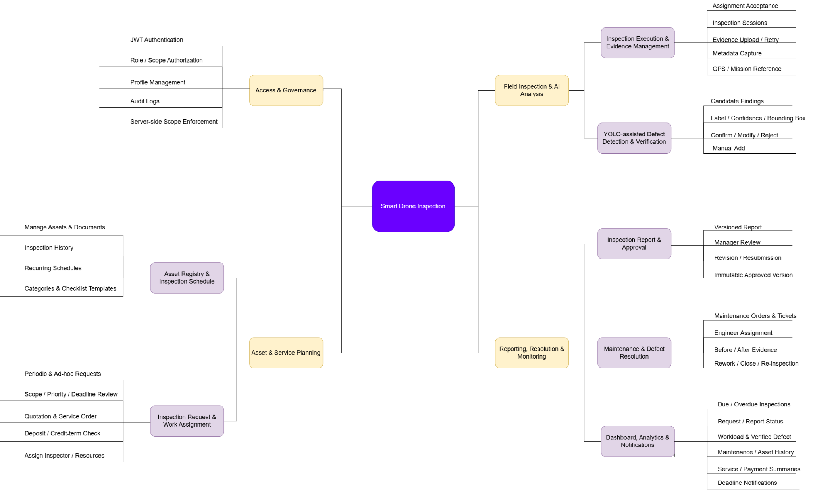

# report 1

CAPSTONE PROJECT REPORT

Report 1 – Project Introduction

SmartDroneInspection

AI-powered Infrastructure Inspection-as-a-Service Platform

– Ho Chi Minh City, September 2026 –

Table of Contents

I. Record of Changes	3

II. Project Introduction	4

1. Overview	4

1.1 Project Information	4

1.2 Project Team	4

2. Product Background	4

3. Existing Systems	5

3.1 DroneDeploy Inspection AI	5

3.2 Flyability Inspector	5

4. Business Opportunity	5

5. Software Product Vision	6

6. Project Scope & Limitations	6

6.1 Major Features	6

6.2 Limitations & Exclusions	8

# I. Record of Changes

| Date | A* M, D | In charge | Change Description |
| --- | --- | --- | --- |
| 11 Sep 2026 | A | Team | Version 1.0: complete project-specific content and team information. |
| 12 Sep 2026 | M | Team | Version 1.1: clarified Review 1 target users and scope boundaries. |
| 21 Sep 2026 | M | Team | Version 1.2: aligned roles, Client organization self-registration, post-service billing milestones, and scope exclusions with the current business flow. |

*A - Added M - Modified D - Deleted

# II. Project Introduction

## 1. Overview

### 1.1 Project Information

- Project name: SmartDroneInspection: AI-powered Infrastructure Inspection Management Platform

- Project code: GFA26SE139

- Group name: FA26SE112

- Software type: Responsive Web Portal, Flutter Field Application, REST APIs and server-side AI services

### 1.2 Project Team

| Full Name | Role | Email | Mobile |
| --- | --- | --- | --- |
| Phạm Minh Trí | Lecturer | tripm14@fpt.edu.vn |  |
| Đặng Ngọc Minh Đức | Lecturer | ducdnm2@fpt.edu.vn |  |
| Trần Hoàng Trung Hiếu | Leader | hieuthtse184212@fpt.edu.vn | 0963832382 |
| Phùng Trung Quốc | Member | quocptse170027@fpt.edu.vn | 0896986551 |
| Trương Thái Như | Member | nhuttse180082@fpt.edu.vn | 0328416716 |
| Trần Tùng Bách | Member | bachttse180220@fpt.edu.vn | 0378351050 |

## 2. Product Background

Organizations that own or manage infrastructure assets need to perform inspections regularly to identify defects, assess asset conditions, and verify repairs. In practice, inspection requests, captured images, findings, approvals, and maintenance updates may be handled through separate tools or manual processes, making it difficult to track the latest condition and resolution status of each defect. This can lead to fragmented information, slower follow-up, and difficulty connecting inspection evidence with the related asset and maintenance activity. SmartDroneInspection is proposed to centralize this process in a shared platform for requesting inspection services, managing inspection evidence, reviewing findings, and tracking defect resolution. The intended customers are organizations that own or manage infrastructure assets and require inspection services.

## 3. Existing Systems

The following products provide relevant references for inspection evidence, findings and reporting. Their published capabilities inform the design comparison; the scope-fit observations below are project assessments, not claims that the products lack all other capabilities.

### 3.1 DroneDeploy

Description: DroneDeploy is a cloud-based drone data platform for flight planning, image processing, inspection, analysis, and reporting.

Actors: Organization Owner/Admin, Coordinator, Member, External User, Pilot, Editor/Analyst, Upload-only User, and Viewer.

Main features: Automated flight planning, drone image upload and processing, 2D/3D mapping, measurements, issue tagging, inspection reports, collaboration, and permission management.

Pros: Provides an integrated inspection workflow, strong visualization and analysis tools, flexible access control, and good support for collaboration.

Cons: Advanced features may require higher-tier plans, some inspection tasks are more desktop-oriented, and its workflow focuses more on drone data and inspection management than on service-order processes such as quotations, deposits, provider assignment, and remediation requests.

Reference: DroneDeploy, https://www.dronedeploy.com/

### 3.2 Flyability Inspector

Description: Flyability Inspector is companion software designed for organizing, reviewing, and reporting inspection data captured by Elios 3 drones.

Actors: Inspection Teams, Engineers, and Asset Owners.

Main features: Asset-based organization, visual review with points of interest (POI), spatial context mapping, historical data comparison over time, structured report generation, and stakeholder collaboration.

Pros: Allows findings to be reviewed with strong visual and spatial context, and supports inspection history comparisons over time.

Cons: Specialized specifically for Elios 3 data rather than general service management or standard uploaded-image workflows, and lacks a built-in 3D digital-twin requirement for this project's scope.

Reference: Flyability, “Inspector”, https://www.flyability.com/inspector (accessed 11 September 2026).

## 4. Business Opportunity

Infrastructure owners need a more convenient way to purchase, manage, and track occasional or recurring inspection services. When service requests, quotations, inspection evidence, findings, reports, and defect follow-up are handled separately, customers may have difficulty understanding the current status of an inspection or tracing a defect from discovery to resolution. SmartDroneInspection provides a shared platform where customers can define inspection needs, review and confirm service orders, access inspection evidence and reports, and follow defect resolution. For the service provider, the same platform supports resource allocation and maintains a traceable history of inspection activities.

Compared with solutions that primarily focus on drone data capture, mapping, or inspection analysis, SmartDroneInspection focuses on connecting inspection-service ordering with evidence management, AI-assisted defect detection, reporting, and follow-up activities. This makes the proposed system suitable for organizations that need inspection services without operating their own inspection teams or drone infrastructure. The expected benefits are clearer service coordination, easier retrieval of inspection evidence, more consistent defect follow-up, and better visibility of service progress.

## 5. Software Product Vision

For organizations that need reliable infrastructure inspection services without managing an internal provider workforce, SmartDroneInspection is a B2B web and field application that connects service requests and confirmed prices to manual field inspections, human-verified AI findings, customer-approved reports, and separately ordered remediation.

Unlike fragmented manual communications and generic software lacking complete service workflows, SmartDroneInspection gives customers a clear record of what was purchased, what was observed, who verified the findings, and how defects were resolved. It gives the service provider a consistent way to allocate resources and deliver traceable evidence, prioritizing a demonstrable end-to-end service lifecycle with a limited, validated AI detection scope.

## 6. Project Scope & Limitations

The project scope covers four main business workflows.

WF1 Asset Registration & Periodic Inspection Schedule Processing.

WF2 Inspection Request Review & Service Assignment.

WF3 Inspection Execution, AI-assisted Finding Verification & Report Approval; and

WF4 Maintenance, Defect Resolution, and Re-inspection. The platform supports five human roles: Admin, Client, Service Manager, Inspector, and Maintenance Engineer. AI services are supporting system integrations; drone flight control is outside the platform.

Within the scope, a Client represents one customer organization and can self-register that organization, manage its assets, request or schedule inspections, approve quotations and reports, and create maintenance tickets. Service Managers review requests, prepare quotations and orders, assign field staff, verify deliverables, and release customer-visible results. Inspectors and Maintenance Engineers work only on their assigned inspections or maintenance tasks.

The project may include assembling and configuring a prototype drone using commercially available components for demonstration and system integration. The drone is manually operated using its designated controller and is used to capture inspection evidence for upload to SmartDroneInspection.

The project does not include fully autonomous drone operation, custom flight-control algorithms, commercial-grade drone manufacturing, or a complete 3D digital-twin platform. AI-generated defect candidates must be reviewed by an Inspector and do not replace professional judgment. The capstone release is limited to the defined inspection and maintenance workflows; additional hardware, advanced analytics, or commercial features are outside the current scope unless formally approved as a scope change.

### 6.1 Major Features

Feature identifiers FE-01 to FE-08 form the scope baseline for requirements, work estimates and acceptance tests. Optional enhancements are scheduled only after the core workflows are stable.

FE-01: Identity & Access Governance. Client self-registration creates one active customer organization and its first Client account. JWT-based authentication, role-/scope-based authorization, organization and assignment scope, profile management, and audit logs enforce access on the server. Self-registration cannot create platform or service-workforce roles.

FE-02: Asset Registry & Inspection Schedule. Clients create and manage their organization’s assets, documents, inspection history and recurring schedules. Admins maintain categories and checklist templates. WF1 generates periodic requests with an Asset + Schedule + Due Cycle idempotency key.

FE-03: Inspection Request & Work Assignment. WF2 unifies PERIODIC and AD_HOC requests. Client request details and Service Manager review lead to a versioned quotation and service-order confirmation. The Client approves post-service payment terms before assignment; no upfront payment or online payment gateway is required.

FE-04: Inspection Execution & Evidence Management. The Flutter application supports assignment acceptance, inspection sessions, evidence upload/retry and metadata. Evidence records the inspection, asset, Inspector, capture time and source; GPS or external mission references are retained when available. Manual drone piloting stays outside the platform.

FE-05: YOLO-assisted Defect Detection & Verification. Server-side inference generates candidates with defect label, confidence, bounding box and model version. Inspector Confirm, Modify, Reject and Manual Add actions determine official findings. Unverified candidates are excluded from official defect statistics.

FE-06: Inspection Report & Approval. WF3 combines checklist results, evidence and verified findings into a versioned report. Inspector submission is followed by peer review by another Inspector and Service Manager release. Accepted versions are immutable; corrections create a new version and preserve approval history. Client acceptance is the inspection billing milestone.

FE-07: Maintenance & Defect Resolution. WF4 links approved defects to separately confirmed maintenance orders and tickets. The platform supports Engineer assignment after the maintenance order and post-service payment terms are approved. The Engineer uploads before/after evidence and marks the work resolved; the Service Manager requests rework or releases the result, and the Client closes it or requests a new re-inspection through WF2. Client acceptance is the maintenance billing milestone.

FE-08: Dashboard, Analytics & Notifications. Scoped views summarize due and overdue inspections, request and report status, workload, verified defects, maintenance, asset history and service/payment summaries. Notifications support assignments, reviews and deadlines without requiring live telemetry.

Figure 1. The four service workflows and the re-inspection return to WF2.

### 6.2 Limitations & Exclusions

The first release is limited to infrastructure inspection and maintenance management. The following items define either excluded capabilities or mandatory product constraints. These boundaries apply to the software release and project demonstration; they do not prevent the system from retaining records for the supported inspection-to-maintenance lifecycle.

LI-1: The platform does not provide autonomous drone flight control, flight-path programming, drone piloting, or automatic drone telemetry collection. Manual capture may occur outside the platform, but only authorized evidence is uploaded and managed by the product.

LI-2: AI is limited to generating candidate findings. An Inspector must review and verify each candidate before it can become an official finding. The system does not automatically publish AI-generated findings.

LI-3: A Client representative may self-register a new organization and create the first Client account. The organization and account are activated immediately after successful registration. Self-registration cannot create or assign Admin, Service Manager, Inspector, or Maintenance Engineer roles. Anonymous access to system data is not supported.

LI-4: Access is strictly scoped. A Client can access only data belonging to the Client’s organization. An Inspector and Maintenance Engineer can access only assignments explicitly allocated to them. A Service Manager can access only the service operations required by assigned requests and orders.

LI-5: An inspection report version accepted by the Client is immutable. Any subsequent correction or change must create a new version and preserve the previously accepted version.

LI-6: General-purpose photogrammetry, 3D reconstruction, and unrelated consumer use are outside the product scope.

LI-7: Integration with external drone-management platforms or other unconfirmed third-party systems is excluded from the release. The system does not provide certified digital-signature services; approval is recorded as an authenticated and versioned application record.
