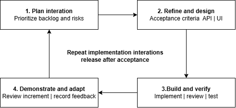

# report 2

Capstone Project Report

Report 2 – Project Management Plan

– Ho Chi Minh City, September 2026 –

Table of Contents

# I. Record of Changes

| Date | A* M, D | In charge | Change Description |
| --- | --- | --- | --- |
| 11 Sep 2026 | A | Team | Version 1.0: project-specific PMP content. |
| 13 Sep 2026 | M | Team | Version 1.1: aligned scope and milestones with Reports 1 and 3. |
| 14 Sep 2026 | M | Team | Version 1.2: condensed content to the official Report 2 template. |
| 14 Sep 2026 | M | Team | Version 1.3: corrected WBS, effort allocation, schedule and Review 1 controls. |
| 14 Sep 2026 | M | Team | Version 1.4: organized WBS as software features/functions and completed layout QA. |
| 14 Sep 2026 | M | Team | Version 1.5: aligned WBS and responsibilities one-to-one with FE-01 through FE-08. |
| 21 Sep 2026 | M | Team | Version 1.6: added Client self-registration and separate post-service billing milestones. |

*A - Added M - Modified D - Deleted

# II. Project Management Plan

## 1. Overview

### 1.1 Scope & Estimation

SmartDroneInspection is a B2B infrastructure inspection service platform. The baseline covers Client self-registration of a customer organization, asset and inspection-zone management, schedules, service requests and orders, direct evidence upload to MinIO, human-verified YOLO findings, Inspector-reviewed LLM report drafting, approval and maintenance follow-up. Inspection and maintenance use separate post-service billing milestones with a shared invoice status lifecycle; the first release records external or manual payment confirmation and does not integrate a payment gateway. Direct upload is the core path. Autonomous flight control, complete 3D reconstruction, real payment settlement and full enterprise CMMS are outside the baseline. The eight bold parent rows map one-to-one to FE-01 through FE-08; each parent is a software feature roll-up and each numbered child is an estimable software function. Parent rows are not assigned as separate Jira work; the child functions are. The 135 man-days include analysis, design, implementation, testing and documentation for those functions.

| # | WBS Item | Complexity | Est. Effort (man-days) |
| --- | --- | --- | --- |
| 1 | FE-01 Identity & Access Governance |  | 16 |
| 1.1 | Client organization self-registration, JWT authentication, account and profile management | Medium | 5 |
| 1.2 | Role- and scope-based authorization for five roles | Complex | 6 |
| 1.3 | Organization and assignment scope enforcement with audit logs | Complex | 5 |
| 2 | FE-02 Asset Registry & Inspection Schedule |  | 16 |
| 2.1 | Asset documents and inspection history management | Medium | 6 |
| 2.2 | Recurring schedules and safe automatic due-cycle generation. | Medium | 6 |
| 2.3 | Asset categories and checklist templates | Simple | 4 |
| 3 | FE-03 Inspection Request & Work Assignment |  | 18 |
| 3.1 | Periodic and ad-hoc inspection request intake | Medium | 5 |
| 3.2 | Service Manager scope, priority and deadline review | Medium | 4 |
| 3.3 | Versioned quotation and service-order confirmation | Complex | 5 |
| 3.4 | Client approval of post-service payment terms before assignment | Medium | 4 |
| 4 | FE-04 Inspection Execution & Evidence Management |  | 20 |
| 4.1 | Assignment acceptance and inspection session management | Medium | 5 |
| 4.2 | Flutter evidence capture and metadata recording | Complex | 5 |
| 4.3 | Recoverable upload, retry and MinIO evidence storage | Complex | 6 |
| 4.4 | Evidence traceability with optional GPS or mission references | Medium | 4 |
| 5 | FE-05 YOLO-assisted Defect Detection & Verification |  | 20 |
| 5.1 | Versioned model, dataset and inference configuration | Medium | 6 |
| 5.2 | Candidate detection with label, confidence and bounding box | Complex | 5 |
| 5.3 | Inspector Confirm, Modify, Reject and Manual Add actions | Complex | 6 |
| 5.4 | Include only Inspector-verified defects in official reports and statistics. | Simple | 3 |
| 6 | FE-06 Inspection Report & Approval |  | 16 |
| 6.1 | LLM-assisted versioned report compilation from verified data | Complex | 5 |
| 6.2 | Inspector peer review and Service Manager release workflow | Complex | 6 |
| 6.3 | Approved-version immutability and correction history | Complex | 5 |
| 7 | FE-07 Maintenance & Defect Resolution |  | 17 |
| 7.1 | Approved-defect linkage to maintenance orders and tickets | Medium | 4 |
| 7.2 | Engineer assignment after initial scope approval and confirmation of post-service payment terms | Complex | 4 |
| 7.3 | Before-and-after evidence and resolution recording | Complex | 5 |
| 7.4 | Service Manager rework, closure and re-inspection decisions | Medium | 4 |
| 8 | FE-08 Dashboard, Analytics & Notifications |  | 12 |
| 8.1 | Scoped operational, defect and service analytics | Complex | 7 |
| 8.2 | Assignment, review and deadline notifications | Medium | 5 |
| Total Estimated Effort (man-days) | 135 |  |  |

### 1.2 Project Objectives

The objective is to deliver a demonstrable B2B service lifecycle from Client organization onboarding, asset and inspection request management to evidence review, verified AI findings, approved reports, separate inspection and maintenance billing milestones, and maintenance follow-up, while enforcing role and organization access boundaries. The core demo covers prioritized mainflows and uses only implemented or clearly identified conditional integrations.

Quality: 100% of Must requirements are linked to test evidence; all critical workflows pass; and no Critical or High defect remains open at release.

| # | Testing Stage | Test Coverage | No. of Defects | % of Defect | Notes |
| --- | --- | --- | --- | --- | --- |
| 1 | Reviewing | 100% baseline documents |  |  | Peer review, traceability and feedback closure. |
| 2 | Unit Test | >=80% branch coverage in core rule modules |  |  | Permissions, pricing, configuration and state transitions. |
| 3 | Integration Test | 100% critical API contracts |  |  | PostgreSQL, MinIO, AI, and manual invoice/payment-status recording. |
| 4 | System Test | 100% critical end-to-end scenarios |  |  | No Critical/High defect; mainflows, failures and organization isolation. |
| 5 | Acceptance Test | 100% agreed Must scenarios |  |  | No Critical/High defect; supervisor-reviewed demonstration evidence. |

Milestone Timeliness (%): target at least 90%; Review 1 in Week 4, Review 2 in Week 8, Faculty Council in Week 13 and final submission in Week 15.

Allocated Effort (man-days), cross-checking the same function estimates by lifecycle activity: requirements and project management 18; design 12; implementation and AI engineering 85; testing, deployment, documentation and training 20. Total: 135 man-days.

### 1.3 Project Risks

The team reviews the following risks weekly and before each review gate.

| # | Risk Description | Impact | Possibility | Response Plans |
| --- | --- | --- | --- | --- |
| 1 | Scope exceeds four-person capacity. | High | High | Freeze the baseline, re-estimate weekly and defer optional work. |
| 2 | Dataset or YOLO results do not support the selected defect classes. | Medium | High | Validate data rights and labels early, limit classes and keep Inspector verification mandatory. |
| 3 | LLM draft contains omissions or unsupported statements. | High | Medium | Restrict input to authorized findings; Inspector reviews and edits every draft. |
| 4 | Third-party services or APIs may be unavailable, rate-limited, or change their interfaces. | High | Medium | Isolate each external integration behind an adapter, add timeout and retry handling, provide local or fallback alternatives where possible, and prepare clearly labelled mocks for demonstration. |
| 5 | Interrupted upload loses or duplicates evidence. | High | Medium | Implement a recoverable upload queue with checksum verification and idempotent retry handling to prevent data loss or duplication during connection interruptions. |
| 6 | Customer data is exposed across organizations. | High | Medium | Enforce server-side scope and test two-organization access denial. |
| 7 | Order, payment or assignment states become inconsistent. | High | Medium | Use guarded transitions, unique references and retry/concurrency tests. |
| 8 | Member absence or prototype/site access delays the demonstration. | Medium | Medium | Maintain backup owners, setup notes and approved prerecorded evidence. |
| 9 | Business parameters or AI thresholds are hardcoded or cannot be explained. | High | Medium | Store versioned policy values in database configuration, and record experiment rationale and metrics. |
| 10 | PMP, SRS, Jira, code or review feedback becomes inconsistent. | High | Medium | Run a weekly consistency audit and maintain a Feedback Tracker with owner, deadline, evidence and status. |

## 2. Management Approach

The team uses iterative, risk-driven delivery with a prioritized Jira backlog, weekly planning, peer review and demonstrations at the university review gates. Trần Hoàng Trung Hiếu coordinates planning and reporting. Each WBS leaf has one primary owner, acceptance criteria and a due week in Jira; the Responsibility Matrix and Deliverables table provide the PMP baseline.

### 2.1 Project Process

Each iteration selects a prioritized mainflow, refines acceptance criteria and design, implements and tests the increment, then demonstrates the result and records feedback. A task is Done only when its acceptance criteria pass, the change is reviewed and linked documents are updated. The repeatable process is shown in Figure 1.

Figure 1. Iterative development process.

### 2.2 Quality Management

Quality is managed through prevention, review and layered testing. Requirements, business rules and defects are linked to owners and verification evidence. The team baselines a versioned AI validation set and numerical targets. YOLO evaluation records per-class precision, recall, mAP@0.5, mAP@0.5:0.95 and latency. LLM evaluation records omitted, contradictory and unsupported statements against an Inspector checklist. No result is claimed until the test is executed, and human review remains mandatory for both AI outputs.

- Defect Prevention: agree domain terms, access rules and API contracts; store rates, limits, AI thresholds and notification rules as versioned configuration rather than hardcoded values.

- Reviewing: require a non-author review for material code and document changes.

- Unit Testing: test permissions, pricing, scheduling and valid or invalid state transitions.

- Integration Testing: verify web/mobile APIs, PostgreSQL, MinIO, AI services and manual invoice/payment-status recording. No online payment callback is in scope for the first release.

- System Testing: execute the four workflows, all roles, AI failure paths, report approval, maintenance and access isolation.

### 2.3 Training Plan

Training is limited to skills needed for the assigned work and may be waived after a practical demonstration.

| Training Area | Participants | When, Duration | Waiver Criteria |
| --- | --- | --- | --- |
| Business workflow and Jira | All members | Week 1, 1 hour each | Complete the agreed workflow and task-board exercise. |
| Spring Boot, PostgreSQL and access control | Như, Bách, Quốc | Week 2, 2 hours each | Demonstrate a scoped endpoint and denied cross-organization request. |
| React 19 and Flutter evidence flow | Hiếu, Như | Week 2, 2 hours each | Demonstrate request UI and recoverable image upload. |
| YOLO and LLM evaluation | Như, Bách | Weeks 2-3, 2 hours each | Run inference and review an inaccurate report draft. |
| Git, Docker and MinIO | All members | Week 3, 1 hour each | Build, start and verify the shared development stack. |

## 3. Project Deliverables

The deliverables follow the official 15-week SEP490 schedule. Review 1 is in Week 4, Review 2 is in Week 8, Faculty Council is in Week 13, finalization is in Week 14 and final submission is in Week 15.

| # | Deliverable | Due Date | Notes |
| --- | --- | --- | --- |
| D1 | Initiation package | End Week 1 | Project Introduction, initial scope, team working plan, minutes and contribution log. |
| D2 | PMP planning baseline | End Week 2 | WBS, sprints, effort, responsibility matrix, risk list, timeline and Jira owners/due dates. |
| D3 | Foundation package | End Week 3 | SRS Draft, SDD Draft, architecture, ERD, prioritized mainflows, MF1 demo and AI validation plan. |
| D4 | Review 1 Gate package | Week 4 | Registration form, slides, PMP Draft, SRS Draft, Context/Use Case evidence, minutes and R1 Feedback Tracker. |
| D5 | Incremental design package | Weeks 5-7 | Figma/spec, sequence/class diagrams, API/interface specification and coverage matrix for prioritized mainflows. |
| D6 | Review 2 Gate and MVP | Week 8 | Review 2 slides, PMP Updated, SRS Final, SDD Initial, Test Plan Draft, workflow demo and R2 Feedback Tracker. |
| D7 | Integrated mainflows | Weeks 9-11 | Product v0.9/release candidate, all mainflows, unit/integration evidence and AI validation results. |
| D8 | Final readiness package | Week 12 | STD/test results, release candidate, deployment package, demo script and rehearsal evidence. |
| D9 | Faculty Council package | Week 13 | Final product, slides, PMP/SRS/SDD/STD, Reports 1-5, demo evidence and Council Feedback Tracker. |
| D10 | Finalization package | Week 14 | Council fixes, user/installation guides, Reports 6-7 and consistency audit evidence. |
| D11 | Final submission | Week 15 | Final Report, final slides, software package, release tag and submission record. |

## 4. Responsibility Assignments

The matrix assigns one primary Do owner to each WBS function or grouped set of closely related functions, includes its due week, and distributes Review and Support responsibilities across the team. Parent feature rows are roll-ups only; Jira stores each leaf function with acceptance criteria and an exact due date. H = Trần Hoàng Trung Hiếu (SE184212); Q = Phùng Trung Quốc (SE170027); N = Trương Thái Như (SE180082); B = Trần Tùng Bách (SE180220).

D~Do; R~Review; S~Support; I~Informed; <blank>- Omitted

| Responsibility | H | Q | N | B | Supervisors |
| --- | --- | --- | --- | --- | --- |
| 1.1 JWT authentication, account and profile (W7) | R | S | S | D | R |
| 1.2 Role- and scope-based authorization (W7) | R | S | S | D | R |
| 1.3 Organization scope and audit logs (W7) | R | S | S | D | R |
| 2.1 Asset documents and inspection history (W7) | R | D | S | S | I |
| 2.2 Recurring schedules and due-cycle generation (W7) | R | D | S | S | R |
| 2.3 Categories and checklist templates (W7) | S | D | R | S | R |
| 3.1 Periodic and ad-hoc request intake (W8) | D | R | S | S | I |
| 3.2 Service Manager scope, priority and deadline review (W8) | D | R | S | S | I |
| 3.3 Quotation and service-order confirmation (W8) | D | R | S | S | R |
| 3.4 Inspection assignment after confirmed order and approved post-service payment terms (W8) | R | S | S | D | R |
| 4.1 Assignment acceptance and inspection session (W8) | R | D | S | S | I |
| 4.2 Flutter evidence capture and metadata (W8) | R | D | S | S | I |
| 4.3 Recoverable upload and MinIO storage (W8) | R | S | S | D | R |
| 4.4 GPS or external mission traceability (W8) | S | R | D | S | I |
| 5.1 Model, dataset and inference configuration (W11) | S | S | D | R | R |
| 5.2 YOLO candidate detection output (W11) | S | S | D | R | R |
| 5.3 Inspector verification actions (W11) | D | S | R | S | R |
| 5.4 Verified-only findings and statistics (W11) | S | R | D | S | R |
| 6.1 LLM-assisted versioned report compilation (W11) | D | S | R | S | R |
| 6.2 Submission, review and approval workflow (W11) | D | S | R | S | R |
| 6.3 Approved-version immutability and history (W11) | R | S | S | D | R |
| 7.1 Defect linkage to maintenance orders/tickets (W11) | R | S | S | D | I |
| 7.2 Engineer assignment after approved post-service terms (W11) | R | S | S | D | R |
| 7.3 Before/after evidence and resolution (W11) | S | R | D | S | I |
| 7.4 Rework, closure and re-inspection decisions (W11) | D | R | S | S | R |
| 8.1 Scoped dashboards and analytics (W11) | S | R | D | S | I |
| 8.2 Assignment, review and deadline notifications (W11) | S | D | R | S | I |

## 5. Project Communications

| Communication Item | Who/ Target | Purpose | When, Frequency | Type, Tool, Method(s) |
| --- | --- | --- | --- | --- |
| Daily progress | All members | Progress and blockers | Working days | Jira and team chat |
| Weekly planning and risk review | Leader and team | Plan work and review risks | Weekly | Online meeting and Jira |
| Supervisor checkpoint | Team and supervisors | Review scope and documents | Agreed weekly checkpoint | Meeting and document comments |
| Code and document review | Author and reviewer | Verify changes | Before merge or baseline | Pull request or Word comments |
| Milestone review | Team and supervisors | Confirm readiness and feedback | Weeks 4, 8 and 13 | Presentation, demo and minutes |
| Review feedback tracking | Leader, owner and reviewer | Track action, deadline, evidence and status | After Weeks 4, 8 and 13 | Jira/Sheet Feedback Tracker |

## 6. Configuration Management

### 6.1 Document Management

Store project documents in the agreed shared folder using the university templates and names. Record date, author and reason in the change table. Keep approved baselines read-only while retaining editable version history; link requirement changes to affected design and tests.

### 6.2 Source Code Management

Use GitHub as the source-code baseline. Work on short-lived branches linked to Jira tasks, require non-author review and automated build/tests before merging to the protected main branch, and tag review and final releases. Keep secrets outside source control and version database migrations and deployment files.

### 6.3 Tools & Infrastructures

| Category | Tools / Infrastructure |
| --- | --- |
| Technology | React 19 and Material UI; Flutter; Java 21 Spring Boot with Spring Modulith; REST APIs; YOLO and LLM services; Docker. |
| Database | PostgreSQL 17 with pgvector for business/vector data; MinIO for inspection evidence. |
| IDEs/Editors | Visual Studio Code, IntelliJ IDEA or equivalent, and Android Studio. |
| Diagramming | draw.io for business, UML, database and architecture diagrams. |
| Documentation | Microsoft Word templates and shared Google Docs/Sheets/Slides. |
| Version Control | GitHub for source, pull requests, issues and release tags; shared document history for reports. |
| Deployment server | Docker Compose on an approved development/test server; hosting and GPU are provisioned only for approved tests. |
| Project management | Jira for backlog, sprints, WBS-leaf owners, due dates and defects; shared schedule, risk register and Feedback Tracker. |
