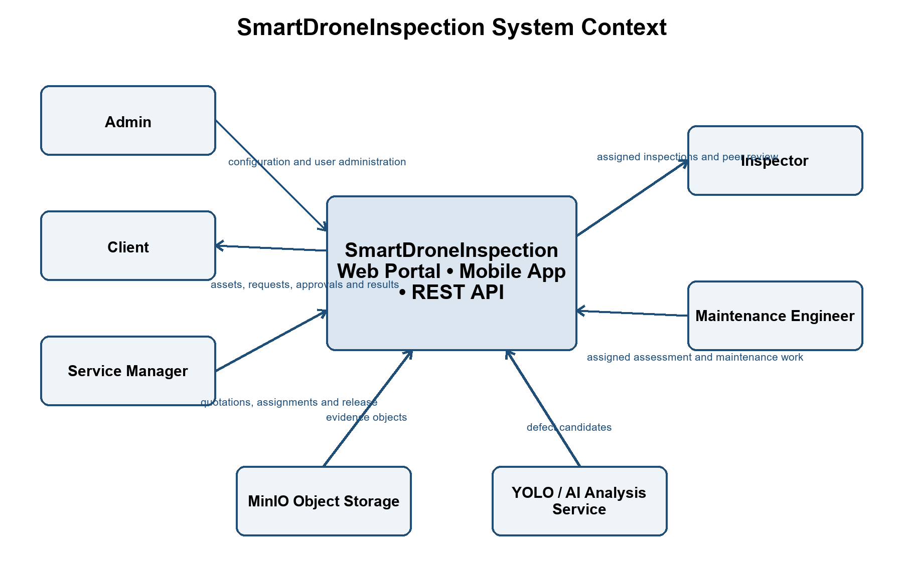

# II. Software Requirement Specification

## 1. Product Overview

SmartDroneInspection is an infrastructure inspection management platform. It coordinates the business lifecycle from customer assets and recurring inspection schedules to inspection requests, service orders, field evidence, verified findings, reports, maintenance tickets, and final resolution. The solution includes a web application for administration, customer operations, and service coordination; a mobile application for assigned field work; and a backend that owns business rules, authorization, transactional data, file access, and integration contracts.

The platform supports five actors: Admin, Service Manager, Inspector, Maintenance Engineer, and Client. A Client acts only within one customer organization. Inspectors and Maintenance Engineers work only on assigned resources. Service Managers coordinate service delivery across customer organizations. Admin manages platform configuration and identities but does not automatically receive permission to perform customer or service workflow actions.

A Client representative may self-register a new organization and the first Client account. The organization and account become active immediately after successful registration. Registration can create only the Client role; platform and service-workforce roles remain controlled by Admin. The Client signs in through the normal authentication flow after registration.

The product does not pilot drones, control flights, own drone telemetry, or replace site safety procedures. Inspection images may be transferred from a drone SD card, computer, web browser, or mobile device. MinIO stores authorized evidence objects. The configured YOLO service may propose defect candidates, but those candidates do not become official findings until an Inspector confirms or corrects them.

The main business flow is:

- WF1: the Client registers an asset and configures periodic inspection scheduling.
- WF2: the Client submits or completes an inspection request; the Service Manager reviews it, prepares a quotation and service order, and assigns an Inspector.
- WF3: the Inspector performs the inspection, uploads evidence, verifies AI candidates, prepares the report, and completes peer review before the Service Manager releases the report to the Client.
- WF4: the Client creates a maintenance ticket from verified findings; the Maintenance Engineer assesses and performs approved work; the Service Manager releases the result; and the Client accepts, requests rework, or requests re-inspection.

