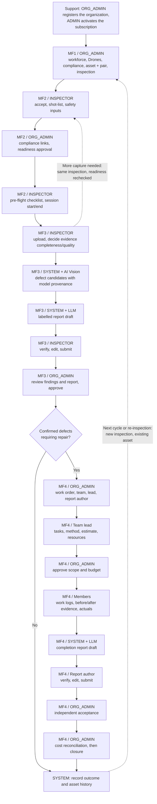

# SmartDroneInspection Business Flows — Enterprise SaaS

This document describes the current product target: a multi-tenant SaaS workspace rented by
infrastructure-owning companies. Four human roles, four connected Main Flows, no marketplace.

> **Requirements, not implementation.** These flows state required behaviour. On 8 October 2026 the
> backend delivered identity, organization registration, the 41-table target schema and the runtime
> cutover on VPS2, and then the MF3 workflow slice: evidence intake, the Inspector's evidence-quality
> decision, advisory AI candidates with a manual fallback, and versioned report authoring, independent
> ORG_ADMIN review, and immutable publication. MF1, MF2, and MF4 execution remains team work. See
> [database-design.md](database-design.md) §11 for what currently exists, and
> [Report 3](../reports/report-3-software-requirement-specification/03-functional-requirements.md)
> for the binding requirements text.

> **Replaces** the six-role marketplace reference, now retained as
> [business-flows-marketplace-v3.4.md](business-flows-marketplace-v3.4.md) for history only. Its
> Provider/Client roles, RFQ, quotation, commission and direct-transfer settlement descriptions are
> retired and must not be cited as current requirements.

## I. Ownership and roles

| Zone | Role | Responsibility |
| --- | --- | --- |
| Platform | `ADMIN` | Manages enterprise workspaces, subscription activation/renewal, technical and security settings, and authorized audited support access. Makes no customer technical conclusion, repair-budget decision, or internal acceptance. |
| Customer organization | `ORG_ADMIN` | Manages workforce, credentials, Drone fleet, assets with their assigned pair, inspections, readiness review, report approval, maintenance team/budget, and independent acceptance. Qualifications are personal: admin rights do not confer professional authority. |
| Customer workforce | `INSPECTOR` | Accepts assigned inspections, prepares the shot-list and compliance inputs, records field sessions, uploads evidence, decides its completeness/quality, and authors the inspection report draft. |
| Customer workforce | `MAINTENANCE_ENGINEER` | Works within assigned repair teams and tasks, supplies assessments and estimates, records work/evidence/actuals, and when designated acts as team lead or report author. |

`SYSTEM`, AI Vision and LLM are automated actors, not account roles.

**Team lead** and **report author** are per-work-order responsibilities held by
`MAINTENANCE_ENGINEER` accounts, not additional roles. Neither designation permits self-approval of
a budget or independent acceptance of the team's own work.

Actor zones: `PLATFORM` (ADMIN only) and `CUSTOMER_ORGANIZATION` (the three customer roles, each
scoped to exactly one organization). Every non-`ADMIN` user belongs to exactly one organization.

## II. Scope boundary — what the platform does not do

- No external Provider sourcing, RFQ, quotation, commission, or Client-Provider settlement. Repair
  costs are an internal cost register, not a payment system.
- No Drone flight control. A Start action records an operator decision; it never arms, pilots, or
  configures an aircraft. Waypoints, GSD and overlap are recorded intent, not flight parameters
  the platform enforces.
- No government permit issuance or registry verification. The platform records permit files,
  issuer references and validity, and requires a recorded human review. An airspace lookup is a
  planning warning, never a clearance.
- No autonomous approval. Every publication, acceptance and closure has a named human actor.
- No certified digital signature from an application checkbox. A signature reference is recorded
  only when a real signing service supplies one.

## III. Flow map



Only platform interactions and recorded decisions are steps. Real-world work — flying the Drone,
adjusting the camera, repairing the structure, measuring, isolating the area — happens outside the
application; users record what was done.

## IV. Main Flows

### MF1 — Organization resources, asset assignment and inspection setup

**Trigger:** an activated organization workspace. **Output:** managed resources plus one identified,
assigned inspection ready for MF2.

| Step | Actor | Action | Output and gate |
| --- | --- | --- | --- |
| MF1-01 | `ORG_ADMIN` | Open own workspace; maintain company identity, operational contacts and named authorized reviewers. | Named responsibility. No cross-tenant management. |
| MF1-02 | `SYSTEM` | Authenticate and check role, organization and subscription entitlement. | Disallowed operations denied; expiry/renewal guidance shown without deleting existing history. |
| MF1-03 | `ORG_ADMIN` | Provision `INSPECTOR` and `MAINTENANCE_ENGINEER` accounts; enable, update or suspend them. | Active workforce records. Suspension removes future assignment eligibility. |
| MF1-04 | `ORG_ADMIN` | Record applicable skills and credentials: qualification, training, issuer/reference, dates and evidence. Health or insurance documents only where lawfully required. | Reviewable credential history. Not every occupation requires the same licence. |
| MF1-05 | `SYSTEM` | Validate document type/subject and dates; calculate expiry warnings and record review status. | Missing, expired and suspended status visible. Machine validation is not government verification. |
| MF1-06 | `ORG_ADMIN` | Register each company Drone by unique identifier/serial, model, payload where applicable, serviceability and maintenance/registration documents. | Identified Drone usable as an assignment reference. Unavailable devices are not eligible for release. |
| MF1-07 | `ORG_ADMIN` | Maintain flight-permit and other compliance files: issuer/reference, geographic/time scope and conditions. | Application, issued permission, expiry, rejection and revocation stay distinct. The platform does not apply to an authority. |
| MF1-08 | `ORG_ADMIN` | Enter asset code/category, components, location, scope context, site access, contact, source documents and known limitations. | Own-organization asset profile. An informational airspace warning does not authorize flight. |
| MF1-09 | `ORG_ADMIN` | In the same asset-creation workflow, select exactly one responsible Inspector and one identified Drone from own resources. | Default Inspector + Drone pair attached to the asset. |
| MF1-10 | `SYSTEM` | Validate asset-code uniqueness, same organization, active users and a valid Drone reference; save asset and pair together and audit. | No partially created asset missing its pair. The pair is an operational default, not a flight permit or exclusive Drone reservation. |
| MF1-11 | `ORG_ADMIN` | Create an inspection for this asset: objective, component scope, acceptance criteria, requested dates, and cadence where needed. | New inspection ID reusing the existing asset. No procurement or RFQ step. |
| MF1-12 | `SYSTEM` | Inherit the current asset pair into the inspection, snapshot scope/defaults, and test known Inspector/Drone schedule conflicts. | Draft/assigned inspection distinct from the mutable asset default. A due-cycle retry cannot duplicate it. |
| MF1-13 | `ORG_ADMIN` | Confirm pair, dates and scope. For reassignment, record the reason and whether it affects this inspection only or future asset defaults. | Versioned assignment. Unresolved conflicts, disabled users and unavailable Drones block dispatch. |
| MF1-14 | `SYSTEM` | Dispatch the assigned inspection to the Inspector; attach source-document references and notify. | Hand-off to MF2: inspection ID, asset, scope, dates, Inspector, Drone and applicable document references. |

**Exceptions:** missing resources keep setup incomplete — the user selects or adds appropriate
resources rather than the SYSTEM inventing them. Updated default assignments never rewrite past
inspection snapshots. A known expiry at the planned time is flagged; the complete mission-specific
permit decision is made in MF2. Cadence changes affect future due work, not published history.

### MF2 — Mission preparation, assignment response and readiness

**Trigger:** an assigned inspection. **Output:** an audited readiness decision plus one or more
ended field-session records under the same inspection.

| Step | Actor | Action | Output and gate |
| --- | --- | --- | --- |
| MF2-01 | `INSPECTOR` | Open the assignment; review asset, scope, dates, assigned Drone and relevant documents. Accept or reject with a reason. | Rejection returns to `ORG_ADMIN` in MF1. No self-selection of an unassigned Drone. |
| MF2-02 | `SYSTEM` | Check assignment and organization, record the response and notify `ORG_ADMIN`. | Only the assigned Inspector responds. Accepting is not itself readiness. |
| MF2-03 | `INSPECTOR` | Prepare the component shot-list, required evidence types and checklist; identify access limitations, proposed field-session times and known hazards on the app. | Reviewable preparation version. Hardware configuration is out of scope. |
| MF2-04 | `ORG_ADMIN` | Link the actual applicable issued permit/permission and credential/Drone records; document airspace-source checks, scope and time coverage, and conditions. | Missing authorization cannot be waived internally. A genuine exemption requires a recorded legal basis and supporting review. |
| MF2-05 | `SYSTEM` | Validate required links, document dates/status, pair, plan version and known conflicts against the planned session time. | Blockers listed. Ambiguous authority or geographic conditions require human verification, not inferred clearance. |
| MF2-06 | `INSPECTOR` | Read the restrictions and preparation checklist; record safety acknowledgments and submit the preparation. | Attributable Inspector submission. An acknowledgment is not a statutory licence or guaranteed digital signature. |
| MF2-07 | `ORG_ADMIN` | As the named qualified reviewer, inspect the preparation and compliance basis. Approve or return with reasons. | `READY_FOR_FLIGHT` only when all applicable mandatory conditions pass. Reviewer identity and source-document versions recorded. |
| MF2-08 | `SYSTEM` | Snapshot the approved plan, pair and documents; notify the Inspector. | A material plan, pair, permit or schedule change invalidates readiness and requires review again. |
| MF2-09 | `INSPECTOR` | On site, identify the assigned Drone, complete the current pre-flight checklist, then request Start or record a postponement/interruption reason. | No software control of the Drone. Weather and site safety can cause postponement even after approval. |
| MF2-10 | `SYSTEM` | Immediately recheck entitlement, assignment, readiness version and required validity; on success record `IN_PROGRESS`, Inspector, Drone and session start time. | Stale, expired or revoked readiness is rejected. Start does not arm the aircraft or establish hardware flight time. |
| MF2-11 | `INSPECTOR` | On the app, record checklist results, observations/incidents, then End, pause/abort or postpone. | Actual collected coverage, limitations and timestamps. Government incident reporting remains the responsible person's duty. |
| MF2-12 | `SYSTEM` | Save the session outcome/end; mark that session `FIELD_COMPLETED` only when ended, preserving previous sessions. | Hand-off to MF3: session references, checklist/shot-list, pair and compliance snapshot. Not overall inspection completion or report approval. |

**Additional capture:** the Inspector may request another session for the same inspection from MF3.
Return to preparation/readiness before Start, especially when time, scope or permits changed. Do not
jump from missing evidence to an unconditional Start.

### MF3 — Evidence, AI candidates, inspection report and publication

**Trigger:** an ended MF2 session with available evidence. **Sequence:** AI Vision detection → LLM
draft → human author verification → qualified human review → publication.

| Step | Actor | Action | Output and gate |
| --- | --- | --- | --- |
| MF3-01 | `INSPECTOR` | Upload original evidence to the correct inspection and session; add component/capture context where metadata is missing. | Attributable files. No automatic quality acceptance. |
| MF3-02 | `SYSTEM` | Validate technical intake, compute the hash, store source references and display upload/processing errors. | Valid stored files. Corrupt, wrong-type, oversize and duplicate failures identify the corrective action. |
| MF3-03 | `INSPECTOR` | Compare evidence with the shot-list and directly decide completeness and quality. Re-upload a file or request another MF2 session. | Inspector's documented adequate/insufficient decision. The SYSTEM does not decide image usefulness. |
| MF3-04 | `SYSTEM` | Snapshot the evidence set after Inspector confirmation; preserve missing-metadata and coverage flags. | Source set eligible for processing. Later changes make dependent drafts and review confirmations stale. |
| MF3-05 | `SYSTEM` / AI Vision | Run compatible detection on eligible images; store suggested defects with model provenance. | Non-official candidates. The manual path stays available on failure or incompatibility. |
| MF3-06 | `INSPECTOR` | Add source-backed field observations, annotations and any manual findings or notes needed for drafting. | Candidate/observation packet. Measurements require a documented method and unit, not pixel guesswork. |
| MF3-07 | `SYSTEM` / LLM | After detection, generate a labelled `DRAFT` from authorized asset/scope/session/checklist/evidence references plus candidate and observation data. | Source-linked narrative. Candidate statements are labelled unverified; missing facts stay unknown. |
| MF3-08 | `INSPECTOR` — report author | Read and edit the entire draft; verify identifiers, equipment, coverage, findings, uncertainty and recommendations against sources; submit the reviewed version. | Human author confirmation and submitted version. Unsupported causes and measurements removed. |
| MF3-09 | `ORG_ADMIN` — qualified reviewer | Review source evidence; accept, modify or reject candidates; confirm manual findings; review text and limitations. Return with reasons or approve. | Final finding decisions and report sign-off. No self-review by the author and no default acceptance on a timer. |
| MF3-10 | `SYSTEM` | Apply reviewer-approved structured finding changes and totals to the draft; return to MF3-08/MF3-09 if the narrative must be regenerated or edited. | Text and findings agree. Any material change invalidates the prior sign-off. |
| MF3-11 | `SYSTEM` | Publish the approved report version and PDF with author, reviewer, date, source index and approval record; apply qualified digital-signature integration only if one is supplied. | Immutable official version. A logged application approval alone is not a certified digital signature. |
| MF3-12 | `ORG_ADMIN` | Mark required corrective items with priorities and deadlines, or record that no corrective work is required within the observed scope. | Approved repair list only. No empty work order for a no-repair outcome. |
| MF3-13 | `SYSTEM` | Update inspection and asset history; hand approved corrective items to MF4 with report-version and finding references. | Pending corrective work stays visible. If none is required, close the outcome with limitations preserved. |

**Report scope:** MF3 produces a point-in-time asset inspection record. It is not a flight permit,
not proof the asset is structurally safe, and not a repair-completion certificate. AI suggestions
never become official findings without a human decision, and an LLM draft never becomes a
published report without the author and reviewer gates above.

### MF4 — Repair team, cost control, completion reporting and acceptance

**Trigger:** published MF3 findings requiring repair. MF4 manages the organization's internal repair
team, approved scope, estimates, changes, actuals and closeout.

| Step | Actor | Action | Output and gate |
| --- | --- | --- | --- |
| MF4-01 | `SYSTEM` | Propose or create a draft work order for selected repair-required findings; link asset, inspection, published report version and source evidence; check duplicates. | Traceable draft. No second active work item for the same scope without a stated reason. |
| MF4-02 | `ORG_ADMIN` | Triage priority, corrective scope, due date, access/safety constraints and acceptance criteria; identify urgent controls in the record. | Explicit work-order scope. No automatic claim that controls were physically applied. |
| MF4-03 | `ORG_ADMIN` | Select qualified own-organization members; designate exactly one lead, one report author and one independent qualified accepting `ORG_ADMIN`. | Attributable team assignment. Not a new role and not an external Provider. |
| MF4-04 | `SYSTEM` | Validate active membership, applicable skills and credential dates, organizational scope and reviewer independence; notify assigned people. | No release when a required assignment, credential or reviewer is missing. |
| MF4-05 | Team lead — `MAINTENANCE_ENGINEER` | Accept or return the planning assignment; record remote or site assessment; divide approved defect scope into tasks with proposed assignees, method and verification needs. | Technical task plan. Unexpected evidence stays linked to the source finding without rewriting MF3. |
| MF4-06 | Team lead — `MAINTENANCE_ENGINEER` | Prepare an estimate version: labour hours and rates, material quantities and unit prices, equipment/tools, applicable services and supporting quotes; propose dates and permitted contingencies. | Itemized estimate and assumptions. The Engineer supplies rates and data, not the LLM. |
| MF4-07 | `SYSTEM` | Validate decimal, currency and quantity inputs; calculate estimate totals; show resources, documents and missing cost lines. | Reviewable baseline candidate. Unpriced work is never silently recorded as zero. |
| MF4-08 | `ORG_ADMIN` | Review technical method, safety/access preparation, acceptance criteria and estimate. Approve scope/budget/version or return with reasons. | Frozen initial approved baseline. The lead or report author cannot approve their own estimate. |
| MF4-09 | Team lead and assigned members — `MAINTENANCE_ENGINEER` | Confirm task acceptance, dates, resources and applicable work-permit or isolation evidence on the app. | Ready task roster. Resources awaiting availability stay blocked, not falsely in progress. |
| MF4-10 | `SYSTEM` | Recheck approved scope/budget, team and applicable prerequisites before recording execution start. | `IN_PROGRESS` for recorded authorized work. No machine actuation or physical safety guarantee. |
| MF4-11 | Assigned members — `MAINTENANCE_ENGINEER` | Enter task progress, hours, materials actually consumed, equipment/service usage, before/during/after evidence and measured or test results. | Attributable task-level actuals and evidence. No self-acceptance of a finished repair. |
| MF4-12 | Team lead and members — `MAINTENANCE_ENGINEER` | For unexpected scope, cost or time, stop the affected additional work on the app and submit a change request with reason, evidence and delta estimate. | Versioned pending change. Unaffected approved tasks continue only where safe and independent. |
| MF4-13 | `ORG_ADMIN`, then `SYSTEM` | Approve, reject or return the change. The SYSTEM preserves the initial baseline and calculates the revised authorized amount and dates from approved changes only. | Changed scope is released only after approval. Rejected changes never enlarge the budget. |
| MF4-14 | Team lead — `MAINTENANCE_ENGINEER` | Consolidate member completion, actual quantities and hours, as-left condition, paired evidence, tests and unresolved issues; mark the physical work reported complete. | `WORK_COMPLETED` is a team declaration, not `ACCEPTED` or `CLOSED`. |
| MF4-15 | Report author — `MAINTENANCE_ENGINEER` | Check the team's source records, receipt/cost links and evidence; request draft generation when the completion packet is ready. | Named author and a versioned source packet. Missing mandatory evidence blocks evidence-free submission. |
| MF4-16 | `SYSTEM` / LLM | Generate a labelled completion-report draft from approved scope, baseline, changes, verified work logs, actuals and evidence. | Draft narrative plus SYSTEM-calculated cost tables. It cannot state "accepted" before the independent decision. |
| MF4-17 | Report author — `MAINTENANCE_ENGINEER` | Read and edit the entire draft; verify facts, tests, costs, variance and residual issues; confirm and submit. | Author-verified `SUBMITTED_FOR_ACCEPTANCE`. The team never independently accepts itself. |
| MF4-18 | Independent qualified `ORG_ADMIN` | Compare completion against scope and acceptance criteria, source proof and tests. Accept, Return for Rework, or Request Re-inspection, with reasons. | Technical acceptance record. Rework returns to the relevant tasks; necessary re-inspection creates a linked MF1 inspection. |
| MF4-19 | `ORG_ADMIN` — authorized cost reviewer | Reconcile actuals and receipts against the approved baseline and changes; record variance explanations and the financial review disposition. | Separate cost reconciliation. Unresolved missing, duplicate or unapproved costs block final closure, not historical recording. |
| MF4-20 | `SYSTEM` | Once tasks, author review, technical acceptance, cost review and pending changes are resolved, publish the completion report with the acceptance record and close the work order. | `CLOSED`. Repair disposition and asset history update without altering the original MF3 findings or report. |
| MF4-21 | `ORG_ADMIN`, then `SYSTEM` | Record follow-up or warranty conditions where applicable; check whether all required corrective work for the inspection has closed. | Unresolved corrective scope stays visible. Do not mark the lifecycle complete while required work is open. |

## V. Cost and change control

```text
approved_budget B = initial_approved_baseline + sum(approved_change_deltas)
actual_total   A = sum(reconciled actual cost lines)
variance       V = A - B
variance_percent = 100 * V / B   when B > 0, otherwise not applicable
```

The SYSTEM calculates totals with decimal arithmetic. A missing price is unknown, not zero.
Contingency is not an incurred expense. A cost line is never silently changed from estimate to
actual.

## VI. Status vocabularies

```text
inspections:
DRAFT -> ASSIGNED -> PREPARING -> READY_FOR_FLIGHT -> IN_PROGRESS
      -> FIELD_COMPLETED -> REPORT_DRAFT -> REPORT_PUBLISHED
      -> REPAIR_PENDING -> COMPLETED

maintenance_work_orders:
DRAFT -> AWAITING_APPROVAL -> APPROVED -> READY -> IN_PROGRESS
      -> WORK_COMPLETED -> SUBMITTED_FOR_ACCEPTANCE -> ACCEPTED
      -> COST_RECONCILED -> CLOSED
IN_PROGRESS -> REWORK_REQUIRED -> IN_PROGRESS
SUBMITTED_FOR_ACCEPTANCE -> REINSPECTION_REQUIRED -> linked inspection
```

`WORK_COMPLETED` is a team declaration; `CLOSED` requires independent acceptance and reconciled
costs. These are target states, not a claim that the backend enums already carry them.

The MF3 inspection and report chain is the exception: those states are now
implemented. `FIELD_COMPLETED -> REPORT_DRAFT -> REPORT_PUBLISHED ->
REPAIR_PENDING | COMPLETED` is enforced by `Inspection`, and `DRAFT ->
AUTHOR_VERIFIED -> SUBMITTED -> RETURNED | APPROVED -> PUBLISHED ->
SUPERSEDED` by `InspectionReportVersion`.

## VII. Cross-cutting rules

1. **One tenant owns every business record.** Organization scope is checked in services and scoped
   repository queries, never by filtering in memory.
2. **Role is not authority.** A role check alone admits nothing without matching organization,
   ownership, assignment or separation-of-duties scope.
3. **Snapshot history is immutable.** Approved report versions, estimate baselines and audit events
   are never edited; corrections create a linked version.
4. **AI output is separate from human decisions.** Candidates are not findings; drafts are not
   approved reports; the LLM never calculates authoritative financial totals.
5. **Completion is not acceptance.** Physical work being reported done requires an independent
   qualified reviewer before closure.
6. **Evidence bytes stay in MinIO.** PostgreSQL stores object identity, checksum, metadata,
   ownership and workflow links only.
7. **Notifications never grant access.** They point to the next accountable user; the backend
   still performs the scope check.

## VIII. Implementation status

| Area | Status on 8 October 2026 |
| --- | --- |
| Roles, organization registration, audit | Delivered and verified on VPS2 |
| Target schema (41 tables) and runtime cutover | Delivered and verified on VPS2 |
| Asset catalog, categories, checklists | Runtime present; MF1 pair/inspection workflow not implemented |
| MF3 evidence, quality decision, findings, versioned report and publication | Implemented and verified on 8 October 2026 |
| MF1, MF2, MF4 workflow execution | Not implemented. Team-owned work. |

Report 5 records the nine target acceptance cases (`WF2-005`-`WF2-007`, `WF3-005`-`WF4-005`) as
`Pending`. They stay `Pending` until matching execution evidence exists; a table or schema row is
not workflow evidence.

## IX. Source reference

- [Report 3 Functional Requirements](../reports/report-3-software-requirement-specification/03-functional-requirements.md) — binding requirements text and step definitions
- [Database design](database-design.md) — 41-table storage contract and authorization invariants
- [Backend architecture](../backend/architecture.md) — module map and runtime status
- [Authentication and access control](../backend/authentication-and-authorization.md) — identity and registration contract
- [Report 5 test report](../reports/report-5-test-report/) — test cases and recorded results
- Historical marketplace reference: [business-flows-marketplace-v3.4.md](business-flows-marketplace-v3.4.md)