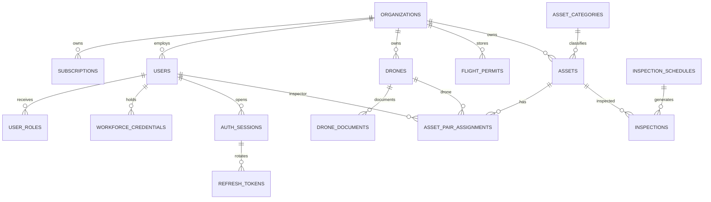
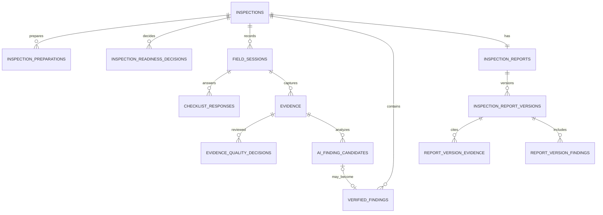
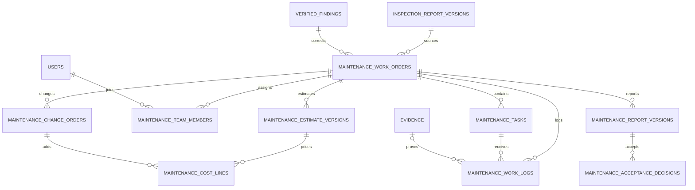

# SmartDroneInspection Database Design

> **Scope:** This document is the database-design companion to the Report 3 SRS revision dated **7 October 2026**. It specifies the Enterprise SaaS target with four human roles and four connected Main Flows; the 41-table count below is a target logical inventory, not a completed database inventory.
>
> **Implementation status — 7 October 2026:** Backend V24 aligns identity vocabulary and performs a fail-closed role/zone migration; V25 is an additive bridge that creates the target tables. `V26__enterprise_saas_runtime_cutover.sql` completes the runtime cutover: it drops every non-target marketplace, old-client and MF5 table, tightens composite tenant foreign keys, and enforces the target status vocabularies. The resulting runtime schema is exactly the 41 application tables plus `event_publication` and `flyway_schema_history`. Schema cutover is complete; MF1-MF4 workflow implementation remains out of scope. A table's presence is not evidence that its use case or MF1–MF4 workflow is implemented. See the current backend plan and migration files for executable details.
>
> **Change boundary:** This design supersedes the former Provider/Client marketplace and MF1–MF5 target schema proposal. The current companion status/report references were also reconciled on 7 October 2026; Report 3 remains the source of business requirements. Backend migrations and code are owned by the backend repository and must not be inferred from this design alone.

## 1. Target model and boundaries

SmartDroneInspection is a multi-tenant SaaS workspace rented by infrastructure-owning organizations. The platform manages:

```text
Enterprise subscription
        -> organization workforce, Drone and compliance records (MF1)
        -> asset + default Inspector/Drone pair + inspection setup (MF1)
        -> mission preparation, Compliance Gate and field session (MF2)
        -> evidence, AI candidates, LLM draft and approved inspection report (MF3)
        -> repair team, work order, cost control, LLM completion report and acceptance (MF4)
```

The system does **not** store or control:

- RC flight commands, camera controls or Drone SDK state;
- a Provider marketplace, quotations between Client and Provider, commissions or platform-held repair funds;
- an accounting ledger, payroll system, procurement system or statutory tax-invoice engine;
- a government permit registry or an automatic legal conclusion;
- an autonomous AI approval or a report accepted only because an LLM generated it.

### 1.1 Human roles

| Role | Data responsibilities |
| --- | --- |
| `ADMIN` | Platform tenant/subscription administration, technical/security settings and authorized support/audit. No default customer technical or repair acceptance authority. |
| `ORG_ADMIN` | Organization users, credentials, Drone fleet, permits, assets, asset-pair assignment, inspection setup, readiness/report review, repair team/budget assignment and independent acceptance. |
| `INSPECTOR` | Assigned inspection preparation, field-session records, evidence upload and substantive evidence-quality decision; inspection report author verification. |
| `MAINTENANCE_ENGINEER` | Assigned repair tasks, team lead/report-author responsibilities when designated, work logs, actuals, evidence and maintenance-report author verification. |

`SYSTEM`, AI Vision and LLM are automated components, not rows in `users` and not approvers.

### 1.2 Flow ownership and storage home

| Flow | Primary records | Handover |
| --- | --- | --- |
| MF1 — Resources, assets, pair assignment and inspection setup | `organizations`, `subscriptions`, workforce credentials, Drones, permits, `assets`, `asset_pair_assignments`, `inspections` | Inspection ID, scope/dates, Inspector + Drone snapshot and compliance references → MF2 |
| MF2 — Preparation, Compliance Gate and field-session records | `inspection_preparations`, `inspection_readiness_decisions`, `field_sessions`, `checklist_responses` | Ended field session, checklist, shot-list and readiness snapshot → MF3 |
| MF3 — Evidence, AI Vision, LLM report and review | `evidence`, evidence-quality decisions, candidates, findings, report versions and source links | Published inspection report version + confirmed repair-required findings → MF4 |
| MF4 — Team repair, cost control, LLM completion report and acceptance | Work orders/tasks/team assignments, estimate/change/actual cost lines, work logs, repair evidence, completion reports and acceptance | Accepted repair disposition, reconciled cost and updated asset history |

## 2. Design principles

1. **Organization scope is explicit.** Every operational aggregate has `organization_id` directly or through a foreign-key chain that cannot cross organizations.
2. **Assignment scope is explicit.** Inspection access requires the assigned Inspector or an authorized `ORG_ADMIN`; repair access requires work-order/team/task assignment.
3. **The asset pair is historical data.** An asset has a current/default Inspector + specific Drone pair, but each inspection snapshots the pair. Changing the default never rewrites past inspections.
4. **Published records are append-only.** Inspection reports, maintenance reports, decisions, cost baselines and change decisions are versioned. Corrections create a linked version.
5. **Evidence bytes stay in MinIO.** PostgreSQL stores object identity, checksum, metadata, ownership and workflow links; it does not store large image/video bytes.
6. **AI output is separate from human findings.** AI candidates cannot be used as official defects until a human decision records confirmation, modification or rejection.
7. **LLM output is separate from approved reports.** A draft stores model provenance and source references. It cannot become published/accepted without the named human gates.
8. **Estimate, approved budget, actual and variance are different values.** A cost line is never silently changed from estimate to actual.
9. **Completion is not acceptance.** A team can report physical work complete; an independent qualified reviewer must accept it before closure.
10. **Forward-only implementation.** Applied migrations are immutable. This document does not authorize editing, dropping or renumbering migrations.

## 3. Right-sized logical schema

The target design contains **41 application tables** plus optional framework infrastructure such as Spring Modulith `event_publication`. Table count is a design inventory, not an implementation claim.

| Area | Tables | Count |
| --- | --- | ---: |
| Tenant, subscription and access | `organizations`, `subscriptions`, `users`, `user_roles`, `auth_sessions`, `refresh_tokens` | 6 |
| Workforce and compliance | `workforce_credentials`, `drones`, `drone_documents`, `flight_permits` | 4 |
| Asset and MF1 setup | `asset_categories`, `checklist_templates`, `checklist_items`, `assets`, `asset_documents`, `asset_pair_assignments`, `inspection_schedules`, `inspections` | 8 |
| MF2 preparation and field | `inspection_preparations`, `inspection_readiness_decisions`, `field_sessions`, `checklist_responses` | 4 |
| MF3 evidence, findings and reports | `evidence`, `evidence_quality_decisions`, `ai_finding_candidates`, `verified_findings`, `inspection_reports`, `inspection_report_versions`, `report_version_evidence`, `report_version_findings` | 8 |
| MF4 repair and cost | `maintenance_work_orders`, `maintenance_tasks`, `maintenance_team_members`, `maintenance_estimate_versions`, `maintenance_cost_lines`, `maintenance_change_orders`, `maintenance_work_logs`, `maintenance_report_versions`, `maintenance_acceptance_decisions` | 9 |
| Cross-cutting | `audit_events`, `notifications` | 2 |

The inventory is intentionally explicit so a later migration review can reconcile every Report 3 step with a storage home. No Provider organization, RFQ, commission, marketplace dispute or MF5 table belongs in this target design.

## 4. PostgreSQL conventions

| Java/domain value | PostgreSQL representation | Rule |
| --- | --- | --- |
| `UUID` | `uuid` | `gen_random_uuid()` default for new entity identifiers. |
| `Instant` | `timestamptz` | Store an absolute instant; display in organization/user timezone. |
| Enum/status | `varchar` + check constraint | Status changes require a forward migration; no silent spelling changes. |
| Money/rate | `numeric(18,2)` | Never binary floating point. Every cost aggregate has an explicit currency and tax basis. |
| Quantity/rate | `numeric(18,6)` | Preserve enough precision for labor hours, material quantities and unit rates. |
| Version | `bigint` or positive `integer` | Optimistic locking/version ordering; published versions are immutable. |
| Flexible snapshot | `jsonb` | Only for immutable source snapshots, model metadata, structured references or organization-specific fields; not a substitute for core foreign keys. |
| File bytes | MinIO object | PostgreSQL stores `object_key`, checksum, media metadata and ownership links only. |

### 4.1 Common columns

Mutable aggregates use:

```sql
id uuid primary key default gen_random_uuid(),
created_at timestamptz not null,
updated_at timestamptz not null,
row_version bigint not null default 0
```

Append-only decisions, evidence metadata and versions use `created_at` plus their actor/time fields and must not be updated after finalization. Historical business records are retired/cancelled/superseded rather than hard-deleted. Foreign keys default to `ON DELETE RESTRICT`; authentication children may use `CASCADE` only where no operational history is lost.

## 5. Relationship overview







## 6. Data dictionary

When a definition below says **mutable aggregate columns**, it means `created_at TIMESTAMPTZ`, `updated_at TIMESTAMPTZ`, and `row_version BIGINT NOT NULL DEFAULT 0`. Append-only child/version tables include `created_at TIMESTAMPTZ`.

### 6.1 Tenant, subscription and access

#### `organizations`

| Column | Type | Constraint/purpose |
| --- | --- | --- |
| `id` | `uuid` | PK. |
| `legal_name` | `varchar(250)` | Required legal organization name. |
| `display_name` | `varchar(200)` | Required workspace name. |
| `registration_code` | `varchar(64)` | Unique platform organization code. |
| `timezone` | `varchar(64)` | Organization display timezone. |
| `status` | `varchar(24)` | `PENDING`, `ACTIVE`, `SUSPENDED`, `CLOSED`. |
| `created_by_user_id` | `uuid` | Initial ORG_ADMIN after atomic creation. |
| common columns | — | Timestamps and optimistic version. |

The organization is the tenant boundary. It is not a Provider organization and does not participate in marketplace quotation or commission settlement.

#### `subscriptions`

| Column | Type | Constraint/purpose |
| --- | --- | --- |
| `id` | `uuid` | PK. |
| `organization_id` | `uuid` | FK `organizations`; RESTRICT. |
| `plan_code` | `varchar(32)` | Only `ENTERPRISE`. |
| `billing_period_months` | `smallint` | Check `IN (1, 6, 12)`. |
| `status` | `varchar(24)` | `PENDING`, `ACTIVE`, `PAST_DUE`, `SUSPENDED`, `EXPIRED`, `CANCELLED`. |
| `starts_at`, `ends_at` | `timestamptz` | Entitlement window. |
| `external_reference` | `varchar(128)` | Administrative invoice/payment reference; not a payment token. |
| `terms_snapshot` | `jsonb` | Immutable accepted subscription terms. |
| `confirmed_by_user_id`, `confirmed_at` | `uuid`, `timestamptz` | Activation decision attribution. |

At most one subscription may be `ACTIVE` for an organization. A future migration must pre-check populated data before adding that partial unique index.

#### `users`, `user_roles`, `auth_sessions`, `refresh_tokens`

- `users`: `id`, `organization_id` nullable only for platform `ADMIN`, normalized email, full name, status (`ACTIVE`, `SUSPENDED`, `DISABLED`), `auth_version`, password hash and timestamps.
- `user_roles`: `user_id`, `role`; unique `(user_id, role)`. Allowed roles are exactly `ADMIN`, `ORG_ADMIN`, `INSPECTOR`, `MAINTENANCE_ENGINEER`.
- `auth_sessions`: user, client type (`WEB`/`MOBILE`), expiry, revoked time/reason.
- `refresh_tokens`: session, token hash, issued/expiry/revoked timestamps. Raw tokens are never stored.

Every non-`ADMIN` user belongs to exactly one organization. Cross-table role/organization policies are also enforced in application services because PostgreSQL local checks cannot validate all authorization rules.

### 6.2 Workforce and compliance

#### `workforce_credentials`

Stores relevant qualifications, training, fitness/insurance documents where applicable and their validity:

- `organization_id`, `user_id`, `credential_type`, issuer/reference;
- `issued_at`, `expires_at`, `status` (`DRAFT`, `PENDING_REVIEW`, `ACTIVE`, `EXPIRING_SOON`, `EXPIRED`, `REJECTED`, `SUSPENDED`);
- `evidence_id`, verifier, verification time and reason.

This records internal document management; it does not claim government registry verification or create a professional licence.

#### `drones` and `drone_documents`

`drones` stores organization-owned devices: `organization_id`, serial, model/manufacturer, payload metadata, serviceability (`ACTIVE`, `MAINTENANCE`, `SUSPENDED`, `RETIRED`), maintenance dates and notes. Unique `(organization_id, serial_number)` prevents duplicate devices in a tenant.

`drone_documents` stores registration/identification, technical, maintenance and insurance documents with issuer/reference, validity window, status, MinIO object key/checksum and ORG_ADMIN review attribution. A suspended/retired Drone or expired mandatory document cannot pass MF2 readiness.

#### `flight_permits`

Stores organization permit/permission records without issuing them: `organization_id`, optional asset/area, permit type, issuing authority/reference, geographic scope/route JSON, `valid_from`, `valid_until`, conditions, status (`APPLICATION`, `ACTIVE`, `EXPIRED`, `REJECTED`, `REVOKED`, `NOT_APPLICABLE`), source evidence and review attribution.

A readiness decision references the permit and snapshots its version/status. A public map lookup is not an `ACTIVE` permit.

### 6.3 Asset and MF1 setup

#### `asset_categories`, `checklist_templates`, `checklist_items`

- `asset_categories`: platform categories plus optional organization-specific categories.
- `checklist_templates`: versioned template, context (`MF2_FIELD`, `MF3_EVIDENCE`, `MF4_ACCEPTANCE`), active period and author.
- `checklist_items`: typed item, order, required flag, evidence requirement and template FK.

A response references the exact template/item version used; later edits do not rewrite historical responses.

#### `assets`

Stores `organization_id`, unique organization-local code, category, name/type, location JSON, technical profile JSON, source documents and status (`ACTIVE`, `INACTIVE`, `RETIRED`).

#### `asset_documents`

Stores asset drawings, manuals and historical files: asset, type/version, object key/checksum/size/media type, uploader, status and timestamps. Published documents are not overwritten.

#### `asset_pair_assignments`

The MF1 pair record stores `organization_id`, `asset_id`, `inspector_user_id`, `drone_id`, `valid_from`, `valid_until`, status (`DRAFT`, `ACTIVE`, `SUPERSEDED`, `SUSPENDED`), reason, assigned by/time and version.

The target invariant permits one current active default pair per asset and requires Inspector, Drone and asset to share the organization. A pair is a default operational assignment, not a permanent Drone reservation.

#### `inspection_schedules` and `inspections`

`inspection_schedules` stores optional cadence, next due time, scope defaults and active status.

`inspections` is the MF1 inspection aggregate: organization, asset, schedule/cycle key, objective, scope/component scope, acceptance criteria, planned dates, assignment snapshot (`asset_pair_assignment_id`, `inspector_id`, `drone_id`) and status:

```text
DRAFT -> ASSIGNED -> PREPARING -> READY_FOR_FLIGHT
      -> IN_PROGRESS -> FIELD_COMPLETED -> REPORT_DRAFT
      -> REPORT_PUBLISHED -> REPAIR_PENDING -> COMPLETED
```

A due-cycle uniqueness key prevents duplicate generated inspections. Past snapshots never change when the asset default pair changes.

### 6.4 MF2 preparation and field records

#### `inspection_preparations`

Versioned preparation records: inspection, Inspector, preparation version, component shot-list JSON, evidence types, access constraints, safety observations, permit/document references, submitted time and status (`DRAFT`, `SUBMITTED`, `RETURNED`, `READY`).

#### `inspection_readiness_decisions`

Append-only decisions: inspection, preparation version, decision (`APPROVED`, `RETURNED`, `INVALIDATED`), ORG_ADMIN reviewer, time/reason, permit/credential/Drone-document snapshot IDs and source hash. `APPROVED` is usable for `READY_FOR_FLIGHT` only when all applicable requirements pass.

#### `field_sessions`

Records app-only sessions: inspection, organization, Inspector, assigned Drone snapshot, readiness version, status (`PLANNED`, `IN_PROGRESS`, `FIELD_COMPLETED`, `POSTPONED`, `ABORTED`), start/end, postponement/abort reason, checklist version and limitations. It does not require flight-control telemetry and does not imply the app piloted the aircraft.

#### `checklist_responses`

Stores context, template/item version, responder, typed answer JSON, notes, evidence reference and timestamp. Revisions are preserved; current-answer uniqueness is enforced by the context/item/version key.

### 6.5 MF3 evidence, findings and reports

#### `evidence`

Shared evidence metadata for inspection and repair:

- organization, optional inspection/session/work-order/task/work-log parents;
- kind (`INSPECTION_SOURCE`, `INSPECTION_ANNOTATION`, `BEFORE_REPAIR`, `DURING_REPAIR`, `AFTER_REPAIR`, `TEST_RESULT`, `DOCUMENT`);
- MinIO object key, SHA-256, size, media type, source (`WEB`, `MOBILE`, `SD_CARD`, `IMPORTED`), available capture/GPS/device metadata;
- uploader, created time and immutable-original flag.

At least one workflow parent is required. Duplicate checksum within the same inspection/work-log scope is rejected. Original files are not overwritten.

#### `evidence_quality_decisions`

Inspector-controlled decision per evidence set/version: `PENDING`, `ACCEPTED`, `REUPLOAD_REQUIRED`, `ADDITIONAL_SESSION_REQUIRED`, `LIMITED`. Stores shot-list comparison, limitation reason, Inspector and time. Technical intake cannot create `ACCEPTED` by itself.

#### `ai_finding_candidates`

Stores AI Vision suggestions: inspection/evidence, model/provider/version, label/confidence/region, raw-result reference, processing status and timestamps. Status: `PENDING`, `CONFIRMED`, `MODIFIED`, `REJECTED`, `ERROR`. Candidates are never official findings by default.

#### `verified_findings`

Stores human findings: inspection, source candidate optional, component/location, description, observed condition, severity/priority, measurement JSON with method/unit, decision (`CONFIRMED`, `MODIFIED`, `REJECTED`), decided by/time, rationale and repair-required flag. Rejected candidates remain auditable but cannot create approved repair work.

#### `inspection_reports`, `inspection_report_versions`, `report_version_evidence`, `report_version_findings`

`inspection_reports` is one aggregate per inspection. `inspection_report_versions` is append-only and stores:

- sequential version and status `DRAFT`, `AUTHOR_VERIFIED`, `SUBMITTED`, `RETURNED`, `APPROVED`, `PUBLISHED`, `SUPERSEDED`;
- Inspector author and verification timestamp;
- qualified ORG_ADMIN reviewer and decision/time/reason;
- LLM provider/model/template/prompt version and generation time;
- structured summary/limitations/recommendations JSON plus rendered object key/checksum;
- source evidence/finding snapshot hash and published time.

The two junction tables preserve exactly which evidence and findings supported a version. An approved report cannot be edited in place; correction creates a linked version. LLM regeneration never silently overwrites author edits.

### 6.6 MF4 repair team, costs and acceptance

#### `maintenance_work_orders`

Stores organization, published source report version, confirmed source finding, status, priority/due date, corrective scope, acceptance criteria, owner/budget approver, exactly one team lead, exactly one report author, one independent accepting reviewer and common columns.

Statuses:

```text
DRAFT -> AWAITING_APPROVAL -> APPROVED -> READY -> IN_PROGRESS
      -> WORK_COMPLETED -> SUBMITTED_FOR_ACCEPTANCE
      -> ACCEPTED -> COST_RECONCILED -> CLOSED

IN_PROGRESS -> REWORK_REQUIRED -> IN_PROGRESS
SUBMITTED_FOR_ACCEPTANCE -> REINSPECTION_REQUIRED -> linked inspection
```

The source report must be published and the finding must be human-confirmed repair-required. Active duplicate corrective scope requires an explicit follow-up reason.

#### `maintenance_tasks`

Divides approved scope: work order, task number/name, method, Engineer assignee, planned dates, acceptance criteria, status (`PLANNED`, `READY`, `IN_PROGRESS`, `WORK_COMPLETED`, `REWORK_REQUIRED`, `ACCEPTED`, `CANCELLED`), completion notes and order. Unique `(work_order_id, task_number)`.

#### `maintenance_team_members`

Assignment history: work order, Engineer, member role (`LEAD`, `REPORT_AUTHOR`, `MEMBER`), effective dates, assigned by/reason and active flag. Application rules enforce exactly one active lead and report author and prevent self-acceptance.

#### `maintenance_estimate_versions` and `maintenance_cost_lines`

`maintenance_estimate_versions` stores version, status (`DRAFT`, `SUBMITTED`, `APPROVED`, `REJECTED`, `SUPERSEDED`), preparer, approver/time, currency, tax basis, baseline total, assumptions and immutable snapshot.

`maintenance_cost_lines` stores estimate/change/actual ownership, optional task, cost kind (`LABOR`, `MATERIAL`, `EQUIPMENT`, `EXTERNAL_SERVICE`, `OTHER`, `CONTINGENCY`), description, quantity, unit, unit rate, amount, currency, tax treatment, evidence/reference and entered by/time.

Authoritative values:

```text
approved_budget B = initial_approved_baseline + sum(approved_change_deltas)
actual_total A   = sum(reconciled actual cost lines)
variance V       = A - B
variance_percent = 100 * V / B, when B > 0; otherwise N/A
```

SYSTEM calculates totals with decimal arithmetic. Missing price is unknown, not zero. Contingency is not an incurred expense.

#### `maintenance_change_orders`

Versioned scope/cost/time changes: work order, change number/version, reason, affected tasks, proposed delta, supporting evidence, proposed dates, status (`DRAFT`, `AWAITING_APPROVAL`, `APPROVED`, `REJECTED`, `RETURNED`, `SUPERSEDED`), requester and decision attribution. Additional work is unauthorized until approval; the initial baseline remains immutable.

#### `maintenance_work_logs`

Task-level execution records: work order/task, Engineer, start/end, narrative, hours, actual-cost references, as-left condition, tests/readings JSON, submitted time and status. `WORK_COMPLETED` is a team declaration, not acceptance. Evidence links through `maintenance_work_log_id`.

#### `maintenance_report_versions`

Append-only completion report versions store work order/version/status, designated Engineer author, author-verification time, LLM provider/model/template/prompt/generation metadata, approved scope/change/work-log/actual snapshot hashes, structured execution/as-left/residual/cost-variance data and rendered object key/checksum.

#### `maintenance_acceptance_decisions`

Append-only decision: work order/report version, ORG_ADMIN reviewer, decision (`ACCEPTED`, `REWORK_REQUIRED`, `REINSPECTION_REQUIRED`, `REJECTED`), technical comments, acceptance checklist/test result, time and signature reference where a real signature service is used. The executing team cannot create final acceptance.

### 6.7 Cross-cutting tables

#### `audit_events`

Append-only security/workflow history: organization, actor, action, aggregate type/id, before/after status, version, reason, timestamp, trace ID and safe metadata. Never store passwords, raw tokens, private keys or protected file contents.

#### `notifications`

Scoped delivery record: recipient, organization, event type, aggregate reference, created/read/sent times and delivery status. A notification never grants access.

## 7. Authorization and integrity invariants

| Rule | Database/domain enforcement |
| --- | --- |
| One tenant owns every business record | Direct `organization_id` plus application scope queries; cross-table organization equality is checked in domain services. |
| Asset code unique within tenant | Unique `(organization_id, asset_code)`. |
| One current default pair per asset | Partial unique index over active `asset_pair_assignments`; pre-check populated data before migration. |
| Asset pair members belong to the same tenant | Domain service plus explicit organization FKs/validation. |
| Periodic inspection is idempotent | Unique `(schedule_id, due_cycle_key)` for generated inspections. |
| Evidence is not duplicated in a workflow context | Scoped unique checksum indexes. |
| AI candidate is not an official defect | Only `verified_findings` may enter approved report/work order links. |
| Report publication requires human gates | State transition requires Inspector author verification and qualified ORG_ADMIN approval. |
| Work order source is valid | FK to published report version and confirmed repair-required finding. |
| One lead/report author per work order | Partial unique active assignment indexes plus application validation. |
| Repair team cannot self-accept | Domain authorization checks accepting reviewer against active team membership. |
| Additional work waits for approval | Change-order state and work-order transition service. |
| Closure requires complete evidence and decisions | Transactional closure query plus workflow test. |
| Cross-tenant access is denied | Organization-scoped repository queries, never in-memory filtering. |

PostgreSQL `CHECK` constraints should cover local-column invariants only. Cross-table rules such as “reviewer is ORG_ADMIN and not a team member” belong in application policy and integration tests; PostgreSQL checks cannot safely use subqueries.

## 8. Index strategy

Create indexes for demonstrated authorization, workflow, scheduler and cleanup queries:

- users: `(organization_id, status)` and unique normalized email;
- credentials: `(organization_id, user_id, status, expires_at)`;
- Drones: `(organization_id, status)` and unique serial per organization;
- permits: `(organization_id, status, valid_from, valid_until)`;
- assets: `(organization_id, status)` and unique organization-local code;
- pair assignments: `(asset_id, status, valid_from)`;
- inspections: `(organization_id, asset_id, status, planned_start_at)`;
- field sessions: `(inspection_id, status, started_at)`;
- evidence: `(organization_id, inspection_id, checksum_sha256)` and `(maintenance_work_order_id, maintenance_work_log_id)`;
- candidates/findings: `(inspection_id, status)`;
- report versions: `(inspection_report_id, version_no)`;
- work orders: `(organization_id, status, due_at)` and `(source_finding_id, status)`;
- costs: `(work_order_id, line_kind, state)`;
- audit: `(organization_id, aggregate_type, aggregate_id, created_at)`.

Do not add indexes for every enum or boolean. Verify expensive queries with PostgreSQL query plans before adding composite indexes.

## 9. Retention, privacy and deletion

- Retain published reports, acceptance decisions, cost baselines, change history and audit events for the organization policy period; no universal period is hard-coded here.
- Credential and permit files are visible only to authorized ORG_ADMIN, the subject where appropriate, assigned reviewers and the minimum workflow scope.
- Raw evidence is never public. MinIO access is issued only after backend organization/assignment/release checks.
- Subscription expiry may restrict new work while preserving historical data according to published terms; it must not silently delete open inspections, reports or work orders.
- Deletion requests must respect legal retention, report immutability and linked-work-order history. Prefer anonymization/retirement over deleting referenced records.

## 10. Migration and implementation policy

Applied migration files remain forward-only history. The backend reset has begun the target cutover; these steps remain necessary for completion:

1. Reconcile this logical target inventory against the current live schema and Java entities; do not assume all 41 target tables exist or that all legacy tables have been retired.
2. Track V24 (role/zone alignment), V25 (additive target schema) and V26 (runtime cutover) as three separate forward migrations; V26 is the destructive step and is authorized as an explicit start-fresh reset.
4. Pre-check populated data before unique indexes, checks and status constraints; backfill parent records before adding non-null foreign keys.
5. Implement entity/repository ownership, authorization policies, and the workflow layers in separately scoped slices. Schema rows alone do not implement MF1–MF4 behavior.
6. Test empty and populated databases, including duplicate/expired credentials, cross-tenant access, stale readiness, self-acceptance and cost variance.
7. Run schema validation and repository verification before claiming implementation; preserve actual execution results in Report 5 without extrapolating beyond tested behavior.

## 11. Implementation status

- This file is a **target database design aligned with Report 3**, not a full implementation report.
- V24 aligns identity/role vocabulary, V25 adds the target schema, and V26 completes the runtime cutover to the 41-table target inventory. Verified by `./mvnw clean verify` on 8 October 2026 (88 tests, exit 0), including empty-database migration, populated V1-V23 fail-closed migration tests, and an exact-table-inventory assertion.
- Current backend runtime has removed provider request/marketplace code and inspection workflow controllers/services. Remaining inspection records/repositories or target tables are persistence only; the reset does not deliver MF1–MF4 workflow behavior.
- Asset/catalog/scheduling and auth runtime remain in the reset branch, but they are partial capabilities and must be checked against current source and the corresponding backend guides.
- Do not read the 41-table target count as the current physical schema. A table's existence does not establish API, use-case, workflow, or test completion.

## 12. Source reference

- Backend plan: [`2026-10-07_enterprise-saas-backend-and-full-db.md`](../../backend/.hermes/plans/2026-10-07_enterprise-saas-backend-and-full-db.md)
- V24 identity alignment: `backend/src/main/resources/db/migration/V24__enterprise_saas_role_and_schema_alignment.sql`
- V25 additive target-schema bridge: `backend/src/main/resources/db/migration/V25__enterprise_saas_target_schema.sql`
- V26 runtime cutover: `backend/src/main/resources/db/migration/V26__enterprise_saas_runtime_cutover.sql`

- [Report 3 Software Requirement Specification](../reports/report-3-software-requirement-specification/)
- [Authentication and Access Control](../backend/authentication-and-authorization.md)
- [Backend Architecture](../backend/architecture.md)
- [AI Agent Rules](../development/ai-agent-rules.md)
