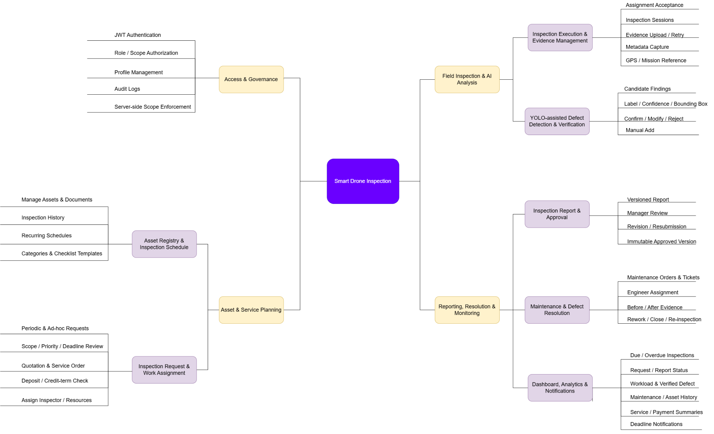

# report 1

CAPSTONE PROJECT REPORT

Report 1 – Project Introduction

SmartDroneInspection

AI-powered Infrastructure Inspection-as-a-Service Platform

– Ho Chi Minh City, September 2026 –

Table of Contents

I. Record of Changes	3

II. Project Introduction	4

1. Overview	4

1.1 Project Information	4

1.2 Project Team	4

2. Product Background	4

3. Existing Systems	5

3.1 DroneDeploy Inspection AI	5

3.2 Flyability Inspector	5

4. Business Opportunity	5

5. Software Product Vision	6

6. Project Scope & Limitations	6

6.1 Major Features	6

6.2 Limitations & Exclusions	8

# I. Record of Changes

| Date | A* M, D | In charge | Change Description |
| --- | --- | --- | --- |
| 11 Sep 2026 | A | Team | Version 1.0: complete project-specific content and team information. |
| 12 Sep 2026 | M | Team | Version 1.1: clarified Review 1 target users and scope boundaries. |
| 21 Sep 2026 | M | Team | Version 1.2: aligned roles, Client organization self-registration, post-service billing milestones, and scope exclusions with the current business flow. |

*A - Added M - Modified D - Deleted

# II. Project Introduction

## 1. Overview

### 1.1 Project Information

- Project name: SmartDroneInspection: AI-powered Infrastructure Inspection Management Platform

- Project code: GFA26SE139

- Group name: FA26SE112

- Software type: Responsive Web Portal, Flutter Field Application, REST APIs and server-side AI services

### 1.2 Project Team

| Full Name | Role | Email | Mobile |
| --- | --- | --- | --- |
| Phạm Minh Trí | Lecturer | tripm14@fpt.edu.vn |  |
| Đặng Ngọc Minh Đức | Lecturer | ducdnm2@fpt.edu.vn |  |
| Trần Hoàng Trung Hiếu | Leader | hieuthtse184212@fpt.edu.vn | 0963832382 |
| Phùng Trung Quốc | Member | quocptse170027@fpt.edu.vn | 0896986551 |
| Trương Thái Như | Member | nhuttse180082@fpt.edu.vn | 0328416716 |
| Trần Tùng Bách | Member | bachttse180220@fpt.edu.vn | 0378351050 |

## 2. Product Background

Organizations that own or manage infrastructure assets need to perform inspections regularly to identify defects, assess asset conditions, and verify repairs. In practice, inspection requests, captured images, findings, approvals, and maintenance updates may be handled through separate tools or manual processes, making it difficult to track the latest condition and resolution status of each defect. This can lead to fragmented information, slower follow-up, and difficulty connecting inspection evidence with the related asset and maintenance activity. SmartDroneInspection is proposed to centralize this process in a shared platform for requesting inspection services, managing inspection evidence, reviewing findings, and tracking defect resolution. The intended customers are organizations that own or manage infrastructure assets and require inspection services.

## 3. Existing Systems

The following products provide relevant references for inspection evidence, findings and reporting. Their published capabilities inform the design comparison; the scope-fit observations below are project assessments, not claims that the products lack all other capabilities.

### 3.1 DroneDeploy

Description: DroneDeploy is a cloud-based drone data platform for flight planning, image processing, inspection, analysis, and reporting.

Actors: Organization Owner/Admin, Coordinator, Member, External User, Pilot, Editor/Analyst, Upload-only User, and Viewer.

Main features: Automated flight planning, drone image upload and processing, 2D/3D mapping, measurements, issue tagging, inspection reports, collaboration, and permission management.

Pros: Provides an integrated inspection workflow, strong visualization and analysis tools, flexible access control, and good support for collaboration.

Cons: Advanced features may require higher-tier plans, some inspection tasks are more desktop-oriented, and its workflow focuses more on drone data and inspection management than on service-order processes such as quotations, deposits, provider assignment, and remediation requests.

Reference: DroneDeploy, https://www.dronedeploy.com/

### 3.2 Flyability Inspector

Description: Flyability Inspector is companion software designed for organizing, reviewing, and reporting inspection data captured by Elios 3 drones.

Actors: Inspection Teams, Engineers, and Asset Owners.

Main features: Asset-based organization, visual review with points of interest (POI), spatial context mapping, historical data comparison over time, structured report generation, and stakeholder collaboration.

Pros: Allows findings to be reviewed with strong visual and spatial context, and supports inspection history comparisons over time.

Cons: Specialized specifically for Elios 3 data rather than general service management or standard uploaded-image workflows, and lacks a built-in 3D digital-twin requirement for this project's scope.

Reference: Flyability, “Inspector”, https://www.flyability.com/inspector (accessed 11 September 2026).

## 4. Business Opportunity

Infrastructure owners need a more convenient way to purchase, manage, and track occasional or recurring inspection services. When service requests, quotations, inspection evidence, findings, reports, and defect follow-up are handled separately, customers may have difficulty understanding the current status of an inspection or tracing a defect from discovery to resolution. SmartDroneInspection provides a shared platform where customers can define inspection needs, review and confirm service orders, access inspection evidence and reports, and follow defect resolution. For the service provider, the same platform supports resource allocation and maintains a traceable history of inspection activities.

Compared with solutions that primarily focus on drone data capture, mapping, or inspection analysis, SmartDroneInspection focuses on connecting inspection-service ordering with evidence management, AI-assisted defect detection, reporting, and follow-up activities. This makes the proposed system suitable for organizations that need inspection services without operating their own inspection teams or drone infrastructure. The expected benefits are clearer service coordination, easier retrieval of inspection evidence, more consistent defect follow-up, and better visibility of service progress.

## 5. Software Product Vision

For organizations that need reliable infrastructure inspection services without managing an internal provider workforce, SmartDroneInspection is a B2B web and field application that connects service requests and confirmed prices to manual field inspections, human-verified AI findings, customer-approved reports, and separately ordered remediation.

Unlike fragmented manual communications and generic software lacking complete service workflows, SmartDroneInspection gives customers a clear record of what was purchased, what was observed, who verified the findings, and how defects were resolved. It gives the service provider a consistent way to allocate resources and deliver traceable evidence, prioritizing a demonstrable end-to-end service lifecycle with a limited, validated AI detection scope.

## 6. Project Scope & Limitations

The approved redesign scope separates one-time setup from the **five core transactional Main Flows** for a multi-provider infrastructure inspection platform. Organization registration, Provider vetting, asset master-data management, and recurring schedule setup are a **Supporting Flow (SF)**: prerequisites for work, not Main Flows.

- **SF — Organization, Provider & Asset Setup**: Client organization registration; legal/provider qualification review by `PLATFORM_OPERATOR`; asset documents, coordinates and periodic schedule setup. SF does not count among MF1–MF5.
- **MF1 — Survey Request, Quotation Sourcing & Conditional Funding**: Client creates an inspection request and sources providers directly or by RFQ; Providers submit versioned direct-service quotes; parties accept an electronic service order and funding terms. Any advance funding uses an authorized payment-partner product that supports the agreed conditions; no fixed advance percentage or Platform custody is presumed.
- **MF2 — Drone Mission Planning & Airspace Clearance**: Provider workforce prepares mission-specific GSD and overlap targets, camera/sensor assumptions, AGL/waypoints, structural shot items and airspace/permit checks. Targets are agreed in the SOW/Mission Plan for the structure and equipment; no global numeric default is assumed. The platform does not pilot the drone.
- **MF3 — Drone Survey, Telemetry, AI Verification & QA Report**: Inspector captures the approved mission evidence; Platform services provide storage and AI assistance; Inspector verifies candidates, peer review is independent, and Provider Manager releases the report.
- **MF4 (target)**: Client reviews the report within the order-snapshotted policy period; the authorized partner processes settlement using the Platform-wide uniform commission policy accepted for the order. `PLATFORM_OPERATOR` handles internal complaints under published terms; no legally final arbitration power is claimed.
- **MF5**: Verified drone findings can create separately quoted and approved maintenance work. Client and Provider agree the maintenance funding and retention terms; the agreed retention and warranty duration are configured and snapshotted per order, with before/after evidence, change control and conditional release milestones.

`PLATFORM_OPERATOR` owns commercial policy publication, including the single uniform rate for all Providers, advance-funding terms, review period, cancellation policy, retention and warranty duration. Each order stores the policy versions and terms accepted at confirmation; later policy edits apply prospectively, not retroactively. `PLATFORM_ADMIN` owns technical configuration such as infrastructure and AI operational settings, not commercial decisions. These are target requirements, not deployed capabilities.

The platform supports six canonical roles across three actor zones: `PLATFORM_ADMIN`, `PLATFORM_OPERATOR`, `CLIENT`, `PROVIDER_MANAGER`, `INSPECTOR`, and `MAINTENANCE_ENGINEER`. `PLATFORM_ADMIN` manages technical configuration and security; `PLATFORM_OPERATOR` vets Providers, supports customer/provider operations, monitors escrow, and resolves disputes under published Platform Terms. Provider organizations are independent businesses whose staff and data are isolated from other Providers.

In the proposed target, Clients manage infrastructure assets, request quotations, select verified Providers, approve electronic Service Orders, fund the agreed service amount through a bank/licensed payment-partner arrangement if that product is approved, review deliverables and file complaints. Providers quote their direct field-flight, engineering, and logistics services; they do not add separate YOLO/LLM/data/storage charges to Client quotations. Platform sets and publishes **one standard, non-negotiable commission rate for all Providers**; each Provider accepts the terms before taking new orders, and the rate/version is locked per order. Platform funds its own AI/data/storage operating costs from its commission revenue and other resources. No numerical commission is selected yet.

The proposed product must be assessed against *Luật Phòng không nhân dân 2024 (Luật số 49/2024/QH15, as amended)*, *Nghị định 198/2025/NĐ-CP*, *Nghị định 288/2025/NĐ-CP*, and published restricted-airspace information at `cambay.mod.gov.vn`. Electronic contracts and data messages follow *Luật Giao dịch điện tử 2023*; GPS and hashes support traceability but do not automatically create conclusive legal evidence. For an October 2026 launch, assess *Luật Thương mại điện tử 2025 (Luật số 122/2025/QH15)* and *Nghị định 248/2026/NĐ-CP*, plus conditionally applicable consumer protection requirements based on the transaction's purpose. Payment arrangements require an authorized bank/payment partner under applicable payment law, not a Platform-operated deposit account. None of the new commercial or regulatory integrations is claimed as implemented.

The project may include assembling and configuring a prototype drone using commercially available components for demonstration and system integration. The drone is manually operated using its designated controller and is used to capture inspection evidence for upload to SmartDroneInspection.

The project does not include fully autonomous drone operation, custom flight-control algorithms, commercial-grade drone manufacturing, or a complete 3D digital-twin platform. AI-generated defect candidates must be reviewed by an Inspector and do not replace professional judgment. The capstone release is limited to the defined inspection and maintenance workflows; additional hardware, advanced analytics, or commercial features are outside the current scope unless formally approved as a scope change.

### 6.1 Major Features

Feature identifiers FE-01 to FE-08 form the scope baseline for requirements, work estimates and acceptance tests. Optional enhancements are scheduled only after the core workflows are stable.

FE-01: Identity & Access Governance. Client self-registration creates one active customer organization and its first Client account. JWT-based authentication, role-/scope-based authorization, organization and assignment scope, profile management, and audit logs enforce access on the server. Self-registration cannot create platform or service-workforce roles.

FE-02: Asset Registry & Inspection Schedule. Clients create and manage their organization’s assets, documents, inspection history and recurring schedules. Admins maintain categories and checklist templates. WF1 generates periodic requests with an Asset + Schedule + Due Cycle idempotency key.

FE-03 (target): Inspection Sourcing, Quotation, Conditional Funding & Assignment. MF2 proposes direct Provider selection or open RFQ, versioned Provider quotations for direct service costs, and an electronic Service Order with one published Platform-set commission rate locked for all Providers. Advance funding, if adopted, goes through a bank/licensed payment partner whose actual product permits conditional release; the Platform does not custody customer funds itself. Platform AI/data/storage costs remain Platform operating costs, not Provider quotation lines.

FE-04: Inspection Execution & Evidence Management. The Flutter application supports assignment acceptance, inspection sessions, evidence upload/retry and metadata. Evidence records the inspection, asset, Inspector, capture time and source; GPS or external mission references are retained when available. Manual drone piloting stays outside the platform.

FE-05: YOLO-assisted Defect Detection & Verification. Server-side inference generates candidates with defect label, confidence, bounding box and model version. Inspector Confirm, Modify, Reject and Manual Add actions determine official findings. Unverified candidates are excluded from official defect statistics.

FE-06: Inspection Report, Acceptance & Internal Dispute Resolution. MF3/MF4 combine verified findings into versioned reports, Platform-hosted LLM narrative assistance, independent Provider Inspector peer review, and `PROVIDER_MANAGER` release. The Client accepts, requests clarification, or files a dispute; a released report is eligible for settlement under its agreed review period. `PLATFORM_OPERATOR` handles disputes internally under published Platform Terms; this does not displace court or commercial-arbitration rights.

FE-07: Maintenance, Warranty Retention & Resolution. MF5 links accepted verified defects to a separately contracted maintenance order with Client-funded escrow through an authorized payment provider. A Maintenance Engineer assesses technical scope and submits before/after evidence. Client completion acceptance releases the agreed first milestone while a contractually specified retention remains held through warranty; rework, re-inspection, and warranty dispute remain distinct outcomes.

FE-08: Dashboard, Analytics & Notifications. Scoped views summarize due and overdue inspections, request and report status, workload, verified defects, maintenance, asset history and service/payment summaries. Notifications support assignments, reviews and deadlines without requiring live telemetry.

Figure 1. Legacy WF1–WF4 service workflow diagram retained from the earlier baseline; it does not depict the approved MF1–MF5 multi-provider target and must be regenerated before final submission.

### 6.2 Limitations & Exclusions

The first release is limited to infrastructure inspection and maintenance management. The following items define either excluded capabilities or mandatory product constraints. These boundaries apply to the software release and project demonstration; they do not prevent the system from retaining records for the supported inspection-to-maintenance lifecycle.

LI-1: The platform does not provide autonomous drone flight control, flight-path programming, drone piloting, or automatic drone telemetry collection. Manual capture may occur outside the platform, but only authorized evidence is uploaded and managed by the product.

LI-2: AI is limited to generating candidate findings. An Inspector must review and verify each candidate before it can become an official finding. The system does not automatically publish AI-generated findings.

LI-3: A Client representative may self-register a new customer organization and its first Client account. Provider organization onboarding requires separate Platform Operator review. Self-registration cannot grant `PLATFORM_ADMIN`, `PLATFORM_OPERATOR`, `PROVIDER_MANAGER`, `INSPECTOR`, or `MAINTENANCE_ENGINEER` roles. Anonymous access to protected system data is not supported.

LI-4: Access is scoped by customer organization, provider organization, and accepted assignment. A Client cannot view another customer's records; a Provider cannot view a competitor's quotation, workforce, or evidence; an Inspector or Maintenance Engineer can access only authorized assigned work. Platform Admin and Operator have separate technical and business authority.

LI-5: An inspection report version accepted by the Client is immutable. Any subsequent correction or change must create a new version and preserve the previously accepted version.

LI-6: General-purpose photogrammetry, 3D reconstruction, and unrelated consumer use are outside the product scope.

LI-7: Integration with external drone-management platforms or other unconfirmed third-party systems is excluded from the release. The system does not provide certified digital-signature services; approval is recorded as an authenticated and versioned application record.
