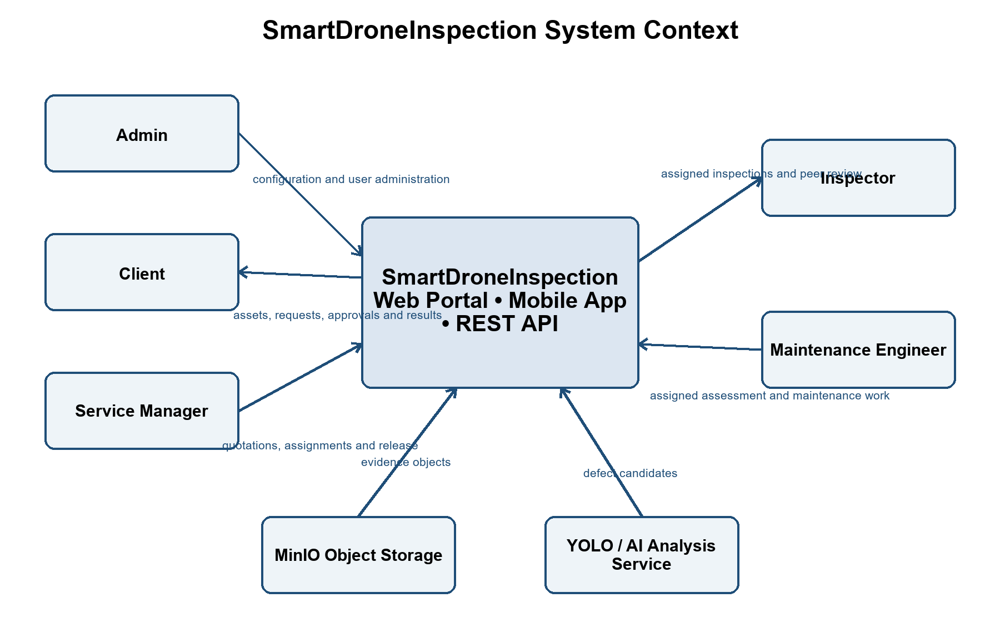

# II. Software Requirement Specification

## 1. Overall Description

### 1.1 Product Overview

SmartDroneInspection is a multi-provider infrastructure inspection and maintenance management platform. It coordinates the business lifecycle across multiple customer organizations and independent service providers: from customer asset onboarding and recurring inspection planning to request sourcing/RFQ, electronic service orders, 100% escrow cash-flow pooling, drone field surveys, automated AI YOLO defect detection, quality assurance peer review, client acceptance, automated settlement, platform dispute arbitration, maintenance ticketing, and warranty retention.

The solution includes a responsive web application for platform administration, partner vetting, customer operations, commercial bidding, and dispute resolution; a mobile application for assigned field pilots and maintenance technicians; and a backend modular monolith that owns business rules, multi-tenant authorization, transactional data, digital evidence integrity, and integration contracts.

The platform supports six canonical actors across three actor zones:
1. **Platform Governance Zone**: `PLATFORM_ADMIN` (IT/system administration, standard checklist templates, security policies, and technical audit logs) and `PLATFORM_OPERATOR` (business operations, provider onboarding vetting, customer matching, escrow oversight, and internal dispute arbitration).
2. **Customer Organization Zone**: `CLIENT` (customer organization representative who registers enterprise assets, issues inspection requests/RFQs, approves quotations, deposits 100% escrow funds, reviews deliverables, files disputes if quality fails, and opens maintenance tickets).
3. **Service Provider Zone**: Independent commercial service provider companies represented by `PROVIDER_MANAGER` (company executive who maintains provider profile, submits quotations, secures flight permits, assigns pilots, and signs off QA reports), `INSPECTOR` (certified drone pilot/inspector who conducts field flights, uploads chunked media with GPS/EXIF/SHA-256 to MinIO, verifies AI YOLO candidate defects, and conducts internal peer reviews), and `MAINTENANCE_ENGINEER` (technician who conducts defect assessments, executes physical repairs, and captures mandatory before/after photo evidence).

In the target model, the Platform provides and pays for shared MinIO storage, data processing, YOLO defect-candidate detection and on-demand LLM narrative assistance (possibly through infrastructure vendors under Platform control). Providers and Clients only use these Platform capabilities through authorized interfaces. Providers quote their own direct flight/engineering/logistics services and do not add separate Platform AI/data/storage charges to Client quotations. Platform sets **one publicly disclosed, non-negotiable commission rate `r` for every Provider**, obtains acceptance of the standard terms, and locks the policy version per order; Platform operating costs are funded from its own revenue, including that commission. No percentage is selected yet.

The product does not pilot drones autonomously or replace civil aviation airspace control. Field pilots must be certified and obtain flight permits from Cục Tác chiến - Bộ Tổng Tham mưu per *Luật Phòng không nhân dân 2024* (Luật số 49/2024/QH15) and *Nghị định 288/2025/NĐ-CP*. Flight planning adheres to national no-fly zone maps published on `cambay.mod.gov.vn` per *Quyết định 18/2020/QĐ-TTg*. MinIO stores authorized evidence with SHA-256 checksums serving as digital evidence under *Luật Giao dịch điện tử 2023* (Luật số 20/2023/QH15). Customer protection, platform mediation, and dispute resolution follow *Luật Bảo vệ quyền lợi người tiêu dùng 2023* (Luật số 19/2023/QH15) and *Nghị định 85/2021/NĐ-CP*. Cash flow is secured via a 100% escrow pool governed by *Nghị định 52/2024/NĐ-CP*.

The five canonical main flows are:

- **MF1**: Legal onboarding of clients and providers, provider vetting by Platform Operator, asset profiling, and periodic inspection scheduling.
- **MF2**: Inspection request sourcing/RFQ, provider quotation, electronic service order confirmation, 100% escrow deposit, flight permit clearance, and inspector assignment.
- **MF3**: Field drone survey, MinIO evidence ingestion with SHA-256/GPS, YOLO AI candidate verification, internal peer review, and provider QA release.
- **MF4 (target)**: Client technical review within an expressly agreed window, partner settlement of Provider proceeds net of the one published Platform commission, or contractual complaint with an authorized hold of disputed funds and internal Platform Operator resolution.
- **MF5**: Defect ticketing, maintenance work order with 10% warranty retention money, before/after evidence capture, change order management, and two-stage completion closure.

### 1.2 Business Rules

| ID | Rule Definition |
| --- | --- |
| BR-01 | Platform Governance, Customer Organization, and Service Provider identities use distinct actor zones; administrative and customer roles are mutually exclusive. |
| BR-02 | A Client can access only assets, requests, orders, reports, tickets, and financial records owned by the Client's organization. |
| BR-03 | A Provider Manager, Inspector, or Maintenance Engineer belongs to exactly one Service Provider organization and cannot access competitors' bids, orders, or flight data. |
| BR-04 | An Inspector or Maintenance Engineer can access only work assigned to that user within their owning Provider organization. |
| BR-05 | Service Providers must be vetted and verified (`VERIFIED`) by `PLATFORM_OPERATOR` before submitting quotations or receiving flight assignments. |
| BR-06 | Provider onboarding requires verified business registration, drone identification registration, certified pilot credentials, and third-party aviation liability insurance per Luật Phòng không nhân dân 2024. |
| BR-07 | Flight assignments require valid flight clearance/permit references issued by Cục Tác chiến - Bộ Tổng Tham mưu where mandated by airspace classification. |
| BR-08 | Asset registration must check geographical coordinates against national no-fly and restricted airspace databases (`cambay.mod.gov.vn` per QĐ 18/2020/QĐ-TTg). |
| BR-09 | An active recurring schedule requires an active asset and an active checklist template; a due cycle generates at most one request package. |
| BR-10 | Provider quotations cover their own direct service costs and applicable Provider taxes, not separately charged Platform AI/LLM/data/storage costs. Platform sets one published, non-negotiable commission rate `r` for all Providers, obtains acceptance of standard terms, and bears its own operating costs from its revenue. |
| BR-11 | The target contract may require customer advance funding through an authorized bank/payment-provider arrangement before field execution; the Platform does not independently custody regulated deposits. Funding requirements are contractual proposals, not implemented or statutory rules. |
| BR-12 | Quotation and order revisions create immutable sequential versions, preserving complete commercial and pricing history. |
| BR-13 | Client cancellation prior to 24h of scheduled flight refunds 100% escrow; cancellation within 24h charges a 20% dry-run fee to compensate the assigned pilot. |
| BR-14 | Unfavorable weather (rain, high winds, fog) is recognized as flight safety force majeure; flight schedules may be postponed without contractual SLA penalties. |
| BR-15 | An Inspector assignment must be accepted before inspection status becomes `READY_FOR_INSPECTION`. Rejection requires a reason and returns the assignment to Provider Manager. |
| BR-16 | Manual drone piloting, flight control, and operational flight safety remain the operational responsibility of the Service Provider. |
| BR-17 | Each evidence file uploaded to MinIO receives an immutable SHA-256 checksum and EXIF GPS/timestamp metadata, serving as legal digital data messages under Luật Giao dịch điện tử 2023. |
| BR-18 | Duplicate evidence checksums within the same inspection or maintenance work log are rejected. |
| BR-19 | Missing GPS is recorded but does not automatically invalidate otherwise acceptable visual evidence. |
| BR-20 | AI YOLO detections remain non-official defect candidates until verified (confirmed, modified, or rejected) by an assigned Inspector. |
| BR-21 | Rejected or unverified AI candidates are excluded from official defect statistics and customer reports. |
| BR-22 | An Inspector may manually record findings missed by the AI model; AI service unavailability triggers safe manual defect recording fallback. |
| BR-23 | An inspection report author cannot peer-review or technically approve the same report (mandatory cross-review within Provider). |
| BR-24 | A report cannot be released to the Client before internal peer-review approval and deliverable completeness sign-off by `PROVIDER_MANAGER`. |
| BR-25 | Internal drafts, peer-review comments, and rejected AI candidates are hidden from customer visibility. |
| BR-26 | An accepted report version is immutable; corrections require a new linked version. |
| BR-27 | The proposed contract review window (illustratively five working days) may trigger deemed acceptance only when expressly agreed and no valid clarification or dispute is open; settlement deducts the uniform published Provider-paid commission `C = r × B` before Provider payout. This is a target policy, not an implemented or statutory rule. |
| BR-28 | Client or Provider may file a formal dispute on grounds of defective imagery, missed shot list items, safety violations, or data fraud, freezing escrow funds (`FROZEN_DISPUTED`). |
| BR-29 | `PLATFORM_OPERATOR` coordinates internal complaint handling under published Platform Terms. Internal resolution does not replace a court judgment or lawful commercial arbitration; MinIO metadata and hashes support integrity but are not automatically conclusive legal evidence. |
| BR-30 | The target terms may offer reshoot, contract termination with justified refund/penalty, or dismissal and release of eligible funds; remedies depend on contract, evidence and applicable law, not an automatic fixed 48-hour or full-refund rule. |
| BR-31 | A maintenance ticket must reference at least one verified defect from a Client-accepted inspection report. |
| BR-32 | A qualified Maintenance Engineer provides the technical maintenance assessment and estimate; Service Manager/Provider Manager does not fabricate technical estimates. |
| BR-33 | The proposed maintenance terms may specify warranty retention; the illustrative 10% and 30-day period require express Client/Provider agreement, payment-partner authorization and tax review. The retained portion earns no second Platform commission on later release. |
| BR-34 | Material maintenance scope or cost growth requires an approved change order and supplemental escrow deposit before additional work begins. |
| BR-35 | Maintenance work completion strictly requires verified before and after photo evidence uploaded to MinIO. |
| BR-36 | Proposed maintenance settlement releases eligible Provider proceeds net of the order-locked Platform commission, with agreed warranty retention `H` held for the warranty period and released later without a second commission; Provider and Platform tax invoices remain separate. |
| BR-37 | Re-inspection requested during maintenance resolution creates a linked ad hoc inspection request returning to MF2. |
| BR-38 | Status transitions that affect assignment, approval, release, acceptance, dispute arbitration, or closure are audited. |
| BR-39 | File possession or an object-storage path alone does not grant access to evidence. |
| BR-40 | Password, role, status, and session-revocation changes invalidate affected active sessions. |
