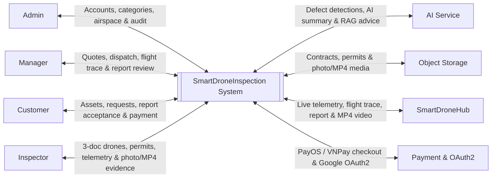

# II. Software Requirement Specification

## 1. Product Overview

SmartDroneInspection is an infrastructure inspection service for customer organizations. This SRS defines the target business requirements across the lifecycle from inspection requests and partner assignment through field evidence, inspection reporting, and payment; it is not a statement that every requirement is currently available. The target service supports Customers managing assets, requesting one-time or recurring inspections, reviewing and accepting VND quotations, recording signed service agreements, and following inspection progress. Implementation status (checked 2026-11-02): platform staff provision Inspector accounts; self-service Inspector applications are unavailable. Recurring requests are supported, and planned occurrences are materialized when the Customer accepts a quotation. This is acceptance-triggered, not time-based generation; automatic future-occurrence reminders are not implemented.

```mermaid
%% title: System Context Diagram
flowchart LR
  ADMIN["Admin"]
  MANAGER["Manager"]
  CUSTOMER["Customer"]
  INSPECTOR["Inspector"]

  SDI[["SmartDroneInspection System"]]
  AI["AI Service"]
  STORAGE["Object Storage"]
  HUB["SmartDroneHub"]
  PAYMENT["Payment & OAuth2"]

  ADMIN <-->|"Accounts, categories, airspace & audit"| SDI
  MANAGER <-->|"Quotes, dispatch, flight trace & report review"| SDI
  CUSTOMER <-->|"Assets, requests, report acceptance & payment"| SDI
  INSPECTOR <-->|"3-doc drones, permits, telemetry & photo/MP4 evidence"| SDI

  SDI <-->|"Defect detections, AI summary & RAG advice"| AI
  SDI <-->|"Contracts, permits & photo/MP4 media"| STORAGE
  SDI <-->|"Live telemetry, flight trace, report & MP4 video"| HUB
  SDI <-->|"PayOS / VNPay checkout & Google OAuth2"| PAYMENT
```

The service supports four human login roles:

- **`ADMIN`**: Governs platform accounts and asset categories; reviews customer airspace cases, partner qualification information, and drone registrations; manages platform financial settings; and reviews activity history. In the current service, platform staff provision Inspector accounts; self-service Inspector applications are not available.
- **`MANAGER`**: Coordinates Inspectors and registered drones, handles customer service requests and VND quotations, records signed service agreements, assigns inspection occurrences, manages dispatch changes, independently reviews and publishes inspection reports, and oversees partner settlement.
- **`CUSTOMER`**: Registers a customer organization and its initial asset subject to airspace screening; manages assets and inspection checkpoints; requests inspections; reviews and accepts quotations and reports; pays service fees.
- **`INSPECTOR`**: In the target partner-admission process, provides required pilot credentials and partner information for platform review; drone ownership is not a prerequisite. The current service provisions Inspector accounts through platform staff rather than self-service application. An Inspector may register owned drones with registration, ownership, and technical inspection documents; records assigned field sessions and evidence; reviews proposed findings; and submits inspection reports.

**System boundaries**: The service governs commercial inspection work, records aviation compliance documents, coordinates field sessions, manages inspection evidence and human-reviewed analysis, publishes inspection reports, records service payment across six product features (`FE-01` to `FE-06`). Corrective maintenance is out of scope. Any pre-existing maintenance schema and data are retained without destructive migration and are not exposed by the application. It does not pilot or control aircraft. Completing a workflow step or recording a document does not itself grant government aviation clearance or a professional qualification. AI findings and summaries are advisory; an authorized person must review and confirm any official decision (`BR-16`, `BR-20`, `BR-27`). Repair guidance is outside application scope.
