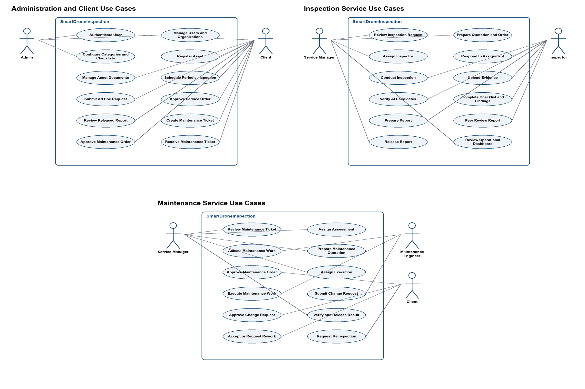

## 2. User Requirements

### 2.1 System Actors

| # | Actor | Description |
| --- | --- | --- |
| 1 | Admin | Manages organizations, user accounts, role assignments, asset categories, checklist templates, platform configuration, and authorized audit views. Admin does not automatically perform Client or service-workforce actions. |
| 2 | Service Manager | Reviews inspection and maintenance requests, prepares quotation and order versions, assigns qualified staff, coordinates peer review, verifies deliverables, and releases customer-visible results. |
| 3 | Inspector | Accesses assigned inspections and assigned peer reviews; completes checklists, evidence, verified findings, and inspection reports. The report author cannot approve the same report as peer reviewer. |
| 4 | Maintenance Engineer | Accesses assigned maintenance assessments and execution work; supplies technical estimates, work logs, change requests, before/after evidence, and completion results. |
| 5 | Client | Represents one customer organization. The Client may self-register the organization and first Client account, then manages that organization's assets, inspection requests, commercial approvals, released reports, maintenance tickets, and resolution decisions. |

### 2.2 Use Cases

#### 2.2.1 Diagram(s)

#### 2.2.2 Descriptions

| ID | Use Case | Actors | Use Case Description |
| --- | --- | --- | --- |
| 01 | Authenticate User | All roles | A Client may register a new organization and first active Client account; all users can sign in with an issued account, complete first-password setup when required, refresh the session, change the password, and sign out. Registration creates only the Client role and does not issue platform or service-workforce permissions. |
| 02 | Manage Users and Organizations | Admin | Create organizations and accounts, assign valid roles, reset credentials, change account status, and revoke sessions. |
| 03 | Configure Categories and Checklists | Admin | Maintain asset categories, checklist templates, checklist versions, and platform-level reference data. |
| 04 | Register Asset | Client | Create and update an infrastructure asset owned by the Client's organization. |
| 05 | Manage Asset Documents | Client | Upload and maintain drawings, manuals, previous reports, and maintenance history for an authorized asset. |
| 06 | Schedule Periodic Inspection | Client | Create, activate, pause, or update a recurring inspection schedule for an active asset and checklist template. |
| 07 | Submit Inspection Request | Client | Submit an ad hoc request or complete a system-generated periodic request with scope, priority, deadline, access constraints, contact, and attachments. |
| 08 | Review Inspection Request | Service Manager | Check request completeness, scope feasibility, service capacity, access conditions, and required supporting information. |
| 09 | Prepare Inspection Quotation and Order | Service Manager | Create a versioned quotation and draft service order containing scope, deliverables, estimated price or rates, duration, and post-service payment terms. |
| 10 | Approve Inspection Order | Client | Approve the current quotation and order or request a revised version. |
| 11 | Assign Inspector | Service Manager | Select an available and qualified Inspector without a known conflict of interest. |
| 12 | Respond to Inspection Assignment | Inspector | Accept or reject an assignment; rejection requires a reason and returns the work for reassignment. |
| 13 | Conduct Inspection | Inspector | Start an assigned inspection session and execute the confirmed checklist and service scope. |
| 14 | Upload Evidence | Inspector | Upload images or documents with file validation, checksum, duplicate prevention, provenance, and available metadata. |
| 15 | Verify AI Candidates | Inspector | Confirm, modify, or reject AI-generated candidates and manually add defects missed by the AI service. |
| 16 | Complete Checklist and Findings | Inspector | Complete checklist responses and record location, severity, technical notes, and recommended action for verified findings. |
| 17 | Prepare Inspection Report | Inspector | Review the compiled report content, correct the working version, and submit it for peer review. |
| 18 | Peer Review Report | Inspector | Review another Inspector's report, request changes, or technically approve the report when evidence supports its conclusions. |
| 19 | Release Inspection Report | Service Manager | Verify deliverable completeness and release a technically approved report to the Client. |
| 20 | Accept or Revise Report | Client | Accept the released report or request clarification or revision without editing technical content directly. |
| 21 | Create Maintenance Ticket | Client | Create a maintenance ticket from one or more verified findings in an accepted report. |
| 22 | Assess Maintenance Work | Maintenance Engineer | Review defect evidence, assess remotely or on site, and estimate work, materials, labor, duration, risks, assumptions, and cost range. |
| 23 | Prepare Maintenance Quotation | Service Manager | Create a versioned maintenance quotation and draft order based on the Engineer's technical assessment. |
| 24 | Approve Maintenance Order | Client | Approve the maintenance scope and post-service payment terms or request revision. |
| 25 | Assign Maintenance Execution | Service Manager | Assign a qualified Maintenance Engineer after the maintenance order is approved. |
| 26 | Execute Maintenance Work | Maintenance Engineer | Accept the execution assignment, perform approved work, and record progress, material use, time, evidence, and cost. |
| 27 | Manage Maintenance Change Request | Maintenance Engineer, Service Manager, Client | Stop unapproved additional work, revise the order, and obtain the Client's decision before continuing. |
| 28 | Release Maintenance Result | Service Manager | Verify the completion report, before/after evidence, and final cost against approved order versions before release. |
| 29 | Resolve Maintenance Ticket | Client | Accept the result, request rework, or request a linked re-inspection. |
| 30 | View Dashboard and Audit History | Admin, Service Manager | View authorized operational summaries and material workflow or security history without bypassing resource scope. |
