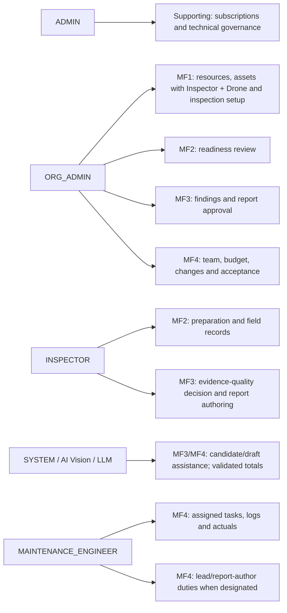

## 2. User Requirements

### 2.1 System Actors

This Report 3 target has four human roles across platform and customer ownership. It is a requirements revision, not a claim that deployed role enums have changed.

| # | Actor | Description |
| --- | --- | --- |
| 1 | Platform Admin (`ADMIN`) | Manages SaaS organizations, enterprise subscription activation/renewal, technical/security settings and platform audit/support. Does not make customer engineering, maintenance budget or acceptance decisions. |
| 2 | Organization Admin (`ORG_ADMIN`) | Represents the enterprise renting the software. Manages workforce/credentials, identified Drones, permits, assets with Inspector + Drone assignments, inspection setup, qualified readiness/report review, repair teams, estimates/changes and independent acceptance/cost reconciliation. A technical reviewing ORG_ADMIN must have appropriate qualifications and be independent of the author/executing team. |
| 3 | Inspector (`INSPECTOR`) | Customer's assigned pilot/inspection technician. Accepts work, prepares shot-list/checklists and records field sessions on web/mobile. Uploads evidence and directly decides completeness/quality, adds observations, verifies/edits the LLM inspection draft and submits it for ORG_ADMIN review. RC flight is not an application command. |
| 4 | Maintenance Engineer (`MAINTENANCE_ENGINEER`) | Customer's assigned repair-team member. Records task assessment/work, hours/materials/equipment, tests and proof. May be designated team lead or accountable repair-report author, with additional work-order-scoped duties but no self-budget approval or independent acceptance authority. |
| — | SYSTEM / AI Vision / LLM (automated actor) | Validates scoped commands, detects candidate defects, drafts source-grounded reports, computes cost totals, versions records and notifies users. Not a login role, professional authority or approving person. |

Each work order has exactly one team lead and one report author, who may be the same Engineer. Members are assigned to explicit tasks. Final acceptance is performed by a qualified ORG_ADMIN outside the repair team and distinct from the author. Actual cost entry, estimate approval and cost reconciliation are attributable separate actions.

### 2.2 Use Cases

#### 2.2.1 Diagram(s)

```mermaid
flowchart LR
  PA["ADMIN"] --> SUB["Supporting: subscriptions and technical governance"]
  OA["ORG_ADMIN"] --> M1["MF1: resources, assets with Inspector + Drone and inspection setup"]
  OA --> M2["MF2: readiness review"]
  IN["INSPECTOR"] --> PREP["MF2: preparation and field records"]
  IN --> EVI["MF3: evidence-quality decision and report authoring"]
  SYS["SYSTEM / AI Vision / LLM"] --> DRAFT["MF3/MF4: candidate/draft assistance; validated totals"]
  OA --> REVIEW["MF3: findings and report approval"]
  OA --> ORDER["MF4: team, budget, changes and acceptance"]
  ME["MAINTENANCE_ENGINEER"] --> TASK["MF4: assigned tasks, logs and actuals"]
  ME --> AUTHOR["MF4: lead/report-author duties when designated"]
```

The earlier `assets/use-cases.png` is retained as a non-normative legacy diagram. The current diagram/text define the target; binary regeneration is outside this edit.

#### 2.2.2 Descriptions

The existing two-digit use-case slots **01–32 are retained**, with meanings revised for the enterprise target. These are Report 3 use-case IDs, not Report 5's historical test IDs. The mapping to detailed steps and retained FE product codes is provided in Functional Requirements.

| ID | Use Case | Actors | Use Case Description / flow |
| --- | --- | --- | --- |
| 01 | Authenticate User | All issued roles; System | Register enterprise/initial ORG_ADMIN, sign in, refresh/revoke sessions and sign out using web/mobile credential profiles; supporting gate. |
| 02 | Configure Technical Settings | ADMIN | Configure AI/storage/security settings and applicable platform checklist/category defaults; not customer technical acceptance. |
| 03 | Manage Enterprise Subscription | ADMIN, ORG_ADMIN, System | Request/activate/renew the sole ENTERPRISE plan for 1/6/12-month periods; preserve terms and confirmed billing status; no assumed online payment gateway. |
| 04 | Register Assigned Asset | ORG_ADMIN, System | Create an asset with one responsible Inspector and one identified own-organization Drone; save profile/pair together, maintain documents and history; MF1-08–MF1-10. |
| 05 | Manage Workforce Credentials | ORG_ADMIN, System | Issue/manage Inspector/Engineer accounts and relevant qualifications, evidence and validity; no uniform licence requirement invented; MF1-03–MF1-05. |
| 06 | Manage Drone and Permit Records | ORG_ADMIN, System | Maintain identified Drone serviceability and applicable issued/application permit records; expiry/status warnings do not grant authority clearance; MF1-06–MF1-07. |
| 07 | Create Inspection | ORG_ADMIN, System | Create an asset inspection/schedule, objective/scope/dates and inherited pair snapshot; due-cycle idempotency; MF1-11–MF1-14. |
| 08 | Change Assigned Pair | ORG_ADMIN, System | Adjust an inspection pair or future asset default with a reason; resolve known resource conflicts, preserve old snapshots and invalidate affected readiness; MF1-13. |
| 09 | Respond to Assignment | Inspector, System | Accept/reject assigned inspection with reason; rejected work returns to ORG_ADMIN; MF2-01–MF2-02. |
| 10 | Review Flight Readiness | ORG_ADMIN, Inspector, System | Verify current mandatory permits/credentials/conditions and preparation version; record qualified approval/return; no legal exemption without basis; MF2-04–MF2-08. |
| 11 | Prepare Inspection Checklist | Inspector | Prepare component shot-list, evidence modality, access/coverage limitations and safety acknowledgments; no device-control or GSD computation; MF2-03/MF2-06. |
| 12 | Record Field Session | Inspector, System | Complete current pre-flight checks; recheck readiness on Start; record End, pause/abort/postponement and observations under the same inspection; MF2-09–MF2-12. |
| 13 | Confirm Evidence Quality | Inspector, System | Directly decide coverage/quality against shot-list after technical intake; re-upload or request renewed MF2 session if inadequate; MF3-03–MF3-04. |
| 14 | Upload Evidence | Inspector or assigned repair member, System | Intake authorized original files with checksum/source references, metadata flags and retry/duplicate safety; MF3-01–MF3-02 or MF4-11. |
| 15 | Review Defect Candidates | Inspector, qualified ORG_ADMIN, System | Generate eligible AI candidates, add source-backed observations/manual findings, then record final human confirm/modify/reject decisions at report review; MF3-05–MF3-06/MF3-09. |
| 16 | Generate Inspection Draft | Inspector, System / LLM | Generate labelled source-grounded draft after AI Vision detection; unknown facts stay unknown and candidate statements remain unverified; MF3-07. |
| 17 | Verify Inspection Draft | Inspector | Verify/edit each section against evidence, method/scope and observations; confirm author submission; MF3-08. |
| 18 | Approve Inspection Report | Qualified independent ORG_ADMIN, System | Review findings/text, return or approve; regenerate changed narrative only with renewed author/reviewer confirmation; MF3-09–MF3-10. |
| 19 | Publish Inspection Report | System after ORG_ADMIN approval | Publish immutable version with author/reviewer and source index; no timer-based technical acceptance or guaranteed qualified signature; MF3-11. |
| 20 | Select Corrective Work | ORG_ADMIN, System | Identify approved repair-required findings/priority/deadline for MF4; no-repair outcome completes without an empty order; MF3-12–MF3-13. |
| 21 | Revise Report Version | Report author, ORG_ADMIN, System | Make linked corrections with renewed approval, keeping published source reports and prior decisions intact. |
| 22 | Review Scoped Operations | Each role, System | View entitled dashboards, expiry/deadline reminders, official versus candidate results and attributable history; supporting FE-08. |
| 23 | Create Maintenance Work Order | ORG_ADMIN, System | Link source report/finding to corrective scope, tasks/criteria and priority; detect duplicate active scope; MF4-01–MF4-02. |
| 24 | Assess Repair Scope | Assigned Engineer team lead | Record qualified assessment, method, task plan and acceptance/test needs without overwriting source inspection; MF4-05. |
| 25 | Prepare Repair Estimate | Team lead, System | Supply itemized labor/material/equipment/services, justified other costs, dates and evidence; calculate decimal totals/version; MF4-06–MF4-07. |
| 26 | Assign Team and Approve Budget | ORG_ADMIN, System; assigned Engineers | Name approved members, one lead, one report author and independent reviewer; approve scope/baseline before release and confirm tasks; MF4-03–MF4-04/MF4-08–MF4-10. |
| 27 | Record Repair Work and Actuals | Assigned Engineers; team lead | Record task progress, hours/consumption, supported actual costs and completion declaration; physical repair occurs outside app; MF4-11/MF4-14. |
| 28 | Submit Repair Evidence | Assigned Engineers; report author | Provide before/during/after and required test/check records; link them to defect/tasks; completeness needed for author submission; MF4-11/MF4-15. |
| 29 | Manage Repair Change | Engineer lead/members, ORG_ADMIN, System | Propose reason, scope/cost/time delta; pause affected extras until explicit approval; preserve initial baseline; MF4-12–MF4-13. |
| 30 | Generate Maintenance Report | Designated Engineer report author, System / LLM | Compile source records, generate a draft, verify/edit facts and actual costs and submit; LLM cannot claim acceptance; MF4-15–MF4-17. |
| 31 | Accept Repair and Close Work | Independent qualified ORG_ADMIN, System | Perform technical acceptance/return or request linked re-inspection; separately reconcile costs; close only when prerequisites resolved; MF4-18–MF4-21. |
| 32 | Audit Evidence and Decisions | Scoped authorized users, System | Trace source evidence, provenance, pair/team handovers, report/estimate versions and independent decisions; missing metadata is explicit and no record grants authority by itself. |
