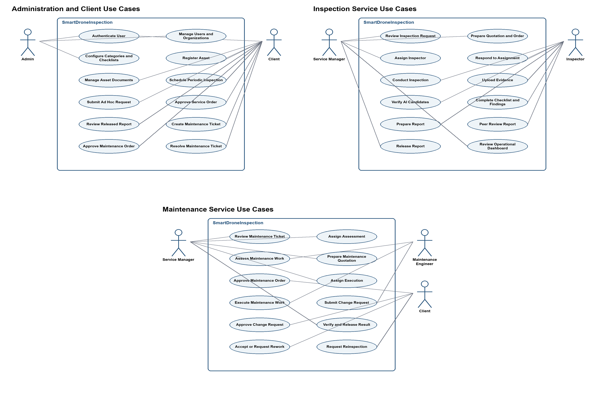

## 2. User Requirements

### 2.1 System Actors

| # | Actor | Description |
| --- | --- | --- |
| 1 | Platform Admin (`PLATFORM_ADMIN`) | Manages technical platform infrastructure, authentication policies, security configurations, standard checklist templates, and system audit views. Platform Admin does not perform commercial operations, customer management, or dispute arbitration. |
| 2 | Platform Operator (`PLATFORM_OPERATOR`) | Manages commercial platform operations: vets and verifies provider credentials (business license, drone registration, pilot certifications, aviation insurance); monitors customer requests; oversees escrow cash flows; and serves as the binding internal platform dispute arbitrator. |
| 3 | Client (`CLIENT`) | Represents an infrastructure customer organization. Registers assets, sets up periodic cadences, issues inspection requests/RFQs, selects providers, approves electronic contracts, deposits 100% escrow funds, reviews deliverables, files quality disputes, and creates maintenance tickets. |
| 4 | Provider Manager (`PROVIDER_MANAGER`) | Executive/lead of an independent service provider company. Maintains company profile and pilot roster, reviews client RFQs, issues versioned quotations, coordinates Cục Tác chiến flight permits, assigns certified inspectors, and signs off QA reports. |
| 5 | Inspector (`INSPECTOR`) | Certified drone pilot and inspection technician employed by a service provider. Conducts field flight surveys, uploads chunked media with GPS/EXIF/SHA-256 to MinIO, confirms or rejects AI YOLO candidate findings, and performs cross peer reviews. Cannot approve self-authored reports. |
| 6 | Maintenance Engineer (`MAINTENANCE_ENGINEER`) | Repair technician employed by a maintenance provider. Performs defect assessments, provides technical estimates, executes physical maintenance work, and captures mandatory before/after photo evidence. |

### 2.2 Use Cases

#### 2.2.1 Diagram(s)

#### 2.2.2 Descriptions

| ID | Use Case | Actors | Use Case Description |
| --- | --- | --- | --- |
| 01 | Authenticate User | All roles | Register an enterprise customer organization or sign in with an issued account, complete multi-factor verification, refresh active sessions, update passwords, and sign out. |
| 02 | Configure System Security | Platform Admin | Configure authentication parameters, security policies, standard checklist templates, asset classifications, and inspect system audit trails. |
| 03 | Vet Service Provider | Platform Operator, Provider Manager | Submit company credentials, drone registration numbers per Luật PKND 2024, pilot licenses, and third-party insurance; Platform Operator verifies or rejects provider onboarding. |
| 04 | Register Infrastructure Asset | Client | Create and maintain asset profiles, boundaries, technical specifications, and check coordinates against `cambay.mod.gov.vn` restricted airspace. |
| 05 | Manage Asset Documents | Client | Upload, version, and maintain engineering drawings, manuals, and prior inspection records for authorized assets. |
| 06 | Schedule Periodic Inspection | Client | Select recommended inspection cadences; system automatically generates inspection request packages upon due cycles. |
| 07 | Solicit Quotations | Client | Publish an inspection request via direct provider selection or open RFQ with required shot list, camera specifications, and GSD resolution requirements. |
| 08 | Issue Inspection Quotation | Provider Manager | Submit versioned quotations covering Provider direct flight/engineering/logistics services and applicable tax, not separately charging Platform AI/data services. Display one Platform-published commission rate and fee-base rule accepted by all Providers before they accept new orders; the commission is a Provider expense, not an extra Client charge. |
| 09 | Approve Service Order | Client, Provider Manager | Review and approve quotation terms into a legally binding electronic service order under Luật Giao dịch điện tử 2023. |
| 10 | Fund Service Order | Client, System, authorized payment partner | Target policy may require advance funding of the agreed service amount through a bank/licensed payment partner whose product supports conditional release; the Platform does not independently hold deposits. Funding alone does not constitute the entire electronic-contract validity test. |
| 11 | Authorize Flight Assignment | Provider Manager, Inspector | Attach Cục Tác chiến flight permit references, verify pilot credentials, check conflict of interest, and dispatch assignment package to Inspector. |
| 12 | Respond to Flight Assignment | Inspector | Review assignment package, airspace constraints, and shot list; accept or reject with formal justification. |
| 13 | Conduct Drone Survey | Inspector | Conduct field flight operations adhering to authorized parameters, safety zones, and checklist scope. |
| 14 | Upload Chunked Evidence | Inspector, System | Upload high-resolution imagery and video to MinIO with EXIF GPS/timestamp extraction and SHA-256 checksum calculation for digital evidence integrity. |
| 15 | Verify Defect Candidates | Inspector, System | Review AI YOLO detections (cracks, spalling, corrosion); confirm, modify, reject candidates, or manually record unflagged defects. |
| 16 | Compile Draft Report | Inspector, System | Compile draft technical report with checklist answers, verified findings, and on-demand LLM narrative summary provided by Platform. |
| 17 | Peer-Review Inspection Report | Inspector | Review another Inspector's report within the same Provider; approve technical quality or request revisions (self-review strictly prohibited). |
| 18 | Release Inspection Report | Provider Manager | Verify deliverable completeness and release final inspection report to Client; activates 5-day client review timer. |
| 19 | Review Final Report | Client | Review released report; accept deliverables, request clarification, or initiate dispute. |
| 20 | Settle Provider Payout | System, Platform Operator, authorized payment partner | At accepted/deemed-accepted service, settle eligible funds under the order-locked standard commission policy `C = r × B`; Provider receives the net service proceeds, while Provider and Platform issue separate service/commission invoices with applicable tax. This is a target workflow, not yet implemented. |
| 21 | File Contract Dispute | Client, Provider Manager | File a contractual quality/safety/payment complaint; pause the disputed release under the authorized payment partner's agreed arrangement, not an unlicensed Platform wallet. |
| 22 | Resolve Contract Dispute | Platform Operator | Review contract and traceable evidence and issue an internal Platform Terms decision; preserve lawful access to court or commercial arbitration. Refunds reverse the commission attributable to reduced service price. |
| 23 | Create Maintenance Ticket | Client | Create repair ticket linked directly to verified defects from an accepted inspection report. |
| 24 | Assess Defect Condition | Maintenance Engineer | Perform remote or on-site defect assessment; submit required scope, materials, labor hours, and cost estimates. |
| 25 | Issue Maintenance Quotation | Provider Manager | Issue versioned maintenance quotation incorporating mandatory 10% warranty retention money clause. |
| 26 | Approve Maintenance Order | Client, System, authorized payment partner | Approve maintenance terms including any expressly agreed advance funding and warranty retention; use a qualified payment partner rather than Platform custody of customer funds. |
| 27 | Execute Maintenance Repair | Maintenance Engineer | Perform physical repair work according to approved scope; log materials and labor hours. |
| 28 | Capture Before-After Evidence | Maintenance Engineer | Upload mandatory paired before-and-after photo evidence to MinIO to substantiate repair completion. |
| 29 | Manage Maintenance Change | Maintenance Engineer, Client | Submit change order for unexpected subsurface defects; work pauses until Client approves and deposits supplemental escrow funds. |
| 30 | Verify Repair Completion | Client, Provider Manager | Inspect before/after evidence; approve completion to trigger 90% payout disbursement and begin 30-day warranty period. |
| 31 | Release Warranty Retention | System, Platform Operator, authorized payment partner | Release the agreed retained portion at the end of the contractual warranty period if there is no unresolved claim; do not charge Platform commission a second time on the same service consideration. |
| 32 | Audit Security Events | Platform Admin, Platform Operator | Inspect immutable access, modification, financial transaction, and arbitration audit logs within authorized scope. |
