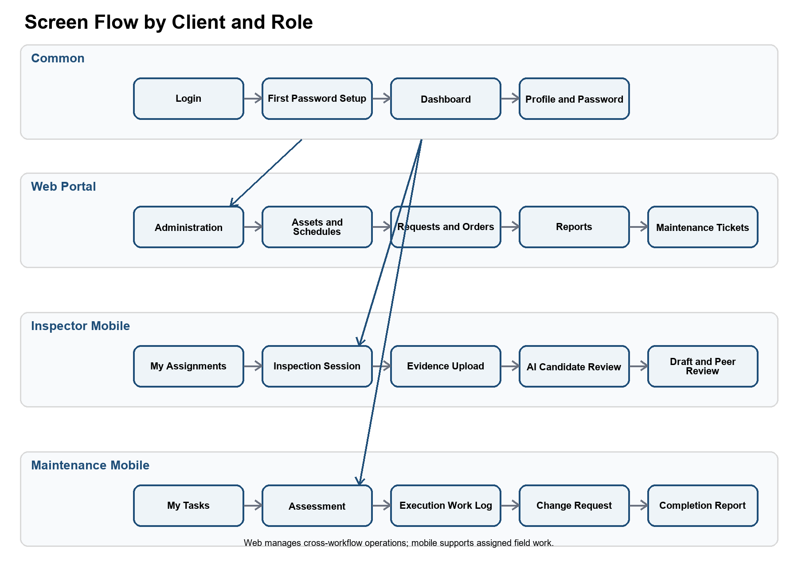
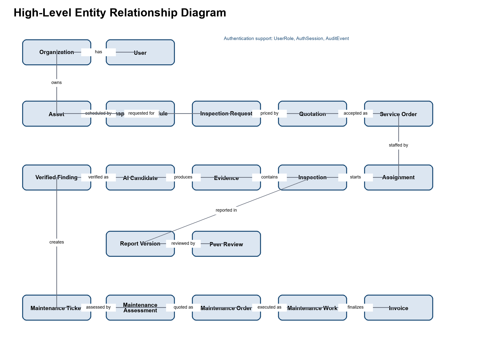

## 3. Functional Requirements

### 3.1 System Functional Overview

#### 3.1.1 Screens Flow

The browser application provides administration, Client, and Service Manager workflows. The mobile application provides assigned Inspector and Maintenance Engineer workflows. Each route is filtered by authenticated role and resource scope, while the backend remains the authorization authority.

#### 3.1.2 Screen Descriptions

| # | Feature | Screen | Description |
| --- | --- | --- | --- |
| 1 | Authentication | Login | Authenticate an issued account and route the user to the permitted application experience. |
| 1a | Authentication | Client Registration | Register a new organization and the first Client account. The account is active immediately and receives only the Client role. |
| 2 | Authentication | First Password Setup | Replace the administrator-issued setup password before normal application access. |
| 3 | Common | Dashboard | Show role-scoped work queues, counts, deadlines, and recently released results. |
| 4 | Common | Profile and Password | View account information, change the password, and terminate the current or all sessions. |
| 5 | Administration | Organizations | Create, activate, suspend, and inspect customer organizations. |
| 6 | Administration | Users | Provision accounts, assign valid roles, reset credentials, change status, and revoke sessions. |
| 7 | Administration | Asset Categories | Maintain classifications used by assets and checklist templates. |
| 8 | Administration | Checklist Templates | Create and version checklist templates and checklist items. |
| 9 | Assets | Asset List | Search, filter, and open assets within the user's authorized scope. |
| 10 | Assets | Asset Details | View and update asset data, documents, schedules, requests, reports, findings, and maintenance history. |
| 11 | Planning | Inspection Schedules | Create, activate, pause, and review recurring inspection schedules. |
| 12 | Requests | Inspection Request | Create, complete, review, or reject a periodic or ad hoc inspection request and its attachments. |
| 13 | Commercial | Inspection Quotation and Order | Create versions, review scope and terms, approve, or request revision. |
| 14 | Assignments | Inspector Assignment | Assign an Inspector and record accept or reject responses. |
| 15 | Inspection | My Inspection Assignments | List only inspections assigned to the signed-in Inspector. |
| 16 | Inspection | Inspection Session | Start work, complete the checklist, record progress, and finish the field session. |
| 17 | Inspection | Evidence Upload | Upload images and documents and show validation and processing status. |
| 18 | AI Assistance | AI Candidate Review | Confirm, modify, or reject AI candidates and add manual findings. |
| 19 | Reports | Draft Report | Review generated content, edit a working version, and submit for peer review. |
| 20 | Reports | Peer Review | Review another Inspector's report and request changes or approve technical content. |
| 21 | Reports | Report Release | Check required deliverables and release the final report to the Client. |
| 22 | Reports | Released Report | View, download, accept, or request clarification or revision. |
| 23 | Maintenance | Maintenance Ticket | Create or review a ticket linked to verified findings. |
| 24 | Maintenance | Assessment Assignment | Assign and complete the technical maintenance assessment. |
| 25 | Maintenance | Maintenance Quotation and Order | Prepare, revise, and approve maintenance scope and terms. |
| 26 | Maintenance | Execution Assignment | Assign a Maintenance Engineer and record acceptance or rejection. |
| 27 | Maintenance | Execution Task | Record work progress, materials, time, actual cost, and before/after evidence. |
| 28 | Maintenance | Change Request | Document additional damage or cost and collect the Client decision before additional work. |
| 29 | Maintenance | Completion and Resolution | Verify, release, and accept the result or route it to rework or re-inspection. |
| 30 | Audit | Audit History | Search security and workflow events allowed for the current role and resource scope. |

#### 3.1.3 Screen Authorization

The matrix preserves the five-column structure of the supplied template. The combined field-workforce column identifies the applicable role in each row: `I` means Inspector and `M` means Maintenance Engineer. `M` in other cells means Manage; `V` means View; `O` means Own organization; `A` means Assigned resource; and `R` means Release or coordinate. A blank cell means denied. Backend organization, ownership, assignment, and separation-of-duties checks remain authoritative.

| Screen | Admin | Service Manager | Inspector / Maintenance Engineer | Client |
| --- | --- | --- | --- | --- |
| Dashboard | V | V | I: V; M: V | V |
| Organizations and Users | Manage |  |  |  |
| Categories and Checklists | Manage | V | I: V; M: V | V |
| Asset List and Details | V |  |  | Manage own organization |
| Inspection Schedules | V |  |  | Manage own organization |
| Inspection Requests | V | Manage and review | I: View assigned | Manage own organization |
| Inspection Quotation and Order | V | Manage and release | I: View assigned | Approve own organization |
| Inspector Assignment | V | Manage | I: Respond to assigned | View own organization |
| Inspection Session | V | Coordinate and view | I: Manage assigned | View own organization result |
| Evidence and AI Review | V | Coordinate and view | I: Manage assigned | View released result |
| Draft Report | V | Coordinate and view | I: Manage authored version |  |
| Peer Review | V | Assign reviewer | I: Manage assigned review |  |
| Report Release | V | Manage and release | I: View assigned | Accept own organization report |
| Maintenance Ticket | V | Manage and review | M: View assigned | Manage own organization |
| Assessment Assignment | V | Manage | M: Manage assigned | View own organization |
| Maintenance Quotation | V | Manage and release | M: View assigned | Approve own organization |
| Execution Assignment and Task | V | Coordinate and view | M: Manage assigned | View own organization result |
| Change Request | V | Manage and release | M: Manage assigned | Decide for own organization |
| Completion and Resolution | V | Manage and release | M: Manage assigned | Decide for own organization |
| Audit History | Manage and view | Authorized view | I: Assigned view; M: Assigned view | Own organization view |

#### 3.1.4 Non-Screen Functions

| # | Feature | System Function | Description |
| --- | --- | --- | --- |
| 1a | Authentication | Client organization registration | Validate the registration request, create an active organization and first Client account atomically, enforce uniqueness and password policy, rate-limit attempts, and append a registration audit event. |
| 1 | Authentication | Access-token validation | Validate token signature, issuer, audience, expiry, session, user status, authentication version, role, and applicable resource scope. |
| 2 | Authentication | Refresh-token rotation | Rotate the opaque refresh token and reject an expired, revoked, or reused token. |
| 3 | Planning | Periodic request generation | Create at most one periodic request for each Asset, Schedule, and Due Cycle combination. |
| 4 | Files | Evidence intake | Validate file type and size, calculate checksum, prevent duplicates, and store authorized objects in MinIO. |
| 5 | AI Assistance | Image inference | Submit eligible images to the YOLO service and store model version, label, confidence, and bounding box as non-official candidates. |
| 6 | Reports | Draft compilation | Compile a versioned report draft from checklist responses, evidence, and Inspector-verified findings. |
| 7 | Reports | Immutable acceptance | Preserve an accepted report version and its complete approval and revision history. |
| 8 | Maintenance | Linked re-inspection | Create an ad hoc inspection request from a re-inspection decision and return it to WF2. |
| 9 | Notifications | Workflow notification | Notify the next responsible actor after material assignments, decisions, deadlines, releases, and correction requests. |
| 10 | Audit | Security and workflow audit | Append material security and workflow events without storing passwords, raw tokens, or protected evidence content. |
| 11 | Cleanup | Retention processing | Remove expired token history and apply configured audit and evidence retention rules. |

#### 3.1.5 Entity Relationship Diagram

The diagram describes the principal transactional entities. The complete physical PostgreSQL schema, indexes, constraints, and Flyway migrations are maintained in the database design and backend source.

**Entities Description**

| # | Entity | Description |
| --- | --- | --- |
| 1 | Organization | Customer organization that owns assets and Client accounts. |
| 2 | User | Issued account with status, actor zone, organization scope, password state, and authentication version. |
| 3 | User Role Assignment | Role assignment constrained by the user's actor zone and organization relationship. |
| 4 | Auth Session | Web or mobile login session that can be revoked independently. |
| 5 | Asset Category | Admin-managed classification used by assets and checklist templates. |
| 6 | Checklist Template | Versioned inspection checklist definition. |
| 7 | Asset | Organization-owned infrastructure item subject to inspection and maintenance. |
| 8 | Asset Document | Drawing, manual, previous report, or maintenance document linked to an asset. |
| 9 | Inspection Schedule | Recurring schedule that generates periodic inspection requests. |
| 10 | Inspection Request | Periodic or ad hoc request with scope, priority, deadline, contact, and access constraints. |
| 11 | Quotation | Versioned commercial proposal for inspection or maintenance service. |
| 12 | Service Order | Confirmed inspection scope, deliverables, and post-service payment terms. |
| 13 | Assignment | Accepted or rejected assignment for inspection, peer review, assessment, or execution. |
| 14 | Inspection | Field inspection session governed by an accepted Inspector assignment. |
| 15 | Checklist Response | Recorded answer to a checklist item for an inspection. |
| 16 | Evidence | Stored file with checksum, provenance, metadata, and object-storage reference. |
| 17 | AI Finding Candidate | Non-official model output awaiting Inspector verification. |
| 18 | Verified Finding | Confirmed or manually added defect with location, severity, notes, and recommendation. |
| 19 | Inspection Report | Report aggregate linked to one inspection. |
| 20 | Report Version | Versioned report content and approval state. |
| 21 | Peer Review | Technical review result by an Inspector other than the report author. |
| 22 | Maintenance Ticket | Client request linked to one or more verified findings. |
| 23 | Maintenance Assessment | Engineer-provided technical scope, estimate, risks, and assumptions. |
| 24 | Maintenance Order | Approved maintenance scope and commercial terms. |
| 25 | Maintenance Assignment | Assessment or execution assignment to a Maintenance Engineer. |
| 26 | Maintenance Work Log | Progress, materials, duration, cost, and before/after evidence. |
| 27 | Change Request | Material change in scope or cost that requires a Client decision. |
| 28 | Invoice | Service invoice and payment-status record issued after Client acceptance of an inspection report or maintenance result. |
| 29 | Notification | Delivery record for a user-facing workflow notification. |
| 30 | Audit Event | Append-only security or material workflow event. |

### 3.2 FE-01 Identity and Access Governance

FE-01 provides Client organization self-registration, authentication, account and profile management, role- and scope-based authorization, session management, and audit logging. A Client registration creates one active organization and its first Client account; it cannot create platform or service-workforce roles. Backend authorization remains authoritative for organization, ownership, assignment, release, and separation-of-duties scope.

#### 3.2.1 Identity, Session and Authorization Rules

- All users sign in through the versioned authentication API. The browser keeps access tokens in memory, uses the protected refresh-cookie flow, and does not persist credentials in browser storage.
- Mobile authentication uses the mobile token-delivery contract and secure platform storage.
- Admin manages platform identities and role assignments. Client self-registration creates only the Client role.
- Logout, password change, disable, role change, and session revocation invalidate affected active sessions.
- Authentication and authorization events are auditable without storing passwords, raw tokens, or protected evidence content.

### 3.3 FE-02 Asset Registry and Inspection Schedule

FE-02 lets a Client manage the assets and recurring inspection schedules belonging to the Client's organization. Admin maintains the categories and checklist templates used by the feature.

#### 3.3.1 Manage Assets and Periodic Inspection Scheduling

**Function trigger:** The Client opens Asset Management to register an asset or opens Inspection Schedules for an existing active asset.

**Function description:**

- The Client enters the asset code, name, category, location, technical description, operational status, and available documents.
- The system verifies that the Client belongs to the asset's organization and that the asset code is unique within that organization.
- The Client selects a checklist template, recurrence rule, next due date, preferred inspection window, and responsible contact.
- The system validates the recurrence rule and activates the schedule only when the asset and checklist template are active.
- On each due cycle, the system creates one periodic inspection request and records the Asset, Schedule, and Due Cycle key.

**Validation and exception requirements:** Missing required asset data prevents activation. An inactive asset pauses its schedule. An unavailable checklist routes the due request to manual review. Retrying the scheduler cannot create a duplicate request for the same due cycle.

**Result:** A valid periodic inspection request enters the request-review process.

### 3.4 FE-03 Inspection Request and Work Assignment

FE-03 manages periodic and ad hoc inspection requests, commercial review, quotation and order versions, Client approval, and Inspector assignment.

#### 3.4.1 Review Request and Assign Inspector

**Function trigger:** A periodic request is generated or the Client submits an ad hoc inspection request.

**Function description:**

- The Client completes scope, priority, preferred deadline, site-access constraints, contact information, and supporting documents.
- The system verifies organization ownership, required fields, attachment references, and valid status transitions.
- The Service Manager assesses completeness, feasibility, required checklist, duration, service capacity, and delivery expectations.
- The Service Manager creates a versioned quotation and draft service order. A revision creates a new version and preserves earlier versions.
- The Client approves the current version and accepts post-service payment terms or requests revision.
- After approval, the Service Manager selects a qualified and available Inspector and sends the assignment package.
- The Inspector accepts or rejects. Rejection requires a reason and returns the request to the Service Manager for reassignment.

**Validation and exception requirements:** An unconfirmed service order cannot be assigned. The system prevents assignment to an inactive user and records known conflict checks. Only an accepted assignment can enter inspection execution.

**Result:** The service order is confirmed and the inspection is `READY_FOR_INSPECTION` with an accepted Inspector assignment.

### 3.5 FE-04 Inspection Execution and Evidence Management

FE-04 provides the assigned Inspector's inspection session, checklist execution, evidence intake, metadata, checksum, duplicate prevention, retry behavior, and authorized MinIO storage.

#### 3.5.1 Execute Inspection and Upload Evidence

**Function trigger:** The assigned Inspector opens an accepted assignment and starts the inspection session.

**Function description:**

- The system records the start time, responsible Inspector, asset, confirmed scope, and checklist version.
- The assigned Inspector can retrieve the published checklist and saved responses through `GET /api/v1/inspections/{inspectionId}/checklist`; checklist responses are saved through the inspection-scoped API and remain attributable to the authenticated Inspector.
- The Inspector performs the field inspection according to the confirmed scope. Manual drone piloting remains outside the platform.
- The Inspector uploads images and documents. The backend validates type and size, calculates a checksum, prevents duplicate records, and stores authorized content in MinIO.
- Web and mobile uploads use the same inspection-scoped API. Available capture time, source (`WEB_UPLOAD`, `MOBILE_UPLOAD`, `SD_CARD`, or `IMPORTED`), GPS, and external reference are stored as metadata. Missing GPS is recorded but does not automatically invalidate evidence.

**Validation and exception requirements:** Unsupported or corrupted files are rejected. Interrupted uploads retry without duplicate evidence records. An Inspector cannot update another Inspector's assignment without a separate authorized role and scope.

**Result:** The inspection has a session record, completed checklist responses, and traceable evidence ready for finding verification.

### 3.6 FE-05 YOLO-Assisted Defect Detection and Verification

FE-05 generates non-official defect candidates from eligible inspection images and requires human verification before findings are used in reports or statistics.

#### 3.6.1 AI Candidate Generation and Review

**Function trigger:** An eligible evidence image is available after upload validation.

**Function description:**

- When YOLO inference is enabled, the configured service receives only eligible authorized images and returns a candidate label, confidence, bounding box, and model version. If inference is disabled or unavailable, evidence remains available and the Inspector can add a manual finding.
- The Inspector reviews every candidate and chooses Confirm, Modify, or Reject.
- The Inspector may manually add a finding that the AI service did not detect.
- Only confirmed, modified, or manually added findings enter official statistics and report content.

**Validation and exception requirements:** AI failure does not discard evidence or prevent manual finding entry. Rejected or unverified candidates remain non-official. An Inspector cannot verify findings outside the assigned inspection scope.

**Result:** The inspection has traceable, Inspector-verified findings that can be used by FE-06.

### 3.7 FE-06 Inspection Report and Approval

FE-06 compiles versioned inspection reports from checklist responses, evidence, and Inspector-verified findings, then controls peer review, Service Manager release, and Client acceptance.

#### 3.7.1 Review and Release Inspection Report

**Function trigger:** The Inspector completes the checklist and required finding details.

**Function description:**

- The system compiles a report draft from checklist responses, evidence, verified findings, and recommendations.
- The Inspector reviews and corrects the draft and submits a version for peer review.
- The Service Manager assigns another qualified Inspector. The author cannot review or technically approve the same report.
- The peer reviewer verifies evidence support, classification, severity, location, checklist consistency, and conclusions.
- When changes are required, the author creates a revised version and resubmits it. Prior versions and review decisions remain traceable.
- When technically approved, the Service Manager checks deliverable completeness and releases the report to the Client.
- The Client accepts the report or requests clarification or revision without editing technical content directly.
- The Client decision is recorded against the released version with the authenticated Client actor; a revision request also retains its reason. A revision request does not remove the released version from the Client's organization-scoped history.
- When the Client accepts the report, the system makes that version immutable, transitions the owning inspection to `COMPLETED`, and publishes one accepted-report handoff for the separately owned billing workflow. That workflow records the inspection billing milestone and creates or issues the invoice according to the confirmed post-service payment terms. No online payment gateway is required in the first release.
- The Inspector may request an on-demand AI-assisted narrative draft for a version in `DRAFT` status. The draft is generated from the version snapshot (checklist, findings, and evidence metadata without GPS/PII) and stored as the pending narrative pending human review. The Inspector reviews and edits the draft through the narrative endpoint before submitting the version for peer review. Generating a new AI draft replaces any existing narrative on that version; the narrative endpoint is the final human correction step before peer review, so the last write wins.

**Validation and exception requirements:** Internal drafts and peer-review comments are not customer-visible. A released report cannot be silently overwritten. An accepted version is immutable; later corrections create a new linked version.

**Result:** A technically reviewed, customer-visible, and accepted inspection report is available for maintenance decisions.

### 3.8 FE-07 Maintenance and Defect Resolution

FE-07 links verified findings from accepted reports to maintenance assessment, approved work, controlled change requests, completion evidence, release, resolution, rework, and re-inspection.

#### 3.8.1 Create and Assess Maintenance Ticket

**Function trigger:** The Client selects one or more verified findings from an accepted report and creates a maintenance ticket.

**Function description:**

- The system links the ticket to the Client organization, asset, accepted report, selected findings, and supporting evidence.
- The Client supplies priority, preferred deadline, access constraints, contact information, and additional instructions.
- The Service Manager reviews completeness and decides whether assessment can be remote or requires a site visit.
- The Service Manager assigns a qualified Maintenance Engineer for assessment; this assignment does not authorize execution work.
- The Engineer records the condition, required work, materials, labor, duration, risks, assumptions, and estimated cost range.

**Validation and exception requirements:** A ticket must reference at least one verified finding. The selected finding must belong to the Client's organization. The Engineer must accept the assessment assignment before submitting the assessment.

**Result:** A traceable technical assessment is ready for commercial preparation.

#### 3.8.2 Prepare and Approve Maintenance Work

**Function trigger:** The Maintenance Engineer submits the technical assessment.

**Function description:**

- The Service Manager creates a versioned maintenance quotation and draft maintenance order from the assessment and approved pricing rules.
- The order identifies scope, deliverables, exclusions, estimated duration, cost or rates, assumptions, and post-service payment terms.
- The Client approves the current version or requests revision.
- After approval, the Service Manager confirms the order and assigns the same or another qualified Maintenance Engineer for execution.
- The Engineer accepts or rejects the execution assignment; rejection requires a reason and returns the work for reassignment.

**Validation and exception requirements:** The Service Manager cannot replace the Engineer's technical assessment with an unsupported estimate. An unapproved order cannot proceed to execution. No upfront payment is required.

**Result:** An approved maintenance order and accepted execution assignment are ready for work.

#### 3.8.3 Execute Work and Manage Change

**Function trigger:** The assigned Maintenance Engineer opens an accepted execution assignment.

**Function description:**

- The Engineer records start time, work progress, materials, labor time, and approved tasks.
- Before and after evidence is uploaded through the authorized file flow and linked to the work log.
- If additional damage or material cost growth is discovered, the Engineer stops the additional work and submits a change request.
- The Service Manager creates a revised order version from the technical change information.
- The Client approves or rejects the change before additional work continues.
- The Engineer completes the approved scope and submits actual duration, materials, final cost, evidence, and completion notes.

**Validation and exception requirements:** Work outside the approved scope is prohibited until the change is approved. Rejected changes remain in history and do not alter the current approved order. Completion requires before/after evidence and a complete work log.

**Result:** A maintenance completion report is ready for internal verification.

#### 3.8.4 Release and Resolve Maintenance Result

**Function trigger:** The Maintenance Engineer submits completion information.

**Function description:**

- The Service Manager compares completion evidence and final cost with the approved order and approved change versions.
- When complete, the Service Manager releases the maintenance result to the Client.
- The Client chooses Accept Resolution, Request Rework, or Request Re-inspection.
- Accept Resolution closes the ticket and linked defect and allows invoice and payment status tracking.
- When the Client accepts the maintenance result, the system finalizes the actual cost and creates or issues the maintenance invoice according to the confirmed post-service payment terms. The invoice follows the same payment-status lifecycle as an inspection invoice.
- Request Rework returns the ticket to execution with a documented reason and a new work cycle.
- Request Re-inspection creates a linked ad hoc inspection request and returns it to WF2.

**Validation and exception requirements:** Only a released result can receive a Client decision. Closing a ticket preserves the assessment, order versions, assignments, work logs, evidence, decisions, and audit history.

**Result:** The ticket is closed, returned for rework, or linked to a new inspection request.

### 3.9 FE-08 Dashboard, Analytics and Notifications

FE-08 provides role- and scope-filtered dashboards, operational summaries, defect and service analytics, asset history, workload visibility, and workflow notifications. The feature does not expose data outside the authenticated user's organization, ownership, assignment, or release scope.

#### 3.9.1 Scoped Dashboard and Analytics

- Admin views platform-level operational and audit summaries allowed by the platform policy.
- Service Manager views request, assignment, review, deadline, report, maintenance, and payment-status summaries for authorized service operations.
- Client views the organization's assets, requests, released reports, maintenance tickets, and invoice or payment status.
- Inspector and Maintenance Engineer view assigned work queues, deadlines, evidence status, and relevant history.

#### 3.9.2 Workflow Notifications

- The system notifies the next responsible actor after material assignments, review decisions, releases, correction requests, deadlines, and Client decisions.
- Notifications do not grant access; every linked page and API request applies the normal authorization and resource-scope checks.
