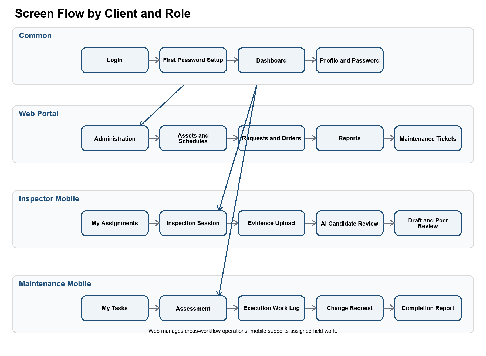
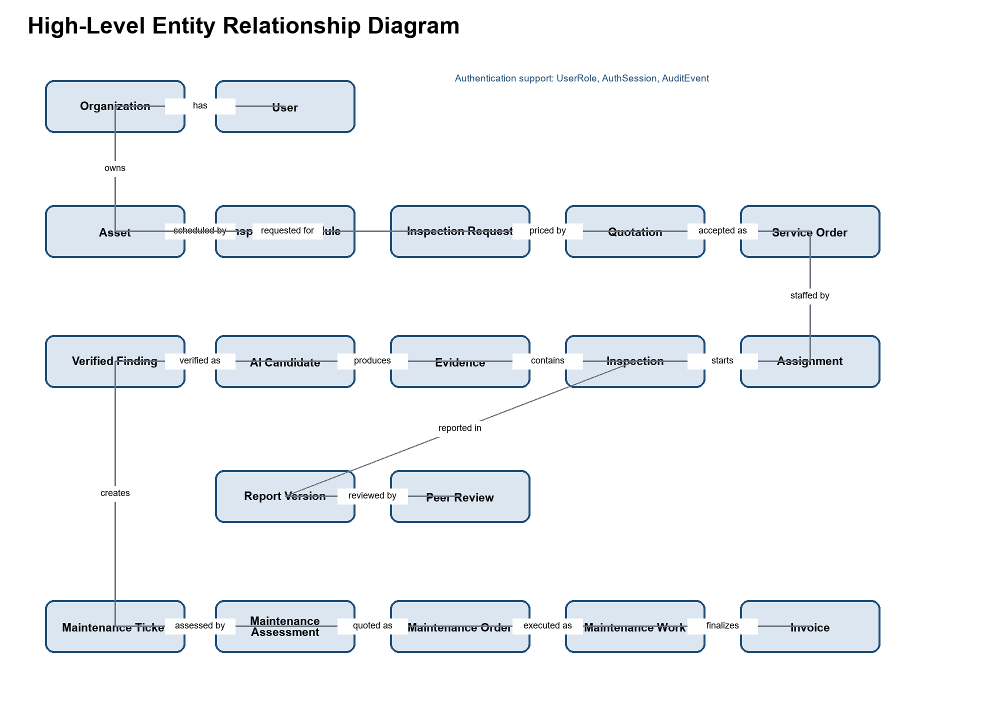

## 3. Functional Requirements

### 3.1 System Functional Overview

#### 3.1.1 Screens Flow

The target browser application provides Platform Admin and Platform Operator governance, Client commercial/order, and Provider Manager sourcing/mission-planning workflows. The mobile application provides assigned Inspector and Maintenance Engineer workflows. Organization registration and provider vetting are Supporting Flow capabilities, not one of the five Main Flows. Each route is filtered by authenticated role and resource scope, while the backend remains the authorization authority. Target multi-provider and mission-planning screens are not claims of current implementation.

#### 3.1.2 Screen Descriptions

| # | Feature | Screen | Description |
| --- | --- | --- | --- |
| 1 | Authentication | Login | Authenticate an issued account across any actor zone and route the user to the permitted portal experience. |
| 1a | Authentication | Client Enterprise Registration | Register a new customer organization and its initial Client administrator account atomically. |
| 1b | Authentication | Provider Onboarding Registration | Register an independent service provider company, upload business license, drone registration codes per Luật PKND 2024, and third-party insurance. |
| 2 | Authentication | First Password Setup | Replace administrator-provisioned setup password before normal application access. |
| 3 | Common | Role Dashboard | Show role-filtered operational queues, upcoming flight deadlines, escrow balances, and recent inspection results. |
| 4 | Common | Profile and Security | View account information, update security settings, and revoke active sessions. |
| 5 | Platform Governance | User Management | Provision accounts, assign canonical roles, manage operational status, and audit security events. |
| 5a | Platform Governance | Provider Vetting Portal | Platform Operator portal to review provider business licenses, pilot certificates, drone registries, and insurance policies to approve or reject provider credentials. |
| 5b | Platform Governance | Commercial Policy Settings | Platform Operator drafts, publishes and audits versioned uniform commission, advance funding, review, cancellation, retention and warranty policies; no provider-specific commission negotiation or retroactive order edits. |
| 5c | Platform Governance | Platform Technical Settings | Platform Admin configures technical infrastructure and AI operational parameters separately from commercial policy. |
| 6 | Administration | Asset Categories & Checklists | Maintain standardized asset categories, checklist templates, and suggested inspection frequencies. |
| 7 | Assets | Asset Inventory & Airspace Map | Search, filter, and inspect asset profiles with integrated `cambay.mod.gov.vn` restricted airspace overlays. |
| 8 | Assets | Asset Details & Documents | Maintain asset specifications, upload engineering drawings, and review historical inspection/maintenance records. |
| 9 | Supporting Flow Planning | Inspection Cadences | Business reviewer approves generated schedule proposals and Client selects an approved proposal for an authorized active asset; the Client cannot create an active schedule directly. |
| 10 | Sourcing & Bidding | Inspection Request & RFQ | Create inspection requests and choose direct provider selection or open RFQ; mission-specific shot list, GSD, overlap, camera and acceptance targets are defined in SOW/Mission Plan, not fixed global defaults. |
| 11 | Commercial | Quotation Management | Provider Manager prepares versioned quotations (covering direct flight and labor fees); Client reviews, requests revision, or accepts. |
| 12 | Commercial | Service Order & Conditional Funding | Review the electronic order, uniform Provider-paid commission terms and any contractually required advance funding via an authorized bank/payment partner; the Platform does not independently custody deposits. |
| 13 | Mission Planning | Drone Mission Planning | Provider Manager and Inspector prepare versioned, equipment- and structure-specific GSD/overlap targets, AGL and shot items; waypoint route coordinates are optional when waypoint programming is used. Manual piloting under the approved shot plan is supported. |
| 13a | Assignments | Flight Assignment & Permits | Provider Manager verifies pilot credentials, attaches applicable Cục Tác chiến flight permit references, and issues flight assignments to Inspector. |
| 14 | Inspection | My Flight Missions | Mobile and web portal showing only assignments dispatched to the authenticated Inspector. |
| 15 | Inspection | Field Survey Session | Start inspection session, execute mandatory checklist items, and record flight progress. |
| 16 | Inspection | Evidence Ingestion | Chunked upload of photos and videos to MinIO with EXIF GPS extraction and SHA-256 digital integrity checksums. |
| 17 | AI Assistance | AI Candidate Review | Review centralized YOLO model detections; confirm, modify, reject candidates, or manually add unflagged defects. |
| 18 | Reports | Draft Compilation & Narrative | Compile technical report drafts with on-demand platform LLM narrative summary assistance. |
| 19 | Reports | Author Draft Verification & Editing | The Inspector-authored AI-assisted draft is checked against evidence, verified findings, checklist and SOW, then corrected and confirmed by that Inspector before Provider Manager completeness review. |
| 20 | Reports | Provider QA Release | Provider Manager reviews deliverable completeness against contractual SOW and formally releases report to Client. |
| 21 | Reports | Released Report Review | Client portal to view, download, accept the report, request clarification or file a complaint during the order-snapshotted review period. |
| 22 | Dispute Resolution | Dispute Filing & Internal Resolution | Client or Provider files a contractual complaint; Platform Operator reviews traceable evidence against SOW and coordinates internal remedies under public terms without replacing court or commercial arbitration. |
| 23 | Financial | Conditional Funding & Payouts | Platform Operator monitors partner-confirmed transaction status and coordinates only the order-accepted instructions supported by the authorized payment partner product; Platform does not custody customer funds. |
| 24 | Maintenance | Maintenance Ticket | Create repair ticket linked directly to verified defects from an accepted inspection report. |
| 25 | Maintenance | Defect Assessment | Maintenance Engineer conducts remote/on-site technical assessment, estimating scope, materials, and labor. |
| 26 | Maintenance | Maintenance Quotation & Order | Provider Manager prepares a maintenance quotation with an expressly agreed warranty-retention term; Client approves and funds the order through the qualified payment partner where the contract requires it. |
| 27 | Maintenance | Execution & Before/After Proof | Maintenance Engineer records work log, materials used, and captures mandatory before/after photo evidence. |
| 28 | Maintenance | Change Order Management | Document unforeseen damage; pause extra work until Client approves change order and supplemental escrow deposit. |
| 29 | Maintenance | Completion & Warranty Release | Client inspects before/after evidence to approve completion; payment partner releases milestones using the funding, retention and warranty values captured in the accepted maintenance order. |
| 30 | Audit | Security & Commercial Audit | Search authorized audit trails for security, policy publication and partner transaction events; an internal complaint record is not a legal arbitration ruling. |

#### 3.1.3 Screen Authorization

The matrix maps screens to the six canonical roles across the three actor zones. `M` = Manage; `V` = View; `O` = Own organization scope only; `A` = Assigned resource scope only; `R` = Release or coordinate; blank = Denied. Backend authorization remains authoritative.

| Screen | Platform Admin | Platform Operator | Client | Provider Manager | Inspector | Maintenance Engineer |
| --- | --- | --- | --- | --- | --- | --- |
| Role Dashboard | V (System) | V (Platform) | V (Own Org) | V (Own Org) | V (Assigned) | V (Assigned) |
| User & System Security | Manage |  |  |  |  |  |
| Platform Technical Settings | Manage | View |  |  |  |  |
| Commercial Policy Settings (target) |  | Manage / Publish / Audit | View accepted terms | View accepted terms |  |  |
| Provider Vetting Portal | V | Manage |  | V (Own Org) |  |  |
| Asset Profile & Documents (SF) | V | V / Review | Manage (Own Org) |  |  |  |
| Drone Mission Planning (target) | V (Audit) | Coordinate (when needed) | View agreed plan | Manage (Own Org) | Manage (Assigned) |  |
| Standard Checklists & Categories | Manage | V | V | V | V | V |
| Asset Inventory & Details | V | V | Manage (Own Org)|  |  |  |
| Inspection Request & RFQ | V | Coordinate | Manage (Own Org)| V (Eligible RFQs)|  |  |
| Quotation Management | V | Coordinate | Decide (Own Org)| Manage (Own Org)|  |  |
| Service Order & Conditional Funding | V | Monitor / Coordinate partner | Decide (Own Org)| View (Own Org) |  |  |
| Flight Assignment & Permits | V | Coordinate | View (Own Org) | Manage (Own Org)| Respond (Assigned)|  |
| Field Survey & Evidence | V | View | View released | View (Own Org) | Manage (Assigned)|  |
| AI Candidate Review | V | View | View verified | View (Own Org) | Manage (Assigned)|  |
| Draft Report & Narrative | V | View |  | View (Own Org) | Manage (Authored)|  |
| Author Draft Verification & Editing | V (Audit) | View |  | View (Own Org) | Verify / Edit (Authored) |  |
| Report Release & Review (target) | V | Coordinate | Accept / Clarify | Check completeness / Release (Own Org)| View (Authored) |  |
| Complaint Filing & Internal Resolution | V (Audit) | Coordinate internal review | File (Own Org) | File / Respond | Provide evidence | Provide evidence (Assigned) |
| Partner Funding & Settlement Status | V (System) | Coordinate partner instructions | View (Own Org) | View (Own Org) |  |  |
| Maintenance Ticket | V | Coordinate | Manage (Own Org)| View (Eligible) |  | View (Assigned) |
| Maintenance Assessment | V | Coordinate | View (Own Org) | Manage (Own Org)|  | Manage (Assigned) |
| Maintenance Quotation & Order | V | Monitor / Freeze | Decide (Own Org)| Manage (Own Org)|  | View (Assigned) |
| Execution & Before/After Proof | V | View | View (Own Org) | View (Own Org) |  | Manage (Assigned) |
| Maintenance Warranty Release | V | Coordinate partner instruction | Accept / Dispute | View (Own Org) |  | View (Assigned) |
| Audit History | Manage & View | Authorized View | View (Own Org) | View (Own Org) | View (Assigned) | View (Assigned) |

#### 3.1.4 Non-Screen Functions

| # | Feature | System Function | Description |
| --- | --- | --- | --- |
| 1a | Authentication | Client registration | Atomically register customer organization and primary client administrator account. |
| 1b | Authentication | Provider onboarding vetting | Validate provider corporate credentials, pilot license registry, and drone identification numbers against regulatory registries. |
| 1 | Authentication | Token validation & revocation | Validate access tokens, enforce multi-tenant organization scoping, and rotate refresh tokens. |
| 2 | Airspace | Restricted airspace geofence check | Intersect asset coordinates with national no-fly and restricted airspace polygons (`cambay.mod.gov.vn`). |
| 3 | Planning | Periodic request generation | Automatically generate request packages from due cycles of Client-selected active schedules. |
| 3a | Drone Mission Planning (target) | Mission Plan Validation | Validate the SOW-linked mission version, equipment inputs, required GSD/overlap targets, shot items, airspace-check state and applicable permit references. Validate waypoint fields when a waypoint route is selected; their absence does not invalidate an approved manual-flight plan. |
| 3b | Platform Governance (target) | Order Policy Snapshot | Resolve published commercial policy versions and copy accepted commission, funding, review, cancellation, retention and warranty terms into the order before confirmation. |
| 4 | Commercial | Conditional funding and dispute hold | Receive verified transaction status from an authorized bank/payment partner; instruct conditional hold/release only within that partner's approved product and order-snapshotted accepted terms. Platform does not independently custody customer deposits; unsupported partner products block the flow. |
| 5 | Commercial | Auto-settlement scheduler (target) | Under an expressly accepted, order-snapshotted review policy, instruct the authorized payment partner to settle eligible funds net of the order-locked uniform Platform commission `C = r × B`; no automatic period is assumed, and retention release does not incur a second commission. |
| 6 | Files | Evidence intake & validation | Validate file formats, calculate SHA-256 checksums, reject duplicates, and persist objects in MinIO with EXIF metadata. |
| 7 | AI Assistance | YOLO defect inference | Platform-hosted YOLO inference server detects cracks, spalling, and corrosion, publishing non-official candidates. |
| 8 | AI Assistance | LLM narrative draft generation | Platform-hosted LLM generates technical draft narrative summaries from snapshot data on Inspector demand. |
| 9 | Reports | Immutable versioning | Enforce append-only version snapshots upon Client acceptance; prevent tampering with finalized findings. |
| 10 | Dispute | Internal complaint resolution | Coordinate authorized payment-partner release/hold instructions, reshoot or justified refund under published Platform Terms; preserve lawful court and commercial-arbitration rights. |
| 11 | Maintenance (target) | Warranty retention timer | Evaluate release eligibility from the warranty duration and retention terms snapshotted in the maintenance order; instruct a release only through a supported authorized payment-partner product. No global rate or duration is assumed. |
| 12 | Audit | Forensic event logging | Immutable logging of security, authentication, financial escrow, and arbitration events without storing secrets. |

#### 3.1.5 Entity Relationship Diagram

The diagram describes the **target** multi-provider model. The Supporting Flow holds onboarding/asset master data; five Main Flows hold the transactional lifecycle. Commercial policy, mission-plan and settlement entities shown for those target workflows are proposals, not implemented schema or migrations.

**Entities Description**

| # | Entity | Description |
| --- | --- | --- |
| 1 | Organization | Customer enterprise owning infrastructure assets and Client accounts. |
| 1a | Provider Organization | Independent commercial inspection/maintenance company with verified legal license, drone permits, and pilot roster. |
| 2 | User | System user account bound to an actor zone and owning customer or provider organization. |
| 3 | User Role Assignment | Role assignment enforcing canonical permissions across the three actor zones. |
| 4 | Auth Session | Web or mobile session token with independent revocation tracking. |
| 5 | Asset Category | Standard classification governing checklist templates and suggested inspection frequencies. |
| 6 | Checklist Template | Versioned inspection checklist definition with typed response requirements. |
| 7 | Asset | Customer infrastructure item with geographic coordinates and airspace restrictions. |
| 8 | Asset Document | Technical drawing, manual, or completion record associated with an asset. |
| 9 | Inspection Schedule | Recurring cadence established by Client generating due inspection request packages. |
| 10 | Inspection Request | RFQ or scheduled inspection demand specifying shot list, resolution, and constraints. |
| 11 | Inspection Quotation | Versioned commercial proposal submitted by a provider covering direct flight and labor fees. |
| 12 | Inspection Service Order | Electronic order record binding parties to approved quotation and expressly accepted terms when legal formation requirements are met; funding status alone does not establish validity. |
| 12a | Conditional Settlement Transaction (target) | Proposed record of partner-confirmed funding, order-locked uniform commission, disputed/retained amounts, refunds and payout; not a Platform bank account or an existing Flyway table. |
| 12b | Platform Configuration Version (target) | Append-only version/effective-date record for commercial policies published by `PLATFORM_OPERATOR`; not an implemented table. |
| 12c | Drone Mission Plan (target) | Versioned SOW-linked mission planning record with equipment, GSD/overlap, AGL, airspace status, permits and approval; not an implemented table. |
| 12d | Mission Shot Item (target) | Ordered structure component, required camera/gimbal instruction and shot-specific target attached to a mission plan; an optional waypoint reference may be included where the chosen capture method uses one. Not an implemented table. |
| 13 | Inspection Assignment | Flight mission assignment issued by Provider Manager to a certified Inspector. |
| 14 | Inspection | Active inspection mission execution record bound to an accepted order. |
| 15 | Checklist Response | Recorded inspection answers to checklist items. |
| 16 | Evidence | Stored visual file in MinIO with SHA-256 checksum, GPS, and timestamp digital provenance. |
| 17 | AI Finding Candidate | Non-official defect candidate generated by platform-hosted YOLO model. |
| 18 | Verified Finding | Inspector-confirmed defect with location, severity, and technical notes. |
| 19 | Inspection Report | Formal aggregate reporting document linked to an inspection. |
| 20 | Report Version | Versioned technical deliverable with AI-draft provenance, author verification/edit status, and Provider Manager completeness/release tracking. |
| 22 | Internal Complaint Case | Order-scoped complaint record, evidence references, party responses and Platform Terms handling status; any partner hold status is recorded separately from Platform custody. |
| 22a | Dispute Evidence | Forensic digital evidence (logs, MinIO files, SOW) attached to an active dispute. |
| 23 | Maintenance Ticket | Customer repair request referencing verified findings from an accepted report. |
| 24 | Maintenance Assessment | Technical estimate of repair scope, materials, labor, and cost range. |
| 25 | Maintenance Quotation | Versioned repair quotation with any adopted retention rate, calculation base, warranty duration and release conditions disclosed for express agreement; these are configurable contractual terms, not statutory defaults. |
| 26 | Maintenance Order | Approved repair contract governing physical execution and two-stage escrow release. |
| 27 | Maintenance Assignment | Execution assignment dispatched to a Maintenance Engineer. |
| 28 | Maintenance Work Log | Recorded work progress, materials, and mandatory before/after photo evidence. |
| 29 | Change Request | Supplemental scope and cost approval record for unforeseen subsurface damage. |
| 30 | Invoice | Commercial billing record between Provider and Client, or platform fee statement. |
| 31 | Notification | Delivery record for workflow, deadline, escrow, and arbitration notices. |
| 32 | Audit Event | Immutable security, access, transaction, and decision event log. |

### 3.2 FE-01 Identity, Multi-Tenant Governance and Provider Vetting

FE-01 defines the Supporting Flow prerequisites (Client organization self-registration, Provider company onboarding/vetting, asset master data and recurring schedules) separately from MF1–MF5. It also defines six target roles, session revocation and actor-zone/organization authorization. `PLATFORM_OPERATOR` owns Provider/commercial operations and internal complaint handling; `PLATFORM_ADMIN` owns technical configuration/security. Multi-provider onboarding and policy-management capabilities are target scope, not assertions of deployed behavior.

#### 3.2.1 Identity, Vetting and Authorization Rules

- All users sign in through the versioned authentication API. The browser keeps access tokens in memory, uses the protected refresh-cookie flow, and does not persist credentials in browser storage. Mobile authentication uses the secure token-delivery contract and platform secure storage.
- A Client representative may self-register a new customer organization and its initial Client administrator account atomically.
- An independent service provider company registers by submitting corporate credentials: legal company name, tax code, business registration license, UAV identification registration numbers per *Luật Phòng không nhân dân 2024* & *Nghị định 288/2025/NĐ-CP*, certified drone pilot roster, and third-party aviation liability insurance.
- `PLATFORM_OPERATOR` audits and vets provider credentials in the Provider Vetting Portal, transitioning status to `VERIFIED` upon approval, or requesting supplementary documentation. Unverified providers cannot submit quotations or receive flight missions.
- `PLATFORM_ADMIN` maintains administrative security policies, technical parameters, standard checklist templates and infrastructure settings; it cannot publish commercial rates or order terms.
- `PLATFORM_OPERATOR` may draft, publish and audit versioned commercial policies with effective dates and audit attribution. Publication applies prospectively; accepted orders preserve policy versions and values in immutable snapshots.
- Logout, password change, disablement, role reassignment, and session revocation immediately invalidate affected active sessions.

### 3.3 FE-02 Asset Registry and Airspace Compliance

FE-02 specifies the Supporting Flow asset profile and recurring-schedule prerequisites; these setup records are not Main Flows. Airspace information available during asset setup is a preliminary warning only, not a flight clearance or permit.

#### 3.3.1 Manage Assets and Airspace Verification

**Function trigger:** The Client registers an asset or opens asset planning.

**Function description:**

- The Client enters asset identity, category, technical description, site-access constraints, responsible contacts, and precise GPS coordinates (latitude/longitude) defining the structure's physical envelope.
- Where a reliable public source is available, the system may show an informational pre-check against published restricted-airspace information (`cambay.mod.gov.vn` per *Quyết định 18/2020/QĐ-TTg*). This lookup does not grant flight authorization; mission-specific authoritative checks and required permits belong to MF2 and must be verified before mission release.
- The Client uploads and versions engineering blueprints, completion manuals, and historical inspection records to MinIO.
- The Client selects an authorized schedule proposal; upon a due cycle, the scheduler generates one periodic request package for MF1 sourcing. Cadence values are selected as asset/business data, not fixed platform-wide commercial defaults.

**Validation and exception requirements:** Coordinates falling within prohibited military/aviation no-fly zones require explicit acknowledgment of special military flight clearances. Duplicate asset codes within the same organization are rejected. Retrying the due-cycle publisher cannot create duplicate request packages for the same cycle.

**Result:** An authorized asset profile and selected recurring schedule ready to create an MF1 request. Asset profile status is not a flight-clearance decision.

### 3.4 FE-03 Inspection Sourcing, Quotation, Service Order and Conditional Funding

FE-03 describes MF1 request sourcing, versioned Provider quotations, electronic service orders and target conditional funding through an authorized bank/payment partner. It snapshots the Platform-published uniform commission and any other accepted commercial policy versions on each order. This is target scope, not an implemented payment system or a conclusion that *Nghị định 52/2024/NĐ-CP* authorizes the Platform itself to pool customer funds.

#### 3.4.1 Source Provider, Approve Service Order and Fund Under Accepted Terms

**Function trigger:** An active inspection schedule reaches its due cycle, or Client creates an inspection demand/re-inspection.

**Function description:**

- The Client reviews the request package, states inspection objectives and available site constraints, and selects the MF1 procurement mechanism. Mission-specific GSD, overlap, equipment assumptions and shot items are agreed during MF2 planning and captured in the SOW/Mission Plan:
  - *Direct Selection*: Dispatches RFQ directly to a pre-selected verified Provider.
  - *Open RFQ*: Broadcasts RFQ to all verified Providers qualified for the asset's geographic region.
- `PROVIDER_MANAGER` reviews asset coordinates, airspace flags, and SOW to prepare a versioned quotation. Quotation line items bóc tách transparently: (1) Field flight survey fee; (2) Engineering and pilot labor fees; (3) Deployment logistics; (4) Applicable VAT. **Platform centrally absorbs AI YOLO model inference, LLM narrative drafting, and MinIO storage costs in its own operational budget; providers do not charge clients for platform AI or storage.**
- The Client reviews quotations, requests adjustments (creating versioned revisions), and accepts the preferred quotation.
- The system drafts an electronic **Inspection Service Order** for express party acceptance; it is intended to bind the parties when applicable legal formation requirements are satisfied, and payment status alone does not establish contract validity.
- The Service Order snapshots the published uniform Platform commission version and rate `r`, accepted funding/review/cancellation policy versions and values, and the other applicable terms. If advance funding is required, the Client uses an authorized partner product that supports the agreed conditions; a partner-confirmed transaction—not a Platform balance—satisfies that funding gate. Order validity follows the accepted electronic terms, not funding alone.
- MF1 output is an accepted Service Order with a sourced Provider and captured policy terms; drone-specific mission planning and permit/airspace clearance proceed in MF2.

**Validation and exception requirements:** If the partner does not support the accepted funding/hold/release product, block that path or use a separately reviewed alternative; never assume Platform custody. Cancellation and reimbursement follow order-snapshotted terms and documented eligible costs, with no global window or rate.

**Result:** A sourced, accepted service order with immutable commercial/funding policy snapshots; MF2 plans and clears the specific flight mission.

### 3.5 FE-04 Inspection Execution and Evidence Management

FE-04 describes target MF3 execution after the MF2 Mission Plan and required clearances are approved. It covers the assigned Inspector's inspection session, checklist execution, evidence intake, available telemetry/capture metadata, checksum, duplicate prevention, retry behavior, and Platform MinIO storage. This SRS target is not evidence that the workflow is implemented.

#### 3.5.1 Execute Inspection and Upload Evidence

**Function trigger:** The assigned Inspector opens an accepted assignment and starts the inspection session.

**Function description:**

- The system records the start time, responsible Inspector, asset, confirmed scope, and checklist version.
- The assigned Inspector can retrieve the published checklist and saved responses through `GET /api/v1/inspections/{inspectionId}/checklist`; checklist responses are saved through the inspection-scoped API and remain attributable to the authenticated Inspector.
- The Inspector performs the field inspection according to the confirmed scope. Manual drone piloting remains outside the platform.
- The Inspector uploads images and documents. The backend validates type and size, calculates a checksum, prevents duplicate records, and stores authorized content in MinIO.
- Web and mobile uploads use the same inspection-scoped API. Available capture time, source (`WEB_UPLOAD`, `MOBILE_UPLOAD`, `SD_CARD`, or `IMPORTED`), GPS, and external reference are stored as metadata. Missing GPS is recorded but does not automatically invalidate evidence.

**Validation and exception requirements:** Unsupported or corrupted files are rejected. Interrupted uploads retry without duplicate evidence records. An Inspector cannot update another Inspector's assignment without a separate authorized role and scope.

**Result:** The inspection has a session record, completed checklist responses, and traceable evidence ready for finding verification.

### 3.6 FE-05 YOLO-Assisted Defect Detection and Verification

FE-05 generates non-official defect candidates from eligible inspection images and requires human verification before findings are used in reports or statistics.

#### 3.6.1 AI Candidate Generation and Review

**Function trigger:** An eligible evidence image is available after upload validation.

**Function description:**

- When YOLO inference is enabled, the configured service receives only eligible authorized images and returns a candidate label, confidence, bounding box, and model version. If inference is disabled or unavailable, evidence remains available and the Inspector can add a manual finding.
- The Inspector reviews every candidate and chooses Confirm, Modify, or Reject.
- The Inspector may manually add a finding that the AI service did not detect.
- Only confirmed, modified, or manually added findings enter official statistics and report content.

**Validation and exception requirements:** AI failure does not discard evidence or prevent manual finding entry. Rejected or unverified candidates remain non-official. An Inspector cannot verify findings outside the assigned inspection scope.

**Result:** The inspection has traceable, Inspector-verified findings that can be used by FE-06.

### 3.7 FE-06 Inspection Report Approval, Conditional Settlement and Internal Dispute Resolution

FE-06 target workflow covers versioned technical inspection reports, Inspector author verification/editing of AI-assisted drafts, Provider Manager completeness review/release, order-accepted settlement through an authorized payment partner, and internal complaint handling by `PLATFORM_OPERATOR`. The existing v1 implementation/test history is tracked separately from this target workflow.

#### 3.7.1 Review, Release, Conditional Settlement and Internal Resolution

**Function trigger:** The Inspector completes checklist responses and verified findings.

**Function description:**

- The system compiles a report draft from checklist responses, MinIO evidence, and verified findings.
- The system may generate an on-demand AI-assisted report draft in `DRAFT` status from the checklist, evidence, telemetry available for the capture method, and Inspector-verified findings. AI-generated narrative/candidates are explicitly labelled as drafts/suggestions.
- **Author Verification & Edit (required target step):** the Inspector who authored the report checks every AI-generated statement against source evidence, SOW/shot criteria and verified findings; edits, removes or supplements the draft; marks each required section reviewed; and confirms submission. The report cannot be submitted/released until author verification is complete.
- `PROVIDER_MANAGER` checks the accepted order/SOW deliverables, evidence references, metadata flags and author-verification status. The Inspector remains responsible for technical conclusions. The Manager may return an incomplete package to the author with reasons or release a complete package to the Client. The Client review period is an order-snapshotted contractual term, not a statutory default.
- **Client Decision & Proposed Settlement Path**:
  - The Client reviews the report and may accept it, request clarification, or file a supported complaint.
  - If the Client takes no action by the contractually agreed review deadline and no valid clarification/dispute is open, deemed acceptance may apply only if the accepted terms expressly provide it.
  - Acceptance/deemed acceptance makes the report version immutable and marks the inspection `COMPLETED`. The licensed partner settles eligible funds using the uniform Platform-set commission locked on the order: `B = eligible VAT-exclusive Provider service amount − Provider-funded discount − valid VAT-exclusive price refund` (not below zero), `C = r × B`; Provider receives its eligible service proceeds net of `C` and Platform separately invoices `C` plus applicable Platform VAT. Provider still invoices the Client for the full agreed service consideration and applicable Provider VAT.
  - AI YOLO, LLM narrative, data processing, and MinIO are Platform-provided capabilities used by Provider/Client; Provider quotations do not add those as separate Client fees.
- **Dispute Filing & Internal Platform Resolution Path**:
  - Client or Provider may file a contractual complaint over quality, safety, or commercial terms. The licensed partner pauses release of the disputed portion where its product and agreed terms permit; undisputed amounts may be settled.
  - `PLATFORM_OPERATOR` handles the case under the public Platform Terms, comparing SOW and traceable MinIO evidence. Hash/GPS metadata supports integrity but is not automatically conclusive legal evidence.
  - Internal outcomes may include a no-charge reshoot, justified contract termination with a calculated refund, or dismissal and release of eligible funds. Refunds of actual service price reverse proportional commission (`r × refunded VAT-exclusive service price`) and generate the appropriate invoice adjustments. The internal process does not replace court or lawful commercial arbitration.

**Validation and exception requirements:** AI drafts and unverified/rejected candidates remain hidden from Client visibility. Require the author Inspector's verification/edit confirmation and Provider Manager completeness status before Client release. If the author has not reviewed a section, block submit/release and identify the missing work. A Manager completeness rejection returns the draft to its author with reasons; the author creates a corrected version while preserving prior snapshots. Accepted reports remain immutable; later corrections create a linked version. Provider cross-organization access and concurrent accept/complaint/settlement must be denied or serialized. Target payment/complaint features are not represented as implemented.

**Result:** Target: a verified report with auditable acceptance or internal complaint resolution and a reconciled partner settlement; implementation evidence remains tracked separately.

### 3.8 FE-07 Maintenance, Work Orders and Warranty Retention

FE-07 targets maintenance assessment, versioned work orders, before/after evidence, change control and optional contractual warranty retention. Retention rate, warranty duration and funding milestones are `PLATFORM_OPERATOR`-published policies that the parties accept and snapshot per maintenance order; no numeric default is implied. These target payment flows are not implemented. Any release requires an authorized partner product and earns no second Platform commission on the same service value.

#### 3.8.1 Create and Assess Maintenance Ticket

**Function trigger:** The Client selects one or more verified defects from a Client-accepted report version and creates a maintenance ticket; the target upstream report flow is MF4.

**Function description:**

- The system links the repair ticket to the Client organization, asset, accepted report version, selected defect findings, and supporting evidence.
- The Client specifies priority, preferred deadline, site-access constraints, and special instructions.
- A qualified Maintenance Engineer performs remote or on-site technical assessment, submitting required repair scope, materials, labor hours, duration, and cost range.
- The Engineer must accept the assessment assignment before submitting technical estimates; provider managers do not fabricate technical estimates.

**Validation and exception requirements:** A maintenance ticket must reference at least one verified defect from an accepted report owned by the Client's organization.

**Result:** A traceable technical repair assessment ready for commercial contracting.

#### 3.8.2 Prepare and Approve Maintenance Order with Warranty Retention

**Function trigger:** The Maintenance Engineer submits the technical repair assessment.

**Function description:**

- `PROVIDER_MANAGER` prepares a versioned maintenance quotation based on the assessment.
- Quotations disclose whether the parties adopt warranty retention; if adopted, they disclose its calculation base, configured rate, warranty duration and release conditions. These are optional published contractual policy values, not legal defaults.
- The Client and Provider approve an electronic **Maintenance Work Order** with immutable snapshots of the applicable uniform commission, funding, retention and warranty policy versions/values.
- Where advance funding is agreed, the Client funds the order through the authorized bank/payment partner. Platform does not take custody of deposits.
- `PROVIDER_MANAGER` assigns an active `MAINTENANCE_ENGINEER` for physical execution.

**Validation and exception requirements:** Physical repair follows the contract's approved funding and assignment gates. If the partner cannot support the accepted conditions, block the funding-dependent execution path or use a separately reviewed alternative; no advance proportion is a universal default.

**Result:** An approved maintenance order with policy snapshots and an accepted execution assignment; any partner-funded balance is verified from that partner, not held by the Platform.

#### 3.8.3 Execute Work, Change Orders and Before/After Proof

**Function trigger:** The assigned Maintenance Engineer opens an accepted execution assignment.

**Function description:**

- The Engineer records physical work progress, material consumption, and labor hours.
- **Mandatory Photo Proof**: The Engineer must capture and upload paired **Before and After photo evidence** to MinIO, substantiating the physical defect remediation.
- If unexpected subsurface damage or cost increases occur, the Engineer pauses extra work and submits a versioned **Change Order**. Work remains halted until the Client approves; any supplemental funding follows the maintenance order's accepted policy and supported partner product.
- The Engineer submits the final work completion package.

**Validation and exception requirements:** Completion submission without paired before and after evidence is rejected. Unapproved work outside scope is prohibited.

**Result:** A verifiable maintenance completion report ready for completion acceptance.

#### 3.8.4 Contracted Settlement Milestones, Optional Warranty Release and Closure

**Function trigger:** The Maintenance Engineer submits the completion package.

**Function description:**

- `PROVIDER_MANAGER` checks completion evidence against the approved order and releases the result to the Client.
- The Client reviews before/after evidence and selects Accept, Request Rework, or Request Re-inspection:
  - *Acceptance (First Contracted Milestone)*: If the maintenance order adopts retention, the partner settles eligible repair consideration net of the **single order-locked uniform Platform commission `C = r × B`**, applying the order-snapshotted retention `H` only within the authorized product and expressly accepted terms. The defect transitions to `RESOLVED`; no global retention rate or warranty duration is assumed.
  - *Request Rework*: Returns the ticket to execution for remediation under the warranty/work-order terms; no additional fee is presumed for correcting defective included work.
  - *Request Re-inspection*: Creates a linked drone inspection request returning to MF2 when the Client contracts a separate verification service.
- **Warranty Release**: At the order-snapshotted warranty deadline, if the accepted release conditions are met and no unresolved claim remains, the partner releases `H` to the Provider with **no second commission**. Provider service and Platform commission invoices and their VAT follow applicable tax timing, not automatically the cash-release dates.
- If a warranty dispute arises, `PLATFORM_OPERATOR` coordinates internal review; use of the retained amount requires contractual/legal grounds and does not preclude external remedies.

**Validation and exception requirements:** Closing a ticket preserves all assessments, order versions, work logs, before/after evidence, decisions, and audit history.

**Result:** The repair is certified complete, the order-snapshotted warranty obligations are discharged, and the defect lifecycle is closed.

### 3.9 FE-08 Dashboard, Analytics and Notifications

FE-08 provides role- and scope-filtered dashboards, operational summaries, defect and service analytics, asset history, workload visibility, and workflow notifications. The feature does not expose data outside the authenticated user's organization, ownership, assignment, or release scope.

#### 3.9.1 Scoped Dashboard and Analytics

- `PLATFORM_ADMIN` views platform technical and security audit summaries within authorized scope; does not by default handle Provider commercial decisions.
- `PLATFORM_OPERATOR` views verified Provider/Client operations, complaints and reconciled partner payment statuses within authorized business scope.
- `PROVIDER_MANAGER` views only their Provider organization's requests, accepted quotations, assignments, report release, maintenance work and settlement statements.
- Client views the organization's assets, requests, released reports, maintenance tickets, and invoice or payment status.
- Inspector and Maintenance Engineer view assigned work queues, deadlines, evidence status, and relevant history.

#### 3.9.2 Workflow Notifications

- The system notifies the next responsible actor after material assignments, review decisions, releases, correction requests, deadlines, and Client decisions.
- Notifications do not grant access; every linked page and API request applies the normal authorization and resource-scope checks.
