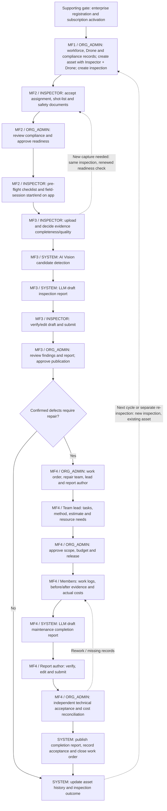

## 3. Functional Requirements

### 3.1 System Functional Overview

**Target requirements — 7 October 2026.** This section specifies the Enterprise SaaS target for Report 3: four human roles and four connected Main Flows. It supersedes the previous multi-provider target within this report, not the deployed API, schema or executed tests. This requirements revision makes no claim that target workflow steps have been implemented or tested. The separate backend reset began on the same date. V24 aligns identity vocabulary, V25 adds the target schema, and V26 completed the runtime cutover to the exact 41-table target inventory on 8 October 2026 (verified by `./mvnw clean verify`, 88 tests, exit 0). MF1–MF4 workflow behavior remains outside reset scope. Selected companion documentation was synchronized on 7 October, without altering Report 5 test evidence; other reports, the proposal and client repositories may still require synchronization.

#### 3.1.1 Screens Flow

The browser supports `ADMIN` platform governance and organization-scoped operations. Web/mobile support assigned `INSPECTOR` and `MAINTENANCE_ENGINEER` work. `SYSTEM`, AI Vision and LLM are automated actors, not user roles. The backend remains the authorization authority.

```mermaid
flowchart TD
  S["Supporting gate: enterprise registration and subscription activation"] --> A
  A["MF1 / ORG_ADMIN: workforce, Drone and compliance records; create asset with Inspector + Drone; create inspection"] --> B
  B["MF2 / INSPECTOR: accept assignment, shot-list and safety documents"] --> C
  C["MF2 / ORG_ADMIN: review compliance and approve readiness"] --> D
  D["MF2 / INSPECTOR: pre-flight checklist and field-session start/end on app"] --> E
  E["MF3 / INSPECTOR: upload and decide evidence completeness/quality"] --> V
  E -.->|"New capture needed: same inspection, renewed readiness check"| B
  V["MF3 / SYSTEM: AI Vision candidate detection"] --> N
  N["MF3 / SYSTEM: LLM draft inspection report"] --> R
  R["MF3 / INSPECTOR: verify/edit draft and submit"] --> F
  F["MF3 / ORG_ADMIN: review findings and report; approve publication"] --> G
  G{"Confirmed defects require repair?"}
  G -->|"No"| Z["SYSTEM: update asset history and inspection outcome"]
  G -->|"Yes"| T
  T["MF4 / ORG_ADMIN: work order, repair team, lead and report author"] --> P
  P["MF4 / Team lead: tasks, method, estimate and resource needs"] --> Q
  Q["MF4 / ORG_ADMIN: approve scope, budget and release"] --> W
  W["MF4 / Members: work logs, before/after evidence and actual costs"] --> H
  H["MF4 / SYSTEM: LLM draft maintenance completion report"] --> I
  I["MF4 / Report author: verify, edit and submit"] --> J
  J["MF4 / ORG_ADMIN: independent technical acceptance and cost reconciliation"] --> K
  J -.->|"Rework / missing records"| W
  K["SYSTEM: publish completion report, record acceptance and close work order"] --> Z
  Z -.->|"Next cycle or separate re-inspection: new inspection, existing asset"| A
```

Only platform interactions and recorded decisions are steps. RC flight, camera adjustment, physical repair, isolation and measurements are real-world activities outside the application's control; users record their preparation, observations and results. A Start action does not arm or pilot a Drone.

#### 3.1.2 Screen Descriptions

| Screen group | Responsible user | Purpose |
| --- | --- | --- |
| Registration, Login, Profile and Sessions | Initial ORG_ADMIN; all issued users | Create an enterprise workspace; authenticate, manage profile and revoke sessions. |
| Enterprise Subscriptions and Technical Settings | ADMIN | Manage one ENTERPRISE offering with 1-, 6- or 12-month billing periods, platform configuration and support/security audit. |
| Organization Team and Credentials | ORG_ADMIN | Manage Inspector/Engineer accounts, qualifications, evidence, validity and disablement. |
| Drone Fleet and Compliance Documents | ORG_ADMIN | Manage identified company Drones, serviceability, maintenance records and applicable regulatory documents. |
| Assets and Assigned Pair | ORG_ADMIN | Create assets with one responsible Inspector and one identified Drone; maintain documents and assignment history. |
| Inspection Schedule and Inspection Setup | ORG_ADMIN | Create an inspection with scope/dates and a snapshot of the asset's assigned pair; review periodic due work. |
| Mission Preparation and Readiness Review | Inspector; ORG_ADMIN | Accept work, prepare component shot-list and applicable permits/checklists; review compliance and readiness. |
| Field Sessions | Assigned Inspector | Complete current pre-flight checklist; record start/end, interruption, postponement and incidents. |
| Evidence and Quality Decision | Assigned Inspector | Upload files, review coverage/quality and decide re-upload or additional capture. |
| AI Candidates and Inspection Report Draft | Assigned Inspector; reviewing ORG_ADMIN | Inspect suggested detections, request/read LLM draft, verify content and submit/return/approve. |
| Published Inspection Reports | ORG_ADMIN; authorized assigned users | Read the approved version and source evidence; initiate corrective work without editing that version. |
| Maintenance Team and Work Order | ORG_ADMIN; assigned Engineer team | Name the team, lead and report author; define tasks, dates and acceptance criteria. |
| Estimate, Budget and Changes | Team lead; ORG_ADMIN | Prepare versioned estimates, approve scope/budget and approve/reject changes. |
| Maintenance Logs, Evidence and Actuals | Assigned team members; lead | Record completed work, materials, hours, equipment use, test results and supporting receipts. |
| Maintenance Report and Acceptance | Report author; independent ORG_ADMIN | Verify the LLM draft, submit, review technical results, reconcile costs and close or return work. |
| Dashboards and Audit | Each role in permitted scope | View responsible work, deadlines, compliance expiries and history. |

#### 3.1.3 Screen Authorization

`O` means own organization; `A` means specifically assigned inspection, work order or task. An organization-level role is insufficient without resource scope. Platform support access must have an authorized purpose and be audited; ADMIN has no default right to make customer technical or budget decisions.

| Resource/action | ADMIN | ORG_ADMIN | INSPECTOR | MAINTENANCE_ENGINEER |
| --- | --- | --- | --- | --- |
| Platform settings, enterprise activation | Manage platform | View/manage own subscription request | Denied | Denied |
| Team, Drone and compliance catalog | Audited support only | Manage O | View applicable own records | View applicable own records |
| Assets, default pair, inspection creation | Audited support only | Manage O | View A | View assets linked to A work |
| Readiness approval | Denied | Approve/return O, qualified reviewer | Prepare/respond A; no self-approval | Denied |
| Field-session start/end | Denied | View/return O | Manage A | Denied |
| Evidence-quality decision | Denied | View O | Decide A | Manage evidence for A repair tasks only |
| Inspection findings and draft | Denied | Review/approve O | Annotate, verify/edit authored A draft | View released sources linked to A work |
| Inspection publication | Denied | Qualified, independent approval O | Submit A; cannot publish | Denied |
| Maintenance team, scope and budget | Denied | Assign/approve O | View when assigned verification | Prepare A; lead privileges only if designated |
| Task logs and actual costs | Denied | View/reconcile O | Denied unless scoped verification | Record own A tasks; lead consolidates A |
| Maintenance report submission | Denied | Return/review O | Provide assigned verification results | Designated report author only |
| Technical acceptance / work-order closure | Denied | Independent decision O | Provide verification if assigned | Cannot accept/close own team work |
| Published history and audit | Platform security scope | O | A | A |

Team lead and report author are work-order responsibilities assigned to `MAINTENANCE_ENGINEER` accounts, not new login roles. One Engineer may hold both responsibilities. Neither role nor designation allows self-approval of a budget or independent acceptance of the team's own work.

#### 3.1.4 Non-Screen Functions

- Enforce workspace/subscription entitlement and organization/assignment authorization on every protected action.
- Generate due-cycle inspections idempotently by asset, schedule and due-cycle key; snapshot the assigned pair instead of making it an exclusive lifetime reservation of a Drone.
- Check typed validity dates, identity links, serviceability and known resource conflicts. Authority-permit applicability, geographic coverage and regulatory conditions require a recorded human review when not reliably machine-verifiable; no universal government-registry integration is assumed.
- Recheck readiness at Start; record postponement and invalidate approval when the relevant assignment, plan or required documents change.
- Validate upload format/size/integrity, compute server-side SHA-256 and persist authorized evidence in MinIO. Technical validation is not the Inspector's substantive quality decision.
- Run eligible image inference only after Inspector evidence confirmation; store candidate/model provenance separately from confirmed findings.
- Produce source-grounded LLM drafts for both inspection and maintenance reports; track generation status/failure separately from evidence upload.
- Calculate estimate, approved-change and actual totals from typed decimal line items. LLM does not calculate the authoritative financial totals.
- Preserve report versions, estimate baselines, changes, decisions and audit events. Notify the next accountable user without granting access through the notification.

#### 3.1.5 Logical Data Relationships

This is a requirements-level inventory, not a statement that tables, endpoints or migrations already exist. The retained legacy `assets/erd.png` describes an earlier model and is not normative for this revision. No schema change is included.

| Logical record | Responsibility and relationship |
| --- | --- |
| Organization, User, Role Assignment, Auth Session | One tenant owns its business records and issued workforce accounts; platform ADMIN is outside the customer business chain. |
| Enterprise Subscription | One ENTERPRISE plan, selected 1/6/12-month period, validity, confirmed billing/payment status and terms version. |
| Workforce Credential / Compliance Document | Subject (organization/user/Drone/permit), issuer, type, reference, effective/expiry dates where applicable, evidence and verification history. Store only legally relevant personal data. |
| Asset Category, Checklist Template | Versioned categories, component checklists and suggested cadences. |
| Asset, Asset Document, Asset Pair Assignment | Own-organization infrastructure and document versions; one default Inspector + specific Drone, with effective assignment history. |
| Drone | Organization-owned identified device, model/serial, applicable payload information, serviceability and maintenance history. |
| Inspection Schedule / Inspection | Due-cycle planning and one uniquely identified inspection created in MF1; asset/scope/dates and assigned-pair snapshot. |
| Mission Preparation / Readiness Decision | MF2 shot-list, applicable permits/checks, plan version, decision maker and approval basis. |
| Field Session / Checklist Response | Start/end, responsible Inspector, actual assigned Drone, checklist and interruption/incident notes; many sessions may belong to one inspection. |
| Evidence / Evidence Quality Decision | Source object/checksum/available metadata plus Inspector's coverage/quality decision for a particular evidence set. |
| AI Candidate / Confirmed Finding | AI suggestion and model version versus a human-confirmed finding with source evidence, component, severity rationale and decision history. |
| Inspection Report / Report Version | Draft generation inputs, human author review, qualified ORG_ADMIN review, publication and immutable approved version. |
| Maintenance Work Order / Task | Approved source report/finding links; corrective scope, acceptance criteria, task responsibilities and lifecycle. |
| Maintenance Team Assignment | Members, exactly one lead and exactly one accountable report author per work order, with assignment history. |
| Estimate Version / Budget Decision / Change Order | Decimal line items, initial approved baseline, approved scope/cost/time changes and decision history. |
| Work Log / Cost Actual / Repair Evidence | Attributable task logs, labor/material/equipment/service actuals, document references and before/after proof. |
| Maintenance Report Version / Acceptance Record | LLM-assisted draft, report-author verification, independent technical decision, cost reconciliation and published closeout. |
| Notification / Audit Event | Scoped recipient and append-only attribution of consequential transitions. |

### 3.2 FE-01 Identity, Enterprise Subscription and Workforce Governance

FE-01 provides supporting identity/subscription gates and the workforce/compliance capabilities used by MF1. Canonical human roles are `ADMIN`, `ORG_ADMIN`, `INSPECTOR`, `MAINTENANCE_ENGINEER`. No Provider, Client marketplace, commission settlement or Platform Operator role exists in this target.

- A company's first representative registers the organization and initial ORG_ADMIN account together. Subscription activation is a separate entitlement decision, not proof of aviation or engineering qualifications.
- ADMIN manages enterprise subscriptions and technical/security settings. ENTERPRISE has only 1-, 6- and 12-month payment periods. Price, discount, trial, resource limits and expiry/retention policies must be expressly configured/disclosed; no numerical discount, unlimited-use promise or trial duration is presumed.
- ORG_ADMIN provisions and manages its own Inspectors/Engineers and relevant credentials. A report reviewer must be identified and qualified for the inspection/repair scope; account administration rights alone do not confer professional authority.
- Workforce and business records are tenant-scoped. Inspectors and Engineers can act only on their assignments; team designations narrow permission further.
- Browser access tokens stay in memory; protected refresh credentials use HttpOnly cookies. Mobile credentials use the secure mobile contract and platform secure storage.
- Logout, password/role/status changes and revocation invalidate affected sessions. Removing a user from a team or replacing the report author ends future authority without erasing prior attribution.
- The first release records subscription invoice/payment confirmation administratively; no online payment gateway, provider billing, commission or custody of repair funds is required. An internal subscription statement is not automatically a statutory tax invoice.

### 3.3 FE-02 Asset, Drone, Workforce and Compliance Catalog — MF1

MF1 retains the agreed asset-creation assignment: **ORG_ADMIN creates an asset together with one responsible Inspector and one specific Drone**, then creates inspections that inherit that pair. Re-inspecting an existing asset does not recreate the asset.

#### 3.3.1 Detailed MF1 Steps

**Trigger:** Activated organization workspace; ORG_ADMIN opens resource setup or an existing asset. **Outputs:** Managed resources plus an identified, assigned inspection ready for MF2. Step IDs below are Report 3 target-step references, not renamed Report 5 test IDs.

| Step | Responsible actor | Platform action / input | Output and gate |
| --- | --- | --- | --- |
| MF1-01 | ORG_ADMIN | Open own workspace; maintain company identity, operational contacts and authorized reviewers. | Named responsibility; no cross-tenant management. |
| MF1-02 | SYSTEM | Authenticate and check role, organization and subscription entitlement. | Deny disallowed operations; show expiry/renewal guidance without deleting existing history. |
| MF1-03 | ORG_ADMIN | Invite/provision Inspector and Maintenance Engineer accounts; enable, update or suspend them. | Active workforce records; suspension removes future assignment eligibility. |
| MF1-04 | ORG_ADMIN | Record applicable skills/credentials: qualification, training, issuer/reference, dates and evidence; health/insurance documents only when relevant and lawfully required. | Reviewable credential history; do not assume every occupation requires the same licence. |
| MF1-05 | SYSTEM | Validate document type/subject and dates; calculate expiry warnings and record review status. | Missing/expired/suspended status visible; machine validation is not government verification. |
| MF1-06 | ORG_ADMIN | Register each company Drone by unique identifier/serial, model, payload when applicable, serviceability and relevant maintenance/registration documents. | Identified Drone usable as an assignment reference; unavailable devices not eligible for release. |
| MF1-07 | ORG_ADMIN | Maintain flight-permit and other applicable compliance files, issuer/reference, geographic/time scope and conditions. | Distinguish application, issued permission, expiry, rejection and revocation; platform does not apply to an authority automatically. |
| MF1-08 | ORG_ADMIN | Enter asset code/category, components, location, scope context, site access, contact, source documents and known limitations. | Own-organization asset profile; informational airspace warning does not authorize flight. |
| MF1-09 | ORG_ADMIN | In the same asset-creation workflow, select exactly one responsible Inspector and one identified Drone from own resources. | Required default Inspector + Drone pair attached to the asset. |
| MF1-10 | SYSTEM | Validate asset-code uniqueness, same organization, active users and valid Drone reference; save asset/pair together and audit. | No partially created complete asset with a missing pair. Asset assignment is not a flight permit or an exclusive reservation of the Drone. |
| MF1-11 | ORG_ADMIN | Create an inspection for this asset: objective, component scope, acceptance criteria, requested dates and, if needed, cadence. | New inspection ID; existing asset reused. No procurement/RFQ step. |
| MF1-12 | SYSTEM | Inherit the current asset pair into the inspection, snapshot scope/defaults and test known Inspector/Drone schedule conflicts. | Draft/assigned inspection distinct from the mutable asset default; periodic due-cycle retry cannot duplicate it. |
| MF1-13 | ORG_ADMIN | Confirm the pair/date/scope; if reassignment is needed, record the reason and whether it affects only this inspection or future asset defaults. | Versioned assignment; unresolved conflicts/disabled users/unavailable Drones block dispatch. |
| MF1-14 | SYSTEM | Dispatch the assigned inspection to Inspector; attach source-document references and notify. | MF1 → MF2: inspection ID, asset/scope/dates, Inspector, Drone and applicable document references. |

**Exceptions:** Missing resources keep setup incomplete; the user must select/add appropriate resources rather than SYSTEM inventing them. Updated default asset assignments never rewrite past inspection snapshots. Known expiry at the planned time is flagged; the complete mission-specific permit/compliance decision is made in MF2. Cadence changes affect future due work, not published history.

### 3.4 FE-03 Mission Preparation, Assignment Response and Readiness — MF2

MF2 receives the assignment created in MF1; it does not source a Provider or calculate recommended GSD, overlap, gimbal or physical flight-control settings. The platform supports a component shot-list and documented compliance/safety preparation.

#### 3.4.1 Detailed MF2 Steps

**Trigger:** Inspector receives an assigned inspection. **Outputs:** Audited readiness decision and one or more ended field-session records under the same inspection.

| Step | Responsible actor | Platform action / input | Output and gate |
| --- | --- | --- | --- |
| MF2-01 | INSPECTOR | Open the assignment; review asset, scope/dates, assigned Drone and relevant documents. Accept or reject with a reason. | Rejection returns to ORG_ADMIN in MF1; no self-selection of an unassigned Drone. |
| MF2-02 | SYSTEM | Check assignment/organization, record response and notify ORG_ADMIN. | Only the assigned Inspector can respond; accepted assignment does not itself establish readiness. |
| MF2-03 | INSPECTOR | Prepare component shot-list, required evidence types and checklist; identify access limitations, proposed field-session times and known hazards on app. | Reviewable preparation version; hardware configuration is outside scope. |
| MF2-04 | ORG_ADMIN | Link the actual applicable issued permit/permission and credential/Drone records; document airspace-source checks, scope/time coverage and conditions. | Missing authorization cannot be waived by an internal approval. An exemption, if genuinely applicable, requires a recorded legal basis and supporting review. |
| MF2-05 | SYSTEM | Validate required links, document dates/status, pair, plan version and known conflicts against planned session time. | List blockers; ambiguous authority/geographic conditions require human verification, not inferred automatic clearance. |
| MF2-06 | INSPECTOR | Read restrictions and preparation checklist; record safety acknowledgments and submit preparation. | Attributable Inspector submission; acknowledgment is not a statutory licence or guaranteed digital signature. |
| MF2-07 | ORG_ADMIN | As the named qualified reviewer, inspect the preparation and compliance basis. Approve or return with reasons. | `READY_FOR_FLIGHT` only when all applicable mandatory conditions pass; reviewer identity and source-document versions recorded. |
| MF2-08 | SYSTEM | Snapshot the approved plan/pair/documents and notify Inspector. | A material plan, pair, permit or schedule change invalidates readiness and requires review again. |
| MF2-09 | INSPECTOR | At site, identify the assigned Drone, complete the current pre-flight checklist and either request Start or record postponement/interruption reason. | No software control of Drone; weather/site safety can lead to postponement even after earlier approval. |
| MF2-10 | SYSTEM | Immediately recheck current entitlement, assignment, readiness version and required validity; on success record `IN_PROGRESS`, Inspector, Drone and session start time. | Reject stale/expired/revoked readiness. Start does not arm the aircraft or establish actual flight time from hardware. |
| MF2-11 | INSPECTOR | On app, record checklist results, relevant observations/incidents and End, pause/abort or postponement. | Actual collected coverage/limitations and timestamps; government incident reporting, if applicable, remains the responsible person's duty. |
| MF2-12 | SYSTEM | Save the session outcome/end; mark that session `FIELD_COMPLETED` only when ended and preserve previous sessions. | MF2 → MF3: session references, checklist/shot-list, pair and compliance snapshot. This is not overall inspection completion or report approval. |

**Additional capture:** Inspector may request another session for the same inspection from MF3. Return to preparation/readiness checks before Start, particularly if the time, scope or permits changed. Do not jump directly from missing evidence to an unconditional Start.

### 3.5 FE-04 Field Records, Evidence and Inspector Quality Decision

FE-04 implements the session-record obligations of MF2 and evidence steps MF3-01–MF3-04. Inspector, not the upload validator or LLM, decides substantive evidence adequacy.

- Store every upload against its organization, inspection and source session; sources may include web/mobile uploads or imported/SD-card files. Do not imply a device SDK or live telemetry connection.
- Validate type/size, detect corrupt input and compute checksum server-side; reject duplicate checksums within the same inspection/work log and support safe retries. A replacement is a new linked object; do not overwrite original evidence.
- Preserve available capture time/GPS/device metadata with its origin/confidence. Missing GPS/telemetry is disclosed, not fabricated and not an automatic rejection of otherwise adequate visual evidence.
- Inspector compares the evidence set with the shot-list: component coverage, focus/exposure, appropriate modality and observable details. Record confirmed adequacy, limitations or the decision to re-upload/request another field session.
- Technical checks can flag problems, but cannot mark substantive evidence accepted on the Inspector's behalf. Disclosed limitations must not turn an unobserved area into a finding of no defect.
- Hashes/timestamps support integrity/provenance; they do not prevent every modification or automatically establish legal admissibility.

#### 3.5.1 Inspection and Report Collections

A user reaches MF3 work through a **scoped list**, not by entering a record identifier by hand. Identifier entry alone is not an acceptable discovery path: it is unauditable, gives no indication of scope, and pushes organization and assignment filtering onto the user.

- Provide a paged inspection collection for the authenticated caller. Scope is resolved from the caller's role and never from a client-supplied organization, owner or assignment value: an Inspector sees only inspections assigned to them, an ORG_ADMIN sees every inspection in their own organization, and a platform `ADMIN` may read across organizations.
- Platform cross-tenant read is a **separate, read-only administrative capability**. It does not confer organization authority, does not extend to authoring, review or publication, and must not be granted implicitly by holding the role.
- Report records are reached **through their inspection**, so the report review queue is a filtered view of the same collection rather than an independent resource. Each row states its report status and version so the inspection and report screens cannot disagree.
- Listing is server-paged with a bounded page size, a stable ordering, and a unique tie-breaker, so no row can appear on two pages and no caller can retrieve an unbounded set.
- A caller with no scope for the resource is refused; an out-of-scope record is not disclosed by appearing in a list.

### 3.6 FE-05 AI Vision Candidates and Human Finding Decisions

FE-05 supports MF3 detection and review. Inference starts only on the evidence set the assigned Inspector has confirmed suitable. Model availability and asset/modality compatibility must be checked.

- SYSTEM stores candidate label, confidence, source evidence, box/location and model version. Unsupported modalities remain for manual review; no guaranteed sub-millimetre measurement or structural diagnosis is promised.
- Inspector may annotate observations, recommend confirm/modify/reject and record manual findings. The MF3 ORG_ADMIN review records the final decision on findings included in the released report.
- Unverified candidates remain distinguishable throughout LLM drafting. Candidate confidence is not the engineering severity/risk rating; severity needs a human rationale and applicable evaluation criteria.
- Only human-confirmed/manual reviewed findings enter official statistics and corrective-work scope. Rejected candidates never become official by virtue of appearing in a generated draft.
- AI failure preserves evidence and permits manual findings/report preparation, with the unavailable/omitted analysis disclosed.

### 3.7 FE-06 Inspection Report Drafting, Review and Publication — MF3

MF3 provides a **point-in-time asset inspection report**, not a flight permit, proof that the asset is structurally safe, or a repair-completion certificate. The assigned Inspector is the human report author; LLM is a drafting tool. The reviewer is an appropriately qualified ORG_ADMIN distinct from the author. Responsibilities assigned here are product controls, not claimed certification under an international standard.

#### 3.7.1 Detailed MF3 Steps

**Trigger:** An ended MF2 session and its evidence are available. **Sequence retained:** AI Vision detection → LLM report draft → human review/publication.

| Step | Responsible actor | Platform action / input | Output and gate |
| --- | --- | --- | --- |
| MF3-01 | INSPECTOR | Upload original evidence to the correct inspection/session; add component/capture context where metadata is missing. | Attributable files; no automatic quality acceptance. |
| MF3-02 | SYSTEM | Validate technical intake, compute hash, store source references and display processing/upload errors. | Valid stored files; corrupt/type/size/duplicate failures identify corrective action. |
| MF3-03 | INSPECTOR | Compare evidence with shot-list and directly decide completeness/quality. Re-upload a file or request an additional MF2 session if needed. | Inspector's documented adequate/insufficient decision; SYSTEM does not decide image usefulness. |
| MF3-04 | SYSTEM | Snapshot the evidence set after Inspector confirmation; preserve missing-metadata/coverage flags. | Source set eligible for processing; changes make dependent drafts/review confirmations stale. |
| MF3-05 | SYSTEM / AI Vision | Run compatible detection on eligible images and store suggested defects/model provenance. | Non-official candidates; manual path remains available on failure or incompatibility. |
| MF3-06 | INSPECTOR | Add source-backed field observations, annotations and any manual findings or notes needed for drafting. | Candidate/observation packet; measurements require documented method/units, not pixel guesswork. |
| MF3-07 | SYSTEM / LLM | After detection, generate a labelled `DRAFT` from authorized asset/scope/session/checklist/evidence references and candidate/observation data. | Source-linked narrative; candidate statements labelled unverified; missing facts retained as unknown. |
| MF3-08 | INSPECTOR — report author | Read/edit the entire draft; verify identifiers, equipment, coverage, findings, uncertainty and recommendations against sources; submit the reviewed version. | Human author confirmation and submitted version; unsupported causes/measurements removed. |
| MF3-09 | ORG_ADMIN — qualified reviewer | Review source evidence, accept/modify/reject candidates, confirm manual findings and review the text/limits. Return with reasons or approve. | Final finding decisions and report sign-off; no self-review by the author and no default acceptance on a timer. |
| MF3-10 | SYSTEM | Apply reviewer-approved structured finding changes and totals to the draft; if narrative regeneration/edits are required, return to MF3-08 and MF3-09. | Text and findings agree; any material change invalidates prior sign-off. |
| MF3-11 | SYSTEM | Publish the approved report version/PDF with author, reviewer, date, source index and approval record; apply qualified digital-signature integration only if supplied. | Immutable official version; logged application approval alone is not a certified digital signature. |
| MF3-12 | ORG_ADMIN | Mark required corrective items and priorities/deadlines or record that no corrective work is required within the observed scope. | Approved repair list only; no empty work order for a no-repair outcome. |
| MF3-13 | SYSTEM | Update inspection/asset history; hand approved corrective items to MF4 with report-version and finding references. | Pending corrective work remains visible. If none is required, close inspection outcome with limitations preserved. |

**Draft-state semantics:** `DRAFT` → author-verified/submitted → review/returned → approved/published are target states, not claims about existing backend enum values. Drafts contain AI suggestions; released reports contain the approved conclusion. Failed LLM generation permits the author to complete a structured manual draft with the same review gates. Regeneration must be explicit/versioned and must not silently overwrite human edits.

#### 3.7.2 Required Inspection Report Content

These fields are a project template informed by report-writing and annotation practices, not a universal regulatory drone-report form. ASNT emphasizes traceable technique, evaluation criteria, equipment and detailed observations; PIX4D's report documentation separates project details and annotated screenshots/properties.[1][7]

| Section | Content to record | Accountable human |
| --- | --- | --- |
| Identification | Report ID/version/status; organization, asset/site/component, inspection/session references; dates; Inspector author and qualified reviewer. | Inspector; reviewer confirms. |
| Executive summary | Observed condition, important confirmed findings, priority actions and limitations; no unsupported whole-asset safety claim. | Inspector; ORG_ADMIN approves. |
| Purpose, scope and criteria | Inspection objective, included/excluded components, shot-list/coverage, supplied technical criteria and their versions. | Inspector; ORG_ADMIN approves. |
| Method, equipment and conditions | Actual visual/thermal/other method used; identified Drone/payload/model/serial where recorded; calibration and measurement method when applicable; site conditions and unavailable data. | Inspector. |
| Evidence register | Evidence IDs, session, capture metadata if present, component/location references, original images and annotated views; missing metadata disclosed. | Inspector; SYSTEM indexes. |
| Confirmed findings | Finding ID, component/location, description, observed evidence, measurements with method/units if valid, severity/priority and human reasoning, decision identity/time. | ORG_ADMIN final decision; Inspector authors observations. |
| Conclusions and recommendations | Point-in-time assessment limited to observed scope; suggested next actions or specialist/additional checks. Causal explanations remain hypotheses unless validated by an appropriate method. | Inspector and qualified reviewer. |
| Approval and revisions | Author confirmation, reviewer approval/return rationale, approved version/time; applicable signature reference; corrections as new linked versions. | ORG_ADMIN; SYSTEM records. |
| Appendices | Checklist, diagrams/source documents, evidence index and links to separate session/compliance logs. | Inspector; SYSTEM compiles. |

No finding is automatically “absent” in an area not observed. This visual/AI-assisted record is not a certified NDT, load-capacity, electrical-safety or statutory inspection report unless the actual scope, methods, qualified personnel and applicable legal requirements justify that specific status. MF3 may identify that a repair estimate is needed; the authorized cost estimate belongs to MF4, not an LLM-invented price.

#### 3.7.3 LLM Safeguards for Both Report Types

NIST's Generative AI Profile identifies confabulation risk and recommends reviewing/verifying generated sources and citations; it is voluntary guidance, not a blanket legal mandate for these application roles.[5]

- Use only scoped source snapshots. Do not provide secrets, unrelated tenant data or unnecessary personal/medical records to a model.
- Treat file text, EXIF and prior drafts as untrusted data, not instructions to change workflow permissions or approve a report.
- Preserve model/provider identifier, template/prompt version, generation time, input evidence/data IDs and subsequent human decisions. Store references to the source facts supporting each narrative section.
- Do not invent telemetry, calibration, measured dimensions, dates, repair completion, cost rates, regulatory references or signatures. Missing data stays unknown/not supplied.
- Separate observed facts, AI candidates, human-confirmed findings, hypotheses and recommendations. Confidence is not certification or engineering risk by itself.
- Numeric report tables come from validated structured data/calculations. LLM may explain differences but cannot approve budgets, make authoritative financial totals or invent financial evidence.
- No autonomous publication, acceptance, defect closure or repair scheduling from generated text. Every official report has a named author and qualified approval/acceptance record.

### 3.8 FE-07 Team Maintenance, Cost Control and Completion Reporting — MF4

MF4 receives **published MF3 findings requiring repair**. It manages the enterprise's internal repair team, approved scope, estimates, changes, actuals and closeout. It is not a provider marketplace or payment/commission flow. Supplier quotes/receipts can be attached as cost evidence without creating a supplier user role, bidding portal, accounting ledger or procurement integration.

**Implementation status (10 Oct 2026; not a normative requirement change):** the backend exposes a partial MF4 REST/workflow slice for repair candidates, work orders, team/task/estimate approval, work logs, change orders, completion report submission, independent acceptance, cost reconciliation and closure. Automated backend verification passed 278 tests, including MF4 Testcontainers/MockMvc scenarios. The following target requirements remain incomplete: no skills model or credential issuance/verification flow; the current interim implementation permits an absent credential record but rejects a present invalid/expired credential (this does not satisfy MF4-04's required-presence rule); notifications are not delivered; `REINSPECTION_REQUIRED` is recorded but does not dispatch a linked MF1 inspection; evidence object upload and rendered report artifact are not implemented; and there are no maintenance web/mobile clients. These are explicit gaps, not deemed satisfied by the REST surface. Report 5 maps the executed backend slice to three selected FE-07 cases; it is not full MF4/SRS coverage.

#### 3.8.1 Team Responsibilities and Assignment

CMMS practice supports work-order tasks, resource requirements, approval, execution records and cost comparison; it is a design reference for this project, not a mandate to copy every ERP role or module.[2][8]

| Responsibility | Existing login role | Assigned by / scope | What this person does |
| --- | --- | --- | --- |
| Work-order owner / budget approver | ORG_ADMIN | Authorized person in the asset's organization | Selects corrective scope; names team, lead, report author and accepting reviewer; approves baseline/changes and records closure authorization. |
| Repair team lead | MAINTENANCE_ENGINEER | ORG_ADMIN designates exactly one per work order | Coordinates assessment, task allocation, method, estimate, resource readiness and consolidated completion/actuals. |
| Team member / task assignee | MAINTENANCE_ENGINEER | ORG_ADMIN selects team; lead allocates tasks within approved membership | Accepts tasks, records own work/consumption/time, uploads before/during/after proof and technical checks. |
| Accountable repair-report author | MAINTENANCE_ENGINEER | ORG_ADMIN designates exactly one per work order | Collects the team's records, requests/verifies/edits the LLM completion report and submits it; remains the author even when LLM drafted text. |
| Independent accepting reviewer | ORG_ADMIN | Named qualified person not on the executing team and not the report author | Checks scope, evidence/test results and residual issues; accepts or returns; cost reconciliation is a separate recorded decision. |
| Re-inspection verifier, if required | INSPECTOR | Assigned through a linked MF1 inspection | Records independent inspection evidence/results; cannot stand in for a repair engineer's work log. |
| Automated assistant | SYSTEM / LLM | Authorized workflow | Validates references, computes totals, drafts narrative, preserves decisions and publishes only after approval. |

A team contains one or more active Engineers; normal multi-person work uses separate task responsibilities. Lead and report author may be the same Engineer, but final acceptance cannot be performed by that person or the executing team. Lead can allocate tasks only to approved members. Replacement of the lead/report author is performed by ORG_ADMIN with a reason and a recorded handover; old logs retain their authors. Budget and technical acceptance are distinct actions even if performed by the same qualified, non-executing ORG_ADMIN under company policy. If no qualified independent reviewer exists, the work remains awaiting review; the platform does not create a professional qualification.

#### 3.8.2 Detailed MF4 Steps

**Trigger:** MF3 report published with confirmed repair-required findings. **Outputs:** Human-verified maintenance completion report, independent acceptance, reconciled costs and immutable work-order history.

| Step | Responsible actor | Platform action / input | Output and gate |
| --- | --- | --- | --- |
| MF4-01 | SYSTEM | Propose/create a draft work order for selected repair-required findings; link asset, inspection, published report version and source evidence; check duplicates. | Traceable draft; do not create a second active work item for the same scope without a reason. |
| MF4-02 | ORG_ADMIN | Triage priority, required corrective scope, due date, access/safety constraints and acceptance criteria; identify urgent controls in the record. | Explicit work-order scope; no automatic claim that controls have physically been applied. |
| MF4-03 | ORG_ADMIN | Select qualified own-organization team members and designate one lead, one report author and an independent qualified accepting ORG_ADMIN. | Attributable team assignment; not a new role or an external Provider. |
| MF4-04 | SYSTEM | Validate active membership, applicable skills/credential dates, organizational scope and reviewer independence; notify assigned people. | No release if required assignment/credentials/reviewer are missing. |
| MF4-05 | Team lead — MAINTENANCE_ENGINEER | Accept/return the planning assignment; record remote/site assessment and divide approved defect scope into tasks with proposed assignees and method/verification needs. | Technical task plan; unexpected evidence remains linked to the source finding without rewriting MF3. |
| MF4-06 | Team lead — MAINTENANCE_ENGINEER | Prepare estimate version: labor hours/rates, materials quantities/unit prices, equipment/tools, applicable services and supporting quotes; propose dates and permitted contingencies. | Itemized estimate and assumptions; the responsible Engineer supplies rates/data, not LLM. |
| MF4-07 | SYSTEM | Validate decimal/currency/quantity inputs and calculate estimate totals; show resources, documents and missing cost lines. | Reviewable baseline candidate; unpriced work is not silently recorded as zero. |
| MF4-08 | ORG_ADMIN | Review technical method, safety/access preparation, acceptance criteria and estimate. Approve scope/budget/version or return with reasons. | Frozen initial approved baseline; lead/report author cannot approve their own estimate. |
| MF4-09 | Team lead and assigned members — MAINTENANCE_ENGINEER | Confirm task acceptance, dates, resources and applicable work-permit/isolation evidence on app. | Ready task roster; resources awaiting availability remain blocked, not falsely in progress. |
| MF4-10 | SYSTEM | Recheck approved scope/budget, team and applicable prerequisites before recording execution start. | `IN_PROGRESS` for recorded authorized work; no machine actuation or physical safety guarantee. |
| MF4-11 | Assigned members — MAINTENANCE_ENGINEER | Enter task progress, hours, materials actually consumed, equipment/service usage, before/during/after evidence and relevant measured/test results. | Attributable task-level actuals and evidence; no self-acceptance of finished repair. |
| MF4-12 | Team lead / members — MAINTENANCE_ENGINEER | For unexpected scope/cost/time, stop the affected additional work on app and submit a change request with reason, evidence and delta estimate. | Versioned pending change; unaffected approved tasks may continue only if safe and independent. |
| MF4-13 | ORG_ADMIN, then SYSTEM | Approve/reject/return the change. SYSTEM preserves initial baseline and calculates the revised authorized amount/dates from approved changes only. | Release of changed scope only after approval; rejected changes do not enlarge the budget. |
| MF4-14 | Team lead — MAINTENANCE_ENGINEER | Consolidate member completion, actual quantities/hours, as-left condition, paired evidence, tests and unresolved issues; mark the physical work reported complete. | `WORK_COMPLETED` is a team declaration, not `ACCEPTED` or `CLOSED`. |
| MF4-15 | Accountable report author — MAINTENANCE_ENGINEER | Check the team's source records, receipt/cost links and evidence; request draft generation when the completion packet is ready. | Named author and a versioned source packet; missing mandatory evidence blocks submission. |
| MF4-16 | SYSTEM / LLM | Generate a labelled draft maintenance completion report from approved scope/baseline/changes, verified work logs, actuals and evidence. | Draft narrative plus SYSTEM-calculated cost tables; it cannot state “accepted” before the independent decision. |
| MF4-17 | Accountable report author — MAINTENANCE_ENGINEER | Read/edit the entire draft, verify facts, tests, costs/variance and residual issues, then confirm and submit. | Author-verified version `SUBMITTED_FOR_ACCEPTANCE`; no claim that the team has independently accepted itself. |
| MF4-18 | Independent qualified ORG_ADMIN | Compare completion with scope/acceptance criteria, source proof and tests; Accept, Return for Rework or Request Re-inspection with reasons. | Technical acceptance record. Rework returns to relevant tasks; necessary re-inspection creates a linked MF1 inspection. |
| MF4-19 | ORG_ADMIN — authorized cost reviewer | Reconcile actuals/receipts with the approved baseline and changes; record variance explanations and financial review/disposition. | Separate cost reconciliation; unresolved missing/duplicate/unapproved costs block final closure, not historical recording. |
| MF4-20 | SYSTEM | Once tasks, author review, technical acceptance, cost review and pending changes are resolved, publish completion report plus acceptance record and close the work order. | `CLOSED`; update repair disposition/asset history without altering original MF3 findings/report. |
| MF4-21 | ORG_ADMIN, then SYSTEM | Record follow-up/warranty conditions if applicable; inspect whether all required corrective work for the inspection has closed. | Any unresolved corrective scope remains visible; do not mark the whole lifecycle complete while related required work is still open. |

**Workflow distinction:** Draft/planning → pending scope/budget approval → approved/ready → in progress → team work completed → submitted for acceptance → accepted and cost-reconciled → closed. Return/rework and waiting-for-resources are explicit non-final branches. These are target semantics, not existing API enum claims. IBM Maximo likewise distinguishes physical completion (`COMP`) from finalized/history (`CLOSE`); this project adds its named human acceptance and cost gates.[3]

**Exceptions:** If LLM fails, the designated author completes the structured report manually under the same gates. Team changes or changed tasks invalidate affected confirmations. After published closure, corrections/recurrent defects use linked new versions/follow-up records, not silent reopening/overwriting. Warranty applies only when genuine terms are supplied; its expiry alone does not prove defect-free condition or automatically certify a repair.

#### 3.8.3 Repair Cost Model and Approval Rules

PeopleSoft's work-order documentation distinguishes estimated, scheduled and actual costs and variances, while Oracle's change-order workflow preserves reason, amount and revised commitment information.[8][4] The following is the bounded project cost register, not a full accounting/procurement system.

| Category | Estimate input from team lead | Actual input from assigned team / cost reviewer |
| --- | --- | --- |
| Labor | Task, planned hours, approved hourly/internal allocation rate. | Recorded hours and applicable approved rate; internal allocated cost is not a wage payment or SaaS fee. |
| Materials | Item, unit, planned quantity, unit price and quote basis. | Consumed quantity/unit cost and receipt/issue reference; record returns/corrections without deleting history. |
| Equipment/tools | Planned usage and rental/internal allocation rate. | Actual recorded usage and cost basis; owned equipment is not assumed free unless explicitly recorded as included/zero. |
| External services, if used | Documented supplier scope/quote and amount. | Received service amount and supporting record; supplier is a cost reference, not a new provider portal. |
| Other authorized costs | Documented logistics, disposal or other justified line; separately itemized tax where applicable. | Supported actual amounts using the same tax basis/currency; do not hard-code a universal VAT rate. |
| Optional contingency | Explicit reserve approved by ORG_ADMIN with conditions. | Not an incurred cost. Spending requires justified actual lines and applicable change/release approval. |

- A cost line records task/category, description, unit, quantity, unit rate/amount, currency, tax treatment where applicable, evidence/reference and responsible user. One work-order comparison uses one currency and consistent tax basis; no automatic foreign-exchange assumption.
- SYSTEM calculates line amounts and totals with decimal arithmetic and a declared rounding rule. Approved initial baseline `E0` remains immutable; revised authorized amount `B = E0 + sum(approved change deltas)`. Pending/rejected changes are excluded.
- Actual cost `A` is the sum of supported, reconciled incurred/allocation lines; variance `V = A − B`. Percentage variance is `100 × V / B` when `B > 0`; if the baseline is zero, percentage is `N/A`, not a divide-by-zero value.
- Quotes/receipts evidence already-counted lines; attaching an invoice must not add the same materials/services a second time. Missing price is unknown/pending, not zero. Any reserve left unspent is not included in actuals.
- Expected scope/budget growth requires a proposed change **before** the affected additional work is authorized. Actual unexpected spending must still be recorded honestly and escalated as a deviation; recording it does not retroactively authorize it.
- Change records include reason, affected tasks, added/reduced quantity/cost, revised dates, supporting evidence and decision identity/time. Do not silently edit initial approved scope or baseline.
- Final technical acceptance and financial reconciliation are separate. The final report displays initial estimate, approved changes, revised authorized amount, actual total and explained variance. Within-budget work still needs evidence/reconciliation; out-of-budget work needs documented resolution rather than hidden cost.
- Repair expense belongs to the customer organization. It is separate from ENTERPRISE subscription revenue and does not generate platform commission. Supplier/petty-cash/payroll payments occur outside the platform; only references/status may be recorded. Statutory tax/accounting documentation remains the enterprise's responsibility.
- No fixed quote count, spending threshold, contingency percentage or warranty period is assumed. Organization policy and applicable law govern these; policy/approval basis is captured with the decision.

#### 3.8.4 Required Maintenance Completion Report and Acceptance Record

Work-order practice records planned resources, executed work, actual usage and asset history, rather than simply repeating inspection findings.[2][8] The report must prove what the team reports doing and preserve the independent acceptance outcome; it does not replace the original MF3 report.

| Section | Required content | Responsible person |
| --- | --- | --- |
| Identification and source | Work-order/report ID/version; organization/asset/site; source inspection report version and finding IDs; planned/actual dates. | Report author; SYSTEM links. |
| Accountability | Full assigned team, task assignees, lead, report author, scope/budget approver and independent accepting reviewer; assignment/replacement history. | ORG_ADMIN assigns; author verifies. |
| Approved scope and criteria | Required correction by defect/task, approved method, limits, inspection/test and acceptance criteria; original scope/version. | Team lead; ORG_ADMIN approves. |
| Plan and approved changes | Initial estimate, allowed resources/dates and every approved/rejected/pending change with reason; budget calculation from structured records. | Lead proposes; ORG_ADMIN decides. |
| Execution and as-left condition | Actual task dates, attributed work logs, work reportedly carried out, consumed parts/materials, checks/tests and final observed condition. | Assigned members input; lead consolidates. |
| Evidence and verification | Before/during/after references linked to the same defect/component, readings with method/units, missing proof and any separate re-inspection result. | Members; author verifies. |
| Cost statement | Itemized actuals, supporting receipts/references, initial/revised approved budget, actual totals and explained variance; reconciliation status. | Lead/author consolidate; ORG_ADMIN reconciles. |
| Residual issues and follow-up | Unresolved/new defects, incomplete tasks, restrictions, monitoring or specialist needs; documented warranty conditions if actually applicable. | Lead and author; accepting reviewer assesses. |
| Author declaration | LLM-assisted draft reviewed against source records; author's identity/time/version and corrections. | Designated report author. |
| Independent acceptance and closure | Accepted/returned decision, checklist/test basis, reviewer/date/comments, cost-review decision, closure status and applicable signature reference. Not populated as “accepted” by LLM. | Independent ORG_ADMIN; SYSTEM publishes. |

Paired images are required proof, but do not by themselves demonstrate load capacity, electrical safety or concealed-work quality. Additional acceptance tests or specialist records are required when the approved scope demands them. A team declaring completion cannot mark defects independently resolved. Publish a maintenance disposition linked to the original finding; retain the point-in-time MF3 observation unchanged.

### 3.9 FE-08 Dashboard, Analytics and Notifications

- ADMIN views subscriptions, technical health and platform/security audit, not customer technical approvals or repair budgets by default.
- ORG_ADMIN views own assets, workforce/Drone availability, credential/permit expiry, inspection/report queues, team workload, repair estimate/actual variance and pending acceptance/cost decisions.
- Inspector views assigned inspections, quality decisions, draft authoring and returned work. Engineers view their assigned team/task responsibilities; lead/report-author actions appear only for the designated people.
- Official findings analytics use approved findings; candidate/draft counts stay separate. Dashboards distinguish field completed, report published, repairs pending, team work completed, technically accepted and closed.
- Notifications cover assignment/response, document expiry, readiness changes, upload/AI completion or failure, returned reports, budget/change decisions, rework and closure. Notifications do not waive backend scope checks.

### 3.10 Research Basis and Applicability

The referenced sources support the report/maintenance design; they do not certify this SaaS or supply a universal report template for all asset types.

- **Inspection reports:** ASNT's first-party report-writing guidance stresses reproducible technique, criteria/equipment identification, honest missing information and attributable authors; PIX4D documents project details, annotations and screenshots in inspection-support reports.[1][7] Requirements in 3.7 are the project's synthesis, to be adapted to the actual asset type and professional scope.
- **Maintenance lifecycle:** Oracle documents an approval → schedule → technician actuals → complete tasks → close/history flow; IBM distinguishes work completed from work-order closure.[2][3]
- **Cost and change control:** Oracle documents resource/task costs and approved change information.[8][4] We adopt a smaller internal-team workflow, not ERP/vendor integration requirements.
- **Generative reports:** NIST AI 600-1 is voluntary cross-sector guidance addressing confabulation and source verification, used here to justify bounded drafting and human gates.[5] The application's four-role approvals are project decisions.
- **Vietnamese UAV documents:** The Government portal identifies Nghị định 288/2025/NĐ-CP as governing unmanned aircraft and other flying vehicles.[6] This metadata does not establish every applicable clause or the latest amendment; mission-specific applicability, exemptions and later changes must be checked against authoritative law before operation. Foreign FAA/CAA or bridge rules are benchmarks, not Vietnamese legal obligations.
- No claim of ISO/ASTM accreditation, mandatory industry-standard report form, certified digital signature, legal admissibility, or statutory inspection authority is made from these references. Qualified reviewers and asset-specific criteria remain necessary.

## Sources

[1] https://www.asnt.org/standards-publications/blog/nondestructive-testing-report-writing-back-to-basics — Nondestructive Testing Report Writing: Back to Basics - ASNT Pulse
[2] https://docs.oracle.com/en/applications/peoplesoft/financials-and-supply-chain-management/9.2.056/peoplesoft-maintenance-management/peoplesoft-maintenance-management-process-flow.html — PeopleSoft Maintenance Management Process Flow
[3] https://www.ibm.com/docs/en/maximo-manage/cd?topic=orders-work-order-statuses — Work order statuses
[4] https://docs.oracle.com/en/industries/construction-engineering/primavera-unifier/26/accelerator-user/changeorderbusinessprocess-10296629a.html — Change Order Business Process
[5] https://nvlpubs.nist.gov/nistpubs/ai/NIST.AI.600-1.pdf — Artificial Intelligence Risk Management Framework: Generative Artificial Intelligence Profile
[6] https://vanban.chinhphu.vn/?docid=215810&pageid=27160 — Nghị định số 288/2025/NĐ-CP của Chính phủ: Quy định về quản lý tàu bay không người lái và phương tiện bay khác
[7] https://support.pix4d.com/hc/en-us/articles/13552115283613 — Annotations report - PIX4Dcloud Pro
[8] https://docs.oracle.com/cd/G47724_01/fscm92pbr55/eng/fscm/fwkm/UnderstandingWorkOrders-c9f12c.html — Understanding Work Orders
