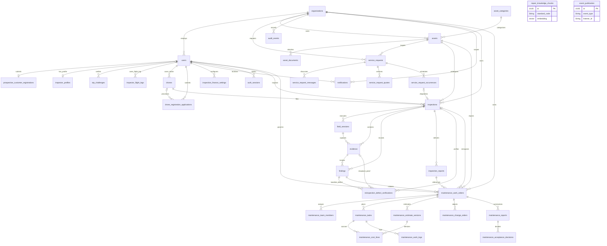

## 2. Database Design

**Files and Persistence Storage Description**

SmartDroneInspection persists structured relational and vector data in **PostgreSQL 17** (with the `pgvector` and `pgcrypto` extensions) and binary media/documents in **MinIO S3-compatible object storage**:

- **Flyway Schema Migration Files (`SmartDroneInspection-backend/src/main/resources/db/migration/V1__baseline.sql` – `V28__persist_field_session_flight_report.sql`)**: Versioned forward SQL migration files managed automatically by Flyway on application startup. Across migrations `V1` through `V28`, the schema defines **36 tables** in the `public` schema (35 application domain tables plus `event_publication` for the Spring Modulith transactional event outbox) along with `hnsw` cosine vector indexes on `repair_knowledge_chunks(embedding)`, composite tenant foreign keys, status check constraints, and optimistic locking (`row_version`) columns.
- **MinIO Object Storage Files (`inspection-evidence` bucket)**: Binary files are streamed through `MinioEvidenceObjectStore` using deterministic or UUID-scoped object keys referenced by PostgreSQL columns:
  - `contracts/requests/{requestId}/{uuid}/{fileName}`: Signed offline service agreement scans (`service_requests.contract_object_key`).
  - `licenses/{userId}/{uuid}-{fileName}` and `drones/registrations/{inspectorId}/{docType}/{uuid}-{fileName}`: Inspector pilot license scans (`inspector_profiles.pilot_license_file_key`) and 3-document drone registration files (`drone_registration_applications`).
  - `assets/{assetId}/documents/{uuid}-{fileName}`: Infrastructure asset engineering drawings and reference documents verified with `SHA-256` checksums (`asset_documents.object_key`).
  - `inspections/{inspectionId}/flight-permits/{uuid}-{fileName}` and `inspections/{inspectionId}/evidence/{uuid}-{fileName}`: Mission flight permits (`inspections.flight_permit_file_key`) and field photographs / `video/mp4` captures (`evidence.object_key`).
  - `reports/{reportVersionId}.pdf` and `maintenance-reports/{reportVersionId}.pdf`: Rendered A4 Inspection Reports and Maintenance Completion Reports generated by `OpenHTMLtoPDF`.

```mermaid
%% title: Database Entity Relationship Diagram (ERD)
erDiagram
  organizations ||--o{ users : employs
  users ||--o| prospective_customer_registrations : submits
  users ||--o| inspector_profiles : has_profile
  users |o--o{ otp_challenges : verifies
  users ||--o{ inspector_flight_logs : owns_flight_log
  users ||--o{ drones : owns_drone
  users ||--o{ drone_registration_applications : submits
  drones |o--o{ drone_registration_applications : provisions
  users ||--o{ inspection_finance_settings : configures
  organizations ||--o{ assets : owns
  asset_categories ||--o{ assets : categorizes
  assets ||--o{ asset_documents : attaches
  organizations ||--o{ service_requests : requests
  assets ||--o{ service_requests : targets
  service_requests ||--o{ service_request_messages : discusses
  service_requests ||--o{ service_request_quotes : versions
  service_requests ||--o{ service_request_occurrences : schedules
  service_request_occurrences |o--o| inspections : dispatches
  organizations ||--o{ audit_events : records
  organizations ||--o{ notifications : scopes
  users ||--o{ notifications : receives
  users ||--o{ auth_sessions : opens
  organizations ||--o{ inspections : owns
  assets ||--o{ inspections : undergoes
  users ||--o{ inspections : inspects
  drones ||--o{ inspections : flies
  inspections ||--o{ field_sessions : executes
  inspections ||--o{ evidence : contains
  field_sessions ||--o{ evidence : captures
  inspections ||--o{ findings : records
  evidence ||--o{ findings : locates
  inspections ||--o{ inspection_reports : delivers
  inspections ||--o{ reinspection_defect_verifications : verifies
  findings ||--o{ reinspection_defect_verifications : baseline_defect
  evidence |o--o{ reinspection_defect_verifications : recapture_proof
  organizations ||--o{ maintenance_work_orders : owns
  assets ||--o{ maintenance_work_orders : repairs
  users ||--o{ maintenance_work_orders : governs
  findings ||--o{ maintenance_work_orders : initiates
  inspection_reports ||--o{ maintenance_work_orders : references
  inspections |o--o{ maintenance_work_orders : reinspects
  maintenance_work_orders ||--o{ maintenance_team_members : assigns
  maintenance_work_orders ||--o{ maintenance_tasks : plans
  maintenance_work_orders ||--o{ maintenance_estimate_versions : estimates
  maintenance_estimate_versions ||--o{ maintenance_cost_lines : itemizes
  maintenance_tasks ||--o{ maintenance_cost_lines : accrues
  maintenance_work_orders ||--o{ maintenance_change_orders : adjusts
  maintenance_tasks ||--o{ maintenance_work_logs : logs
  maintenance_work_orders ||--o{ maintenance_reports : summarizes
  maintenance_reports ||--o{ maintenance_acceptance_decisions : decides
  repair_knowledge_chunks {
    UUID id PK
    String standard_code
    vector embedding
  }
  event_publication {
    UUID id PK
    String event_type
    String listener_id
  }
```

**Table Descriptions**

| No | Table | Description |
| :---: | :--- | :--- |
| 01 | `organizations` | Stores customer organizations that own infrastructure assets, request inspection services, and govern maintenance work orders. - Primary keys: `id` - Foreign keys: None |
| 02 | `users` | Stores user accounts across the five system roles (`ADMIN`, `MANAGER`, `CUSTOMER`, `INSPECTOR`, and `MAINTENANCE_ENGINEER`), account status, `ActorZone`, and organization scope. - Primary keys: `id` - Foreign keys: `organization_id` |
| 03 | `inspector_profiles` | Stores Inspector pilot license numbers, license classes, expiration dates, scanned license files, flight hours, and technical specializations. - Primary keys: `user_id` - Foreign keys: `user_id` |
| 04 | `otp_challenges` | Stores consolidated one-time verification codes (`LOGIN`, `REGISTRATION`, and `PASSWORD_RESET`), expiration timestamps, and attempt counters. - Primary keys: `id` - Foreign keys: `user_id` |
| 05 | `inspector_flight_logs` | Records historical flight missions, flight duration, aircraft details, location, and safety notes for Inspectors. - Primary keys: `id` - Foreign keys: `inspector_user_id`, `recorded_by_user_id` |
| 06 | `auth_sessions` | Tracks active web and mobile login sessions, hashed refresh tokens, expiration times, and session revocation records. - Primary keys: `id` - Foreign keys: `user_id` |
| 07 | `prospective_customer_registrations` | Stores customer organization and initial asset registration requests that require platform review due to restricted airspace proximity. - Primary keys: `id` - Foreign keys: `user_id`, `asset_category_id`, `reviewed_by_user_id` |
| 08 | `drone_registration_applications` | Stores Inspector applications to register owned drones with registration, ownership, and technical inspection documents. - Primary keys: `id` - Foreign keys: `inspector_user_id`, `drone_id`, `reviewed_by_user_id` |
| 09 | `drones` | Catalogs approved drones owned by Inspectors or customer organizations, including serial number, model, and serviceability status. - Primary keys: `id` - Foreign keys: `inspector_owner_id`, `organization_id` |
| 10 | `asset_categories` | Defines the global catalog of infrastructure asset categories managed by platform administrators. - Primary keys: `id` - Foreign keys: None |
| 11 | `assets` | Stores customer infrastructure assets, geographic coordinates, technical profiles, and structural inspection checkpoints (`inspection_items`). - Primary keys: `id` - Foreign keys: `organization_id`, `category_id` |
| 12 | `asset_documents` | Stores engineering drawings and reference documents attached to an infrastructure asset with SHA-256 checksums. - Primary keys: `id` - Foreign keys: `asset_id`, `uploaded_by_user_id` |
| 13 | `service_requests` | Stores one-time and recurring customer inspection requests, preferred time windows, recurrence rules, accepted quotation version, and signed agreement file reference. - Primary keys: `id` - Foreign keys: `organization_id`, `asset_id`, `created_by_user_id` |
| 14 | `service_request_messages` | Stores chat messages exchanged between the Customer and the Platform Manager during service request negotiation. - Primary keys: `id` - Foreign keys: `request_id`, `author_user_id` |
| 15 | `service_request_quotes` | Stores versioned VND quotations proposing the inspection scope, schedule window, Inspector, drone, and fee per occurrence. - Primary keys: `id` - Foreign keys: `request_id`, `inspector_id`, `drone_id`, `issued_by_user_id` |
| 16 | `service_request_occurrences` | Stores scheduled inspection occurrences generated from accepted service requests, including dispatch status and assigned Inspector, drone, and inspection. - Primary keys: `id` - Foreign keys: `request_id`, `inspector_id`, `drone_id`, `inspection_id` |
| 17 | `service_invoices` | Stores per-occurrence service price and VAT, commission, and TNCN rate snapshots, plus the Customer report-acceptance time. - Primary keys: `occurrence_id` - Foreign keys: `occurrence_id` → `service_request_occurrences.id` |
| 18 | `service_payments` | Tracks customer payment status, PayOS/VNPay order code and method, transaction reference, and confirmation time for an invoice. - Primary keys: `occurrence_id` - Foreign keys: `occurrence_id` → `service_invoices.occurrence_id` |
| 19 | `inspector_payouts` | Records the Inspector recipient, invoice payout status, external or simulated payout reference, and recorded time. - Primary keys: `occurrence_id` - Foreign keys: `occurrence_id` → `service_invoices.occurrence_id`, `inspector_id` → `users.id` |
| 20 | `inspection_finance_settings` | Stores platform commission, VAT, and personal income tax rates used to calculate net partner payouts. - Primary keys: `id` - Foreign keys: `updated_by_user_id` |
| 21 | `inspections` | Stores scheduled inspection missions (initial inspections and re-inspections), assigned Inspector and drone, flight permit reference, `findings_confirmed_at` timestamp, indexed `work_order_id` linkage, and 6-state mission status. - Primary keys: `id` - Foreign keys: `organization_id`, `asset_id`, `inspector_id`, `drone_id`, `source_inspection_id` |
| 22 | `field_sessions` | Records on-site field flight sessions, pre-flight safety notes, completion outcome notes, abort reasons, persisted `SmartDroneHub` flight report metrics (`telemetry_source`, `flight_duration_seconds`, `distance_flown_meters`, `max_altitude_meters`, `start_battery_percent`, `end_battery_percent`, `flight_final_state`, `flight_report_note`), GPS flight trace (`flight_trace_json`), and synced flight video reference (`flight_video_evidence_id`). - Primary keys: `id` - Foreign keys: `inspection_id`, `flight_video_evidence_id` |
| 23 | `evidence` | Stores metadata and object storage keys for photographs and MP4 videos captured during field sessions, including capture time and GPS coordinates. - Primary keys: `id` - Foreign keys: `inspection_id`, `field_session_id` |
| 24 | `findings` | Stores AI-suggested defect candidates and Inspector-confirmed defect findings, including defect label, severity, confidence score, and bounding box. - Primary keys: `id` - Foreign keys: `inspection_id`, `evidence_id` |
| 25 | `inspection_reports` | Stores versioned 4-state inspection report records (`SUBMITTED`, `RETURNED`, `PUBLISHED`, `SUPERSEDED`), submission and review timestamps, and return feedback. - Primary keys: `id` - Foreign keys: `inspection_id`, `reviewer_user_id` |
| 26 | `reinspection_defect_verifications` | Stores three-way verification records comparing the original defect finding, engineer repair proof, and new re-inspection evidence. - Primary keys: `id` - Foreign keys: `reinspection_id`, `source_finding_id`, `new_evidence_id` |
| 27 | `maintenance_work_orders` | Stores 12-state corrective maintenance work orders created from published inspection defects, tracking scope, priority, assigned roles, and re-inspection links. - Primary keys: `id` - Foreign keys: `organization_id`, `asset_id`, `source_finding_id`, `source_report_version_id`, `reinspection_id`, `reinspection_report_version_id`, `owner_user_id`, `budget_approver_user_id`, `team_lead_user_id`, `report_author_user_id`, `accepting_reviewer_user_id` |
| 28 | `maintenance_team_members` | Stores Maintenance Engineers assigned to a work order along with their team role (`LEAD`, `REPORT_AUTHOR`, or `MEMBER`). - Primary keys: `id` - Foreign keys: `work_order_id`, `engineer_user_id`, `assigned_by_user_id` |
| 29 | `maintenance_tasks` | Stores individual repair tasks, repair methods, planned schedules, acceptance criteria, and task status under a work order. - Primary keys: `id` - Foreign keys: `work_order_id`, `assigned_engineer_user_id` |
| 30 | `maintenance_estimate_versions` | Stores versioned repair cost estimates prepared by Maintenance Engineers and reviewed by the Customer budget approver. - Primary keys: `id` - Foreign keys: `work_order_id`, `prepared_by_user_id`, `approved_by_user_id` |
| 31 | `maintenance_cost_lines` | Stores itemized planned and actual cost entries (labor, material, equipment, external service, and contingency) for a work order. - Primary keys: `id` - Foreign keys: `work_order_id`, `estimate_version_id`, `task_id`, `entered_by_user_id` |
| 32 | `maintenance_change_orders` | Stores scope or budget change requests submitted during repair execution and decided by the Customer. - Primary keys: `id` - Foreign keys: `work_order_id`, `requested_by_user_id`, `decided_by_user_id` |
| 33 | `maintenance_work_logs` | Stores field repair execution logs, labor hours, test measurements, as-left conditions, and Team Lead verification status. - Primary keys: `id` - Foreign keys: `work_order_id`, `task_id`, `engineer_user_id` |
| 34 | `maintenance_reports` | Stores versioned maintenance completion reports prepared by the Report Author for Customer review. - Primary keys: `id` - Foreign keys: `work_order_id` |
| 35 | `maintenance_acceptance_decisions` | Records independent Customer acceptance decisions, technical review comments, and re-inspection or rework outcomes. - Primary keys: `id` - Foreign keys: `work_order_id`, `report_version_id`, `reviewer_user_id` |
| 36 | `repair_knowledge_chunks` | Stores civil and structural engineering standard excerpts (`TCVN`/`EN`/`ISO`) and 1536-dimensional `pgvector` embeddings used by the maintenance advisor. - Primary keys: `id` - Foreign keys: None |
| 37 | `notifications` | Stores deduplicated in-app notifications (`uq_notifications_deduplication_key`), read status, and navigation target paths for users. - Primary keys: `id` - Foreign keys: `organization_id`, `recipient_user_id` |
| 38 | `audit_events` | Stores append-only security and business audit trail events with actor, action, aggregate type, and aggregate ID. - Primary keys: `id` - Foreign keys: `organization_id`, `actor_user_id` |
| 39 | `event_publication` | Stores Spring Modulith transactional domain event publications and listener completion timestamps for reliable asynchronous delivery. - Primary keys: `id` - Foreign keys: None |
