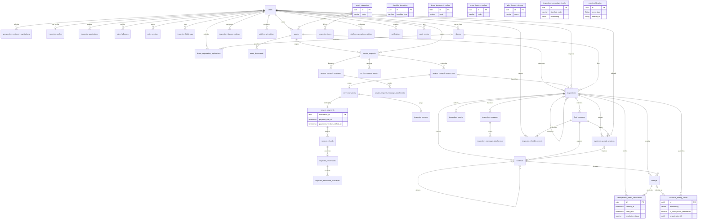

## 2. Database Design

**Scope boundary:** The schema models buildings only. Flyway applies `V1__baseline.sql`, a consolidated baseline holding the complete current schema and the catalog seeds, followed by ten forward migrations: `V2__remove_finding_recommended_action.sql` (merges the former `recommended_action` text into `technical_notes`), `V3__reinspection_resolved_validity.sql` (adds `verified_at` and `valid_until` to re-inspection verdicts), `V4__payment_due_expiry.sql` (adds payment due and overdue-notice columns), `V60__quote_partner_assignment_optional.sql` (makes the quoted partner Inspector and drone optional), `V61__inspection_chat_and_dispatch_settings.sql` (Inspector–Customer chat, dispatch timeout settings and timeout tracking), `V62__inspection_knowledge_rag.sql` (DroneKnowledgeAI case/standard stores with `pgvector` embeddings), `V63__ai_auto_confirm_default_70.sql` (lowers default `auto_confirm_threshold` in `platform_ai_settings` from `85.00` to `70.00`), `V64__backfill_published_historical_cases.sql` (idempotently backfills existing published confirmed findings into `historical_finding_cases`), `V65__rag_local_embeddings_384.sql` (alters `embedding` columns to `vector(384)` and rebuilds HNSW cosine indexes for local multilingual `fastembed` embeddings), and `V66__asset_ownership_information.sql` (adds plain-text `assets.ownership_information VARCHAR(1000)` and backfills existing values from `technical_profile jsonb`). No maintenance table, index, or column exists in the delivered schema, and no destructive migration is performed on retained data. `FullDatabaseSchemaMigrationTest` asserts the applied migration set is exactly `["1","2","3","4","60","61","62","63","64","65","66"]`. The schema contains **45 application tables** (`43` JPA-mapped tables plus `audit_events` and `platform_ai_settings`); together with the `event_publication` outbox and `flyway_schema_history`, the `public` schema holds **47 tables** (`RUNTIME_ENTITY_TABLES` has 44 members because it also includes `event_publication`).

**Files and Persistence Storage Description**

SmartDroneInspection persists structured relational data in **PostgreSQL 17** and binary media and documents in **MinIO S3-compatible object storage**:

- **Flyway Schema Migration Files (`SmartDroneInspection-backend/src/main/resources/db/migration/`)**: Versioned forward SQL migrations applied automatically by Flyway on startup. `V1__baseline.sql` is the single consolidated baseline containing the full current schema, all constraints, indexes, and catalog seed rows; `V2`, `V3`, `V4`, `V60`, `V61`, `V62`, `V63`, `V64`, `V65`, and `V66` are the forward migrations layered on top of it. `FullDatabaseSchemaMigrationTest` asserts that the applied migration set is exactly `["1","2","3","4","60","61","62","63","64","65","66"]`, so an accidental renumbering or an unstaged script fails the build. The schema includes the Spring Modulith `event_publication` transactional outbox, the request-level Manager assignment columns on `service_requests`, the flight-permit verification metadata and review status on `inspections`, the `service_request_message_attachments` metadata table that permits an empty message body only when attachment rows are present, the evidence-media optimization and resumable upload session tables, the re-inspection verdict validity window (`V3`), the payment due/overdue-notice window (`V4`), optional quotation partner and drone references (`V60`), the Inspector–Customer chat and platform operations settings (`V61`), the `pgvector` case/standard stores (`V62`), the `70.00` default AI auto-confirm threshold (`V63`), historical published-case backfill (`V64`), `vector(384)` local multilingual embeddings (`V65`), and dedicated plain-text `assets.ownership_information` (`V66`). These records do not execute bank or payment-gateway transfers.
- **MinIO Object Storage Files (`inspection-evidence` bucket)**: Binary files are streamed through `MinioEvidenceObjectStore` using UUID-scoped object keys referenced by PostgreSQL columns:
  - `contracts/requests/{requestId}/{uuid}/{fileName}`: signed offline service agreement scans (`service_requests.contract_object_key`).
  - `contracts/requests/{requestId}/messages/{uuid}/{fileName}`: private service-request chat attachments. `service_request_message_attachments` stores the message foreign key, safe file name, verified MIME type, byte size, SHA-256, and object key. The API rechecks request ownership or Manager assignment before any read and never accepts a client-supplied object key. Inspector–Customer chat attachments are handled analogously under `inspections/{inspectionId}/messages/{uuid}/{fileName}` (`inspection_messages`, `inspection_message_attachments`, `V61`), with a 4000-character body cap, verified MIME type, SHA-256, a 20 MiB per-file limit, and delivery only through `InspectionChatController` after the inspection read scope is rechecked.
  - `licenses/{userId}/{uuid}-{fileName}` and `drone-registration-applications/{inspectorId}/evidence/{docType}/{uuid}.{ext}`: Inspector pilot-licence scans (`inspector_profiles.pilot_license_file_key`), configurable drone registration documents, and drone photographs referenced by `drone_registration_applications` and `drones`.
  - `assets/{assetId}/documents/{uuid}-{fileName}`: building engineering drawings and reference documents verified with SHA-256 checksums (`asset_documents.object_key`).
  - `inspections/{inspectionId}/flight-permits/{uuid}-{fileName}` and `inspections/{inspectionId}/evidence/{uuid}-{fileName}` (with `.../raw/{uuid}-{fileName}`, `.../thumb/{uuid}.jpg`, `.../poster/{uuid}.jpg`): mission flight permits (`inspections.flight_permit_file_key`), normalized photographs up to 2048 px with 480 px JPEG thumbnails, and raw staged MP4 uploads retained until the FFmpeg outputs (a 1080p H.264 `+faststart` primary MP4 and a 480 px JPEG poster) are verified and committed `READY` (`evidence.object_key`, `raw_object_key`, `thumbnail_object_key`).
  - `reports/{reportVersionId}.pdf`: rendered A4 inspection reports produced by openhtmltopdf.

```mermaid
%% title: Database Entity Relationship Diagram (ERD)
erDiagram
  users ||--o{ prospective_customer_registrations : submits
  users ||--o| inspector_profiles : has_profile
  users ||--o{ inspector_applications : applies
  users |o--o{ otp_challenges : verifies
  users ||--o{ auth_sessions : opens
  users ||--o{ inspector_flight_logs : logs
  users ||--o{ drones : owns_drone
  users ||--o{ drone_registration_applications : submits
  drones |o--o{ drone_registration_applications : provisions
  users ||--o{ inspection_finance_settings : configures
  users ||--o{ platform_ai_settings : configures
  users ||--o{ assets : owns
  asset_categories ||--o{ assets : classifies
  asset_categories ||--o{ inspection_items : defines
  assets ||--o{ asset_documents : attaches
  assets ||--o{ service_requests : targets
  assets ||--o{ inspections : undergoes
  users ||--o{ service_requests : creates
  service_requests ||--o{ service_request_messages : discusses
  service_request_messages ||--o{ service_request_message_attachments : carries
  service_requests ||--o{ service_request_quotes : versions
  service_requests ||--o{ service_request_occurrences : schedules
  service_request_occurrences ||--o| service_invoices : prices
  service_invoices ||--o| service_payments : settled_by
  service_invoices ||--o| inspector_payouts : pays
  service_payments ||--o{ service_refunds : refunds
  service_refunds ||--o| inspector_receivables : assesses
  inspector_receivables ||--o{ inspector_receivable_recoveries : recovers
  service_request_occurrences |o--o| inspections : dispatches
  users ||--o{ inspections : inspects
  drones ||--o{ inspections : flies
  inspections |o--o{ inspections : reinspects
  inspections ||--o{ field_sessions : executes
  inspections ||--o{ evidence : contains
  field_sessions ||--o{ evidence : captures
  inspections ||--o{ evidence_upload_sessions : stages
  field_sessions ||--o{ evidence_upload_sessions : binds
  users ||--o{ evidence_upload_sessions : uploads
  evidence_upload_sessions |o--o| evidence : finalizes
  evidence |o--o{ evidence : derives
  inspections ||--o{ findings : records
  evidence ||--o{ findings : locates
  inspections ||--o{ inspection_reports : delivers
  inspections ||--o{ reinspection_defect_verifications : verifies
  findings ||--o{ reinspection_defect_verifications : rechecks
  inspections ||--o{ inspection_messages : discusses
  inspection_messages ||--o{ inspection_message_attachments : carries
  users ||--o{ platform_operations_settings : configures
  findings |o--o| historical_finding_cases : indexed_as
  inspections |o--o{ historical_finding_cases : publishes
  users ||--o{ notifications : receives
  users ||--o{ audit_events : acts
  users ||--o{ inspector_reliability_events : causes
  field_sessions ||--o{ inspector_reliability_events : evidences
  asset_categories {
    uuid id PK
    varchar code
  }
  checklist_templates {
    uuid id PK
    varchar template_type
  }
  drone_document_configs {
    uuid id PK
    varchar code
  }
  drone_feature_configs {
    uuid id PK
    varchar code
  }
  pilot_license_classes {
    uuid id PK
    varchar name
  }
  reinspection_defect_verifications {
    uuid id PK
    timestamp verified_at
    timestamp valid_until
    varchar resolution_status
  }
  service_payments {
    uuid occurrence_id PK
    timestamp payment_due_at
    timestamp payment_overdue_notified_at
  }
  inspection_knowledge_chunks {
    uuid id PK
    varchar standard_code
    vector embedding
  }
  historical_finding_cases {
    uuid id PK
    vector embedding
    boolean is_anonymized_benchmark
    uuid organization_id
  }
  event_publication {
    UUID id PK
    String event_type
    String listener_id
  }
```

**Table Descriptions**

| No | Table | Description |
| :---: | :--- | :--- |
| 01 | `users` | Stores every platform account: email and normalized email, full name, password hash, `ACTIVE`/`SUSPENDED`/`DISABLED` status, authentication version, failed-login count and lockout, forced password change, the comma-separated role set constrained to `ADMIN`, `MANAGER`, `CUSTOMER`, `INSPECTOR`, vision-fallback preference, phone, and avatar. There is no separate organization table: a customer organization is represented by the `CUSTOMER` account that owns assets and requests. - Primary keys: `id` - Foreign keys: None |
| 02 | `inspector_profiles` | Stores Inspector pilot credentials and partner onboarding state: licence number, class, expiry, issuing date and authority, licence scan key, citizen ID, date of birth, address, prior flight hours, certified drone models, specializations, experience summary, partner contract keys and SHA-256, approval actor and time, and rejection reason. - Primary keys: `user_id` - Foreign keys: `user_id`, `approved_by_user_id` → `users.id` |
| 03 | `inspector_applications` | Stores public partner Inspector applications before an account exists: identity and contact details, pilot licence number, class, and expiry, licence scan key, password hash for later provisioning, review status, reviewing Manager or Admin, review time, rejection reason, notification state, cleanup attempts, correlation ID, and signed partner contract reference. - Primary keys: `id` - Foreign keys: `reviewed_by_user_id`, `approved_user_id` → `users.id` |
| 04 | `otp_challenges` | Stores one-time verification challenges for `LOGIN`, `REGISTRATION`, and `PASSWORD_RESET`: purpose, challenge and code hashes, destination and channel, client IP, expiry, consumption time, failed attempts, send count, and last send time. - Primary keys: `id` - Foreign keys: `user_id` → `users.id` |
| 05 | `auth_sessions` | Tracks active web and mobile sessions with client type, hashed refresh token and its predecessor, issue and expiry times, and revocation time and reason. - Primary keys: `id` - Foreign keys: `user_id` → `users.id` |
| 06 | `inspector_flight_logs` | Records historical Inspector flight missions: flight code and date, mission title, drone model and serial, location, duration in minutes, inspection type, safety-incident flag, notes, and the recording actor. - Primary keys: `id` - Foreign keys: `inspector_user_id`, `recorded_by_user_id` → `users.id` |
| 07 | `prospective_customer_registrations` | Stores customer organization and initial building registration requests that require platform review because the location falls in restricted airspace: proposed organization name and code, category, building code, name, description and location, coordinates, ownership information, airspace classification, review status and note, reviewer and time, plus structure height and footprint area. - Primary keys: `id` - Foreign keys: `user_id`, `asset_category_id`, `reviewed_by_user_id` |
| 08 | `drone_registration_applications` | Stores Inspector requests to register an owned drone: serial number, model and manufacturer, registration number and expiry, registration document key and the full per-type document set, drone photographs, outdoor flight capabilities (wind resistance, optical zoom, maximum altitude), selected features, review status and note, reviewer and time, and the resulting drone. - Primary keys: `id` - Foreign keys: `inspector_user_id`, `drone_id`, `reviewed_by_user_id` |
| 09 | `drones` | Catalogs approved drones with serial number, model, manufacturer, payload metadata, serviceability, notes, registration number and expiry, document set, photographs, outdoor flight capabilities, and features. A drone belongs either to an Inspector or to a customer organization. - Primary keys: `id` - Foreign keys: `inspector_owner_id`, `owner_customer_id` → `users.id` |
| 10 | `asset_categories` | Defines the platform catalog of building categories: normalized uppercase code, name, description, and active flag. All six seeded rows are building categories: high-rise office, residential tower, commercial mall, industrial factory and warehouse, hotel and hospital complex, and telecom rooftop mast. - Primary keys: `id` - Foreign keys: None |
| 11 | `inspection_items` | Defines the inspection checkpoints belonging to each building category: label, sort order, active flag, and optimistic version. Selecting a building records the category's checkpoints against that building. - Primary keys: `id` - Foreign keys: `category_id` → `asset_categories.id` |
| 12 | `assets` | Stores customer buildings: normalized asset code, name, description, latitude and longitude, location text, operational status, dedicated plain-text `ownership_information VARCHAR(1000)` (`V66`, backfilled from `technical_profile`), optional `technical_profile jsonb`, the per-building snapshot of inspection checkpoints, structure height in metres, footprint area in square metres, and the owning customer account. - Primary keys: `id` - Foreign keys: `category_id` → `asset_categories.id`, `owner_customer_id` → `users.id` |
| 13 | `asset_documents` | Stores engineering drawings and reference documents attached to a building: document type, file name, content type, size, SHA-256 checksum, object key, document date, and uploader. - Primary keys: `id` - Foreign keys: `asset_id` → `assets.id`, `uploaded_by_user_id` → `users.id` |
| 14 | `checklist_templates` | Stores the configurable safety-checklist and field-form templates used by the field workflow: template type, label, sort order, required flag, and active flag. - Primary keys: `id` - Foreign keys: None |
| 15 | `drone_document_configs` | Stores which drone document types the platform requires: code, bilingual title and description, required and active flags, and display order. `REGISTRATION` and `OWNERSHIP` are required and active by default; `INSPECTION` is optional and inactive by default. - Primary keys: `id` - Foreign keys: None |
| 16 | `drone_feature_configs` | Stores the configurable drone capability catalogue: code, bilingual name and description, category, active flag, and display order. - Primary keys: `id` - Foreign keys: None |
| 17 | `pilot_license_classes` | Stores the recognised pilot-licence classes: name, description, and active flag. These classes gate Inspector eligibility. - Primary keys: `id` - Foreign keys: None |
| 18 | `inspection_finance_settings` | Stores the platform commission, VAT, and personal income tax rates used to calculate net partner payouts, with the last updating actor and time. - Primary keys: `id` - Foreign keys: `updated_by_user_id` → `users.id` |
| 19 | `platform_ai_settings` | Stores detection settings: whether candidates at or above the confidence threshold are auto-confirmed (`default: 70.00` since `V63`, lowered from `85.00`), the count of pending rejected candidates, and the last updating actor and time. - Primary keys: `id` - Foreign keys: `updated_by` |
| 20 | `service_requests` | Stores one-time and recurring customer inspection requests: description, requested window, business timezone, request type, recurrence unit, interval, occurrence count, recurrence end date, status, signed agreement key and upload time, the accepted quotation and acceptance snapshot, the owning customer, an optional source inspection for a follow-up request, and the request-level Manager assignment (`assigned_manager_id`, `manager_assigned_at`, `manager_assigned_by_user_id`). - Primary keys: `id` - Foreign keys: `asset_id` → `assets.id`, `created_by_user_id`, `accepted_by_user_id`, `assigned_manager_id`, `manager_assigned_by_user_id`, `owner_customer_id` → `users.id`, `source_inspection_id` → `inspections.id` |
| 21 | `service_request_messages` | Stores order-chat messages between the owning customer and the assigned Manager: body text, creation time, and read receipt. The body may be blank only when attachment rows are present. - Primary keys: `id` - Foreign keys: `request_id` → `service_requests.id`, `author_user_id` → `users.id` |
| 22 | `service_request_message_attachments` | Stores private chat attachment metadata: safe file name, verified MIME type, size, SHA-256, object key, and creation time. Allowed types are PNG, JPEG, WEBP, PDF, and DOCX, at most five per message, 10 MiB per file and 20 MiB per message. - Primary keys: `id` - Foreign keys: `message_id` → `service_request_messages.id` |
| 23 | `service_request_quotes` | Stores the current VND quotation: scope snapshot, first-occurrence window, inspector, drone, issuing and updating actors, price per occurrence, required drone feature codes, and optimistic version. A revised quotation replaces the active one; accepted terms are frozen into the request snapshot. Since `V60` the proposed `inspector_id` and `drone_id` are nullable: the partner pair is chosen at dispatch and confirmed by the Inspector rather than at quotation, and existing rows keep their legacy pair. - Primary keys: `id` - Foreign keys: `request_id` → `service_requests.id`, `inspector_id`, `issued_by_user_id`, `updated_by_user_id` → `users.id`, `drone_id` → `drones.id` |
| 24 | `service_request_occurrences` | Stores the scheduled occurrences materialized from an accepted request: index, planned start and end, status, assigned Inspector and drone, and the resulting inspection. - Primary keys: `id` - Foreign keys: `request_id` → `service_requests.id`, `inspector_id` → `users.id`, `drone_id` → `drones.id`, `inspection_id` → `inspections.id` |
| 25 | `service_invoices` | Stores the per-occurrence price and the commission, VAT, and personal income tax rate snapshots applied at the time of issue, plus the customer report-acceptance time. - Primary keys: `occurrence_id` - Foreign keys: `occurrence_id` → `service_request_occurrences.id` |
| 26 | `service_payments` | Tracks customer payment for an invoice: status, PayOS order code, payment method, transaction reference, confirmation time, cumulative refunded amount, refund status, and the `V4` payment-due window (`payment_due_at`, a configurable default of 15 days, plus a single `payment_overdue_notified_at` reminder guard). - Primary keys: `occurrence_id` - Foreign keys: `occurrence_id` → `service_invoices.occurrence_id` |
| 27 | `inspector_payouts` | Records the Inspector recipient, payout eligibility and disbursement state, external payout reference and time, the recording Manager, the refund hold flag, and the capped final payout amount after verified reductions. - Primary keys: `occurrence_id` - Foreign keys: `occurrence_id` → `service_invoices.occurrence_id`, `inspector_id`, `payout_recorded_by_user_id` → `users.id` |
| 28 | `service_refunds` | Stores the refund lifecycle ledger: occurrence, amount and reason, request and external references, status (`INITIATED`, `COMPLETED`, `CANCELLED`), initiating, completing and cancelling actors and times, cancellation reason, the accounting allocation across Inspector payout reduction, platform commission, VAT, personal income tax, and platform absorption, the reconciliation actor, reference, note and time, and the Inspector receivable and platform-absorption plan amounts. Completion requires a unique external reference and an allocation summing exactly to the amount. - Primary keys: `id` - Foreign keys: `occurrence_id` → `service_payments.occurrence_id`, `initiated_by_user_id`, `completed_by_user_id`, `cancelled_by_user_id`, `allocation_reconciled_by_user_id` → `users.id` |
| 29 | `inspector_receivables` | Records attributable Inspector debt assessed when a customer refund follows an already-disbursed payout. It preserves the historical payout and does not automatically offset future payouts. Stores the refund, occurrence, Inspector, assessed amount, source reference, reason, recording Manager, timestamps, and optimistic version. - Primary keys: `id` - Foreign keys: `refund_id` → `service_refunds.id`, `occurrence_id` → `service_request_occurrences.id`, `inspector_id`, `recorded_by_user_id` → `users.id` |
| 30 | `inspector_receivable_recoveries` | Stores append-only manual collection records against a receivable: amount, globally unique case-insensitive external reference, note, recording Manager, and recorded time. Aggregate recovery cannot exceed the outstanding receivable. - Primary keys: `id` - Foreign keys: `receivable_id` → `inspector_receivables.id`, `recorded_by_user_id` → `users.id` |
| 31 | `inspections` | Stores scheduled inspection missions: building, type, planned window, status, assigned Inspector and drone, partner-assignment state and acceptance or decline with reason, cancellation reason, overdue notice time, clarification count, `findings_confirmed_at`, an optional source inspection for a re-inspection, and the complete flight-permit block — file key and name, structured number, authority, validity window, drone serial, maximum altitude, SHA-256, size, content type, upload time and actor, verification status, verifying Manager or Admin, verification time, rejection reason, and review notes. - Primary keys: `id` - Foreign keys: `asset_id` → `assets.id`, `inspector_id`, `declined_by_inspector_id`, `flight_permit_uploaded_by`, `flight_permit_verified_by`, `owner_customer_id` → `users.id`, `drone_id` → `drones.id`, `source_inspection_id` → `inspections.id` |
| 32 | `field_sessions` | Records on-site field sessions: status, start and end time, pre-flight safety note, outcome notes, abort reason and aborting actor, the `SmartDroneHub` flight report metrics (telemetry source, duration, distance, maximum altitude, start and end battery, final state, report note), the GPS flight trace JSON, the synced flight-video evidence reference, and the hung-session notice time. - Primary keys: `id` - Foreign keys: `inspection_id` → `inspections.id`, `aborted_by_user_id` → `users.id`, `flight_video_evidence_id` → `evidence.id` |
| 33 | `evidence` | Stores evidence metadata and object keys: file name, content type, size, primary object key, retained raw key, 480 px thumbnail key and size, original and optimized sizes, processing lifecycle state (`PENDING`, `PROCESSING`, `READY`, `FAILED`) with error, attempts and lock time, media width, height and duration, capture time, GPS coordinates, location description, soft-delete flag, and the source-video and source-timestamp link when the row is a video keyframe. - Primary keys: `id` - Foreign keys: `inspection_id` → `inspections.id`, `field_session_id` → `field_sessions.id`, `source_video_evidence_id` → `evidence.id` |
| 34 | `evidence_upload_sessions` | Tracks resumable chunked MP4 upload state: file name and type, declared size, chunk size and total parts, status (`OPEN`, `COMPLETING`, `COMPLETED`, `FAILED`, `CANCELLED`, `EXPIRED`), storage multipart upload ID, target raw object key, committed part numbers, capture metadata, error message, expiry and completion times, and the finalized evidence record. - Primary keys: `id` - Foreign keys: `inspection_id` → `inspections.id`, `field_session_id` → `field_sessions.id`, `created_by_user_id` → `users.id`, `evidence_id` → `evidence.id` |
| 35 | `findings` | Stores AI-suggested defect candidates and Inspector-confirmed findings: finding code, defect label, severity, normalized bounding box, technical notes, status, model name, confidence (null for a manually created finding), and soft-delete flag. - Primary keys: `id` - Foreign keys: `inspection_id` → `inspections.id`, `evidence_id` → `evidence.id` |
| 36 | `reinspection_defect_verifications` | Stores the three-way re-inspection comparison between an original finding and its re-observed evidence: resolution status (`RESOLVED`, `UNRESOLVED`, `INCONCLUSIVE`), Inspector notes, timestamps, and (since `V3`) `verified_at` plus a derived `valid_until` expiry that stops a stale `RESOLVED` verdict from closing regressed work. The Web `VerdictExpiryBanner` and Mobile `verdict_expiry.dart` surface lapsed or soon-to-lapse verdicts before the report stage blocks them. - Primary keys: `id` - Foreign keys: `reinspection_id` → `inspections.id`, `source_finding_id` → `findings.id`, `new_evidence_id` → `evidence.id` |
| 37 | `inspection_reports` | Stores versioned inspection reports: version number, status (`SUBMITTED`, `RETURNED`, `PUBLISHED`, `SUPERSEDED`), submission time, reviewing Manager, review time, return reason, publication time, and the advisory summary text. - Primary keys: `id` - Foreign keys: `inspection_id` → `inspections.id`, `reviewer_user_id` → `users.id` |
| 38 | `notifications` | Stores deduplicated in-app notifications: event type, channel, title, body, navigation target path, delivery status, sent and read times, and a deduplication key that prevents a retried event from producing a duplicate row. - Primary keys: `id` - Foreign keys: `recipient_user_id` → `users.id` |
| 39 | `audit_events` | Stores the append-only audit trail: actor, action, aggregate type and identifier, before and after status, aggregate version, trace identifier, safe metadata, and creation time. Historical rows are never silently rewritten. - Primary keys: `id` - Foreign keys: `actor_user_id` → `users.id` |
| 40 | `inspector_reliability_events` | Records attributable Inspector reliability events such as an aborted or hung field session: event type, reason, and occurrence time, linked to the Inspector, the mission, and the field session. - Primary keys: `id` - Foreign keys: `inspector_id` → `users.id`, `inspection_id` → `inspections.id`, `field_session_id` → `field_sessions.id` |
| 41 | `platform_operations_settings` | Stores Admin-configurable platform dispatch settings (`V61`): the assignment-acceptance timeout in hours (default 24, constrained to 1–720) plus the updating actor and time. A timeout that elapses while a dispatch is `PENDING_ACCEPTANCE` automatically unassigns the occurrence and records the last cancellation time and Inspector. - Primary keys: `id` - Foreign keys: `updated_by_user_id` → `users.id` |
| 42 | `inspection_messages` | Stores the Inspector–Customer chat thread for an inspection (`V61`): body text up to 4000 characters (which may be empty when attachments are present), an attachment flag, a read receipt, creation time, and the author. - Primary keys: `id` - Foreign keys: `inspection_id` → `inspections.id`, `author_user_id` → `users.id` |
| 43 | `inspection_message_attachments` | Stores private inspection-chat attachment metadata (`V61`): safe file name, verified MIME type (PNG, JPEG, WEBP, PDF, DOCX), byte size (at most 20 MiB), SHA-256 checksum, object key, and creation time. - Primary keys: `id` - Foreign keys: `message_id` → `inspection_messages.id` |
| 44 | `inspection_knowledge_chunks` | Stores the eight seeded engineering-standard/guideline chunks that ground DroneKnowledgeAI (`V62`, updated to `vector(384)` by `V65`): standard code (for example `TCVN 9343:2012`, `TCVN 9361:2012`, `EN 1504-9`, `ISO 12944-5`, `ASTM C1583`), title, asset-category code, defect patterns, severity, guidance text, reference URL, and a `vector(384)` embedding generated by the local multilingual `fastembed` model (`paraphrase-multilingual-MiniLM-L12-v2`). Category and HNSW `vector_cosine_ops` indexes support cosine retrieval; the embedding is read and written with parameterized JDBC rather than JPA. - Primary keys: `id` - Foreign keys: None |
| 45 | `historical_finding_cases` | Stores six anonymized benchmark cases with no customer PII plus confirmed findings backfilled (`V64`) and indexed automatically when a report is published (`V62`, updated to `vector(384)` by `V65`): source finding/inspection and organization/asset references, asset category and label, defect label, severity, technical notes, report outcome (including re-inspection resolution status), anonymized-benchmark flag, publication time, and a `vector(384)` embedding with an HNSW `vector_cosine_ops` index. Missing embeddings are backfilled asynchronously on startup (`ApplicationReadyEvent`). Retrieval enforces tenant isolation through `(organization_id = actor org OR is_anonymized_benchmark = TRUE) AND (source_inspection_id IS NULL OR source_inspection_id <> current inspection)`, so no cross-organization PII leaks and an inspection cannot recommend itself. - Primary keys: `id` - Foreign keys: None (logical links to `findings`, `inspections`, `assets`, `users`) |

**Framework tables (not counted among the 45 application tables):** `event_publication` stores the Spring Modulith transactional outbox — listener identifier, event type, serialized event payload, publication and completion times, status, completion attempts, and last resubmission time — providing reliable asynchronous delivery of domain events to `notifications` (primary key `id`, no foreign keys). `flyway_schema_history` is Flyway's own migration ledger. Together with the 45 application tables, these bring the `public` schema to 47 tables.

**Logical schema conventions**

- Every business table uses a surrogate `uuid` primary key generated by `gen_random_uuid()`, except the four one-to-one ledger tables (`service_invoices`, `service_payments`, `inspector_payouts`, `inspector_profiles`), where the parent reference is itself the primary key.
- Optimistic concurrency is carried by a `row_version` column on mutable aggregates, exposed through JPA `@Version` so a concurrent edit is rejected rather than silently overwritten.
- Enumerated states are enforced by database check constraints (for example the `users.status` and `users.roles` constraints) as well as by application-level validation, so an invalid state cannot be written by either layer alone.
- Foreign keys are `ON DELETE RESTRICT` by default; the exceptions are the attachment table and the notification and audit trails, which cascade only from their immediate parent.
- `V65` updates the `pgvector` embedding columns on `inspection_knowledge_chunks` and `historical_finding_cases` (seeded by `V62` and backfilled by `V64`) to `vector(384)`, recreating the HNSW `vector_cosine_ops` indexes for the local multilingual `fastembed` model (`paraphrase-multilingual-MiniLM-L12-v2`). Embeddings are deliberately not mapped as JPA attributes; `HistoricalCaseService` reads and writes them with parameterized JDBC using the `pgvector` literal `[v1,v2,...]`, backfills missing vectors on `ApplicationReadyEvent` and report publication, and falls back to deterministic `HYBRID_MATCH` when the embeddings endpoint is unavailable.
